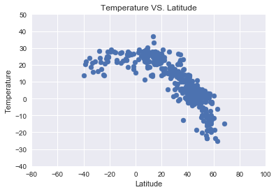
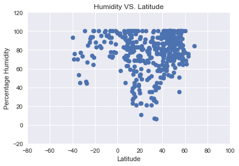
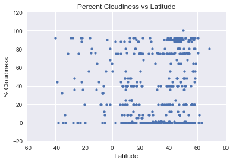
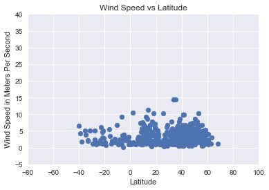

```python
# Three Observable Trends
# 1. The temperature increases as you approach the equator with peaks at -20 degrees and 20 degrees.
# 2. Just below the equator from 0 to -20 there no points with low humidity suggesting this is a very humid region. 
# 3. Cloudiness doesn't seem to have much relationship to latitude. Almost all latitudes had points with various levels of cloudiness. 
```


```python
# Import dependencies and set keys
import requests
import pandas as pd
import matplotlib.pyplot as plt
from citipy import citipy
import seaborn as sns
import random
import numpy as np

url = "api.openweathermap.org/data/2.5/weather?"
api_key = "1554a148a00535035214c4ce3c74a8c7"
units = "metric"
```


```python
#Import the global cities csv, make a dataframe, and take a random sampling.
worldcities_df = pd.read_csv("worldcities.csv")
worldcities_df.head()
random_sample_df = worldcities_df.sample(n=500)
random_sample_df
```


<div>
<style scoped>
    .dataframe tbody tr th:only-of-type {
        vertical-align: middle;
    }

    .dataframe tbody tr th {
        vertical-align: top;
    }

    .dataframe thead th {
        text-align: right;
    }
</style>
<table border="1" class="dataframe">
  <thead>
    <tr style="text-align: right;">
      <th></th>
      <th>Country</th>
      <th>City</th>
      <th>Latitude</th>
      <th>Longitude</th>
    </tr>
  </thead>
  <tbody>
    <tr>
      <th>19616</th>
      <td>in</td>
      <td>tiruchchendur</td>
      <td>8.483333</td>
      <td>78.116667</td>
    </tr>
    <tr>
      <th>11349</th>
      <td>fr</td>
      <td>andresy</td>
      <td>48.982345</td>
      <td>2.056872</td>
    </tr>
    <tr>
      <th>38009</th>
      <td>ru</td>
      <td>sayansk</td>
      <td>54.108800</td>
      <td>102.164800</td>
    </tr>
    <tr>
      <th>36570</th>
      <td>ru</td>
      <td>krasnoobsk</td>
      <td>54.919800</td>
      <td>82.990900</td>
    </tr>
    <tr>
      <th>29252</th>
      <td>ph</td>
      <td>new panay</td>
      <td>6.758611</td>
      <td>124.589167</td>
    </tr>
    <tr>
      <th>22483</th>
      <td>lu</td>
      <td>biwer</td>
      <td>49.702778</td>
      <td>6.374722</td>
    </tr>
    <tr>
      <th>1042</th>
      <td>az</td>
      <td>yevlax</td>
      <td>40.612732</td>
      <td>47.142329</td>
    </tr>
    <tr>
      <th>46600</th>
      <td>za</td>
      <td>greytown</td>
      <td>-29.064155</td>
      <td>30.592786</td>
    </tr>
    <tr>
      <th>18847</th>
      <td>in</td>
      <td>nuh</td>
      <td>28.116667</td>
      <td>77.016667</td>
    </tr>
    <tr>
      <th>9329</th>
      <td>de</td>
      <td>mulheim-karlich</td>
      <td>50.383333</td>
      <td>7.500000</td>
    </tr>
    <tr>
      <th>12468</th>
      <td>gb</td>
      <td>dollar</td>
      <td>56.150000</td>
      <td>-3.666667</td>
    </tr>
    <tr>
      <th>32769</th>
      <td>ro</td>
      <td>cosereni</td>
      <td>44.683333</td>
      <td>26.566667</td>
    </tr>
    <tr>
      <th>4691</th>
      <td>ca</td>
      <td>irricana</td>
      <td>51.316667</td>
      <td>-113.616667</td>
    </tr>
    <tr>
      <th>7247</th>
      <td>co</td>
      <td>rionegro</td>
      <td>7.153611</td>
      <td>-73.153611</td>
    </tr>
    <tr>
      <th>6900</th>
      <td>co</td>
      <td>granada</td>
      <td>6.143526</td>
      <td>-75.185323</td>
    </tr>
    <tr>
      <th>619</th>
      <td>at</td>
      <td>grodig</td>
      <td>47.733333</td>
      <td>13.033333</td>
    </tr>
    <tr>
      <th>7867</th>
      <td>cz</td>
      <td>cejkovice</td>
      <td>48.883333</td>
      <td>16.283333</td>
    </tr>
    <tr>
      <th>24677</th>
      <td>mx</td>
      <td>teteles</td>
      <td>19.866667</td>
      <td>-97.433333</td>
    </tr>
    <tr>
      <th>23112</th>
      <td>mt</td>
      <td>san gwann</td>
      <td>35.905556</td>
      <td>14.476111</td>
    </tr>
    <tr>
      <th>36609</th>
      <td>ru</td>
      <td>krasnyye tkachi</td>
      <td>57.492593</td>
      <td>39.756286</td>
    </tr>
    <tr>
      <th>31858</th>
      <td>pt</td>
      <td>vila nova da telha</td>
      <td>41.071697</td>
      <td>-8.641456</td>
    </tr>
    <tr>
      <th>6848</th>
      <td>co</td>
      <td>el tarra</td>
      <td>8.575621</td>
      <td>-73.094891</td>
    </tr>
    <tr>
      <th>20984</th>
      <td>it</td>
      <td>sessa aurunca</td>
      <td>41.233333</td>
      <td>13.933333</td>
    </tr>
    <tr>
      <th>35934</th>
      <td>ru</td>
      <td>gorshechnoye</td>
      <td>51.524400</td>
      <td>38.036500</td>
    </tr>
    <tr>
      <th>39998</th>
      <td>sy</td>
      <td>darayya</td>
      <td>33.450000</td>
      <td>36.250000</td>
    </tr>
    <tr>
      <th>2658</th>
      <td>br</td>
      <td>capim grosso</td>
      <td>-11.366667</td>
      <td>-40.016667</td>
    </tr>
    <tr>
      <th>9082</th>
      <td>de</td>
      <td>kaarst</td>
      <td>51.233333</td>
      <td>6.616667</td>
    </tr>
    <tr>
      <th>40313</th>
      <td>th</td>
      <td>tha chang</td>
      <td>9.264179</td>
      <td>99.192181</td>
    </tr>
    <tr>
      <th>3337</th>
      <td>br</td>
      <td>marataizes</td>
      <td>-21.033333</td>
      <td>-40.833333</td>
    </tr>
    <tr>
      <th>17736</th>
      <td>in</td>
      <td>ghugus</td>
      <td>19.933333</td>
      <td>79.133333</td>
    </tr>
    <tr>
      <th>...</th>
      <td>...</td>
      <td>...</td>
      <td>...</td>
      <td>...</td>
    </tr>
    <tr>
      <th>29324</th>
      <td>ph</td>
      <td>pagsabangan</td>
      <td>7.481111</td>
      <td>125.749444</td>
    </tr>
    <tr>
      <th>36878</th>
      <td>ru</td>
      <td>luza</td>
      <td>60.630815</td>
      <td>47.251177</td>
    </tr>
    <tr>
      <th>36823</th>
      <td>ru</td>
      <td>liman</td>
      <td>45.784572</td>
      <td>47.224053</td>
    </tr>
    <tr>
      <th>40126</th>
      <td>th</td>
      <td>chaiyo</td>
      <td>14.648778</td>
      <td>100.478778</td>
    </tr>
    <tr>
      <th>30436</th>
      <td>ph</td>
      <td>tarangnan</td>
      <td>11.900900</td>
      <td>124.745900</td>
    </tr>
    <tr>
      <th>43289</th>
      <td>us</td>
      <td>jacksonville</td>
      <td>39.733889</td>
      <td>-90.228889</td>
    </tr>
    <tr>
      <th>129</th>
      <td>al</td>
      <td>rreshen</td>
      <td>41.767500</td>
      <td>19.875556</td>
    </tr>
    <tr>
      <th>43610</th>
      <td>us</td>
      <td>shelbyville</td>
      <td>38.211944</td>
      <td>-85.223611</td>
    </tr>
    <tr>
      <th>43618</th>
      <td>us</td>
      <td>bastrop</td>
      <td>32.756111</td>
      <td>-91.872222</td>
    </tr>
    <tr>
      <th>5565</th>
      <td>ci</td>
      <td>alepe</td>
      <td>5.500397</td>
      <td>-3.663083</td>
    </tr>
    <tr>
      <th>12601</th>
      <td>gb</td>
      <td>hawkhead</td>
      <td>55.833333</td>
      <td>-4.383333</td>
    </tr>
    <tr>
      <th>32928</th>
      <td>ro</td>
      <td>dolhesti</td>
      <td>46.866667</td>
      <td>27.900000</td>
    </tr>
    <tr>
      <th>7732</th>
      <td>cu</td>
      <td>minas</td>
      <td>21.483333</td>
      <td>-77.616667</td>
    </tr>
    <tr>
      <th>33390</th>
      <td>ro</td>
      <td>lespezi</td>
      <td>47.366667</td>
      <td>26.700000</td>
    </tr>
    <tr>
      <th>23298</th>
      <td>mx</td>
      <td>acuautla</td>
      <td>19.333333</td>
      <td>-98.850000</td>
    </tr>
    <tr>
      <th>45071</th>
      <td>us</td>
      <td>new philadelphia</td>
      <td>40.489722</td>
      <td>-81.445833</td>
    </tr>
    <tr>
      <th>26912</th>
      <td>pg</td>
      <td>samarai</td>
      <td>-10.616667</td>
      <td>150.666667</td>
    </tr>
    <tr>
      <th>7644</th>
      <td>cr</td>
      <td>santa ana</td>
      <td>9.932598</td>
      <td>-84.182545</td>
    </tr>
    <tr>
      <th>38794</th>
      <td>ru</td>
      <td>usva</td>
      <td>58.682316</td>
      <td>57.645023</td>
    </tr>
    <tr>
      <th>22624</th>
      <td>lv</td>
      <td>grobina</td>
      <td>56.550000</td>
      <td>21.166667</td>
    </tr>
    <tr>
      <th>38384</th>
      <td>ru</td>
      <td>strelka</td>
      <td>45.206330</td>
      <td>37.286496</td>
    </tr>
    <tr>
      <th>16314</th>
      <td>id</td>
      <td>karangampel</td>
      <td>-6.462222</td>
      <td>108.451944</td>
    </tr>
    <tr>
      <th>35340</th>
      <td>ru</td>
      <td>belinskiy</td>
      <td>52.964739</td>
      <td>43.416472</td>
    </tr>
    <tr>
      <th>24460</th>
      <td>mx</td>
      <td>san martin de las piramides</td>
      <td>19.700000</td>
      <td>-98.833333</td>
    </tr>
    <tr>
      <th>34766</th>
      <td>ro</td>
      <td>vulcana bai</td>
      <td>45.083333</td>
      <td>25.383333</td>
    </tr>
    <tr>
      <th>8895</th>
      <td>de</td>
      <td>gerstetten</td>
      <td>48.633333</td>
      <td>10.033333</td>
    </tr>
    <tr>
      <th>1451</th>
      <td>be</td>
      <td>courcelles</td>
      <td>50.466667</td>
      <td>4.366667</td>
    </tr>
    <tr>
      <th>34465</th>
      <td>ro</td>
      <td>teiu</td>
      <td>44.650000</td>
      <td>25.133333</td>
    </tr>
    <tr>
      <th>13636</th>
      <td>gr</td>
      <td>kalivai</td>
      <td>35.450000</td>
      <td>24.166667</td>
    </tr>
    <tr>
      <th>42118</th>
      <td>us</td>
      <td>lake havasu city</td>
      <td>34.483889</td>
      <td>-114.321667</td>
    </tr>
  </tbody>
</table>
<p>500 rows × 4 columns</p>
</div>


```python
# Define Lists
temp = []
humidity = []
wind = []
cloudiness = []
open_weather_city_number = []
process_number = 0

# Query the API with Coordinates and create lists with Temperature, Humidity, Wind Speed, and Cloudiness Info.

for index, row in random_sample_df.iterrows():
    lat = row["Latitude"]
    lon = row["Longitude"]
    query = f"http://{url}APPID={api_key}&lat={lat}&lon={lon}&units={units}"
    response = requests.get(query).json()
    temp.append(response['main']['temp'])
    humidity.append(response['main']['humidity'])
    wind.append(response['wind']['speed'])
    cloudiness.append(response['clouds']['all'])
    open_weather_city_number.append(response['id'])
    process_number = process_number + 1
    print(f"{process_number}: Currently processing the city with the following information:")
    print(f"City ID Number: {response['id']}")
    print(f"City Name: {row.City}")
    print(f"Query url: {query}")

```

    1: Currently processing the city with the following information:
    City ID Number: 1254390
    City Name: tiruchchendur
    Query url: http://api.openweathermap.org/data/2.5/weather?APPID=1554a148a00535035214c4ce3c74a8c7&lat=8.483333&lon=78.116667&units=metric
    2: Currently processing the city with the following information:
    City ID Number: 3037692
    City Name: andresy
    Query url: http://api.openweathermap.org/data/2.5/weather?APPID=1554a148a00535035214c4ce3c74a8c7&lat=48.982345&lon=2.0568720000000003&units=metric
    3: Currently processing the city with the following information:
    City ID Number: 2055166
    City Name: sayansk
    Query url: http://api.openweathermap.org/data/2.5/weather?APPID=1554a148a00535035214c4ce3c74a8c7&lat=54.1088&lon=102.1648&units=metric
    4: Currently processing the city with the following information:
    City ID Number: 1502091
    City Name: krasnoobsk
    Query url: http://api.openweathermap.org/data/2.5/weather?APPID=1554a148a00535035214c4ce3c74a8c7&lat=54.9198&lon=82.9909&units=metric
    5: Currently processing the city with the following information:
    City ID Number: 1697753
    City Name: new panay
    Query url: http://api.openweathermap.org/data/2.5/weather?APPID=1554a148a00535035214c4ce3c74a8c7&lat=6.758611&lon=124.58916699999999&units=metric
    6: Currently processing the city with the following information:
    City ID Number: 2960499
    City Name: biwer
    Query url: http://api.openweathermap.org/data/2.5/weather?APPID=1554a148a00535035214c4ce3c74a8c7&lat=49.7027778&lon=6.3747222&units=metric
    7: Currently processing the city with the following information:
    City ID Number: 584649
    City Name: yevlax
    Query url: http://api.openweathermap.org/data/2.5/weather?APPID=1554a148a00535035214c4ce3c74a8c7&lat=40.612732&lon=47.142329&units=metric
    8: Currently processing the city with the following information:
    City ID Number: 1000006
    City Name: greytown
    Query url: http://api.openweathermap.org/data/2.5/weather?APPID=1554a148a00535035214c4ce3c74a8c7&lat=-29.064155&lon=30.592786&units=metric
    9: Currently processing the city with the following information:
    City ID Number: 1261145
    City Name: nuh
    Query url: http://api.openweathermap.org/data/2.5/weather?APPID=1554a148a00535035214c4ce3c74a8c7&lat=28.116667&lon=77.016667&units=metric
    10: Currently processing the city with the following information:
    City ID Number: 2867843
    City Name: mulheim-karlich
    Query url: http://api.openweathermap.org/data/2.5/weather?APPID=1554a148a00535035214c4ce3c74a8c7&lat=50.383333&lon=7.5&units=metric
    11: Currently processing the city with the following information:
    City ID Number: 2651151
    City Name: dollar
    Query url: http://api.openweathermap.org/data/2.5/weather?APPID=1554a148a00535035214c4ce3c74a8c7&lat=56.15&lon=-3.666667&units=metric
    12: Currently processing the city with the following information:
    City ID Number: 680649
    City Name: cosereni
    Query url: http://api.openweathermap.org/data/2.5/weather?APPID=1554a148a00535035214c4ce3c74a8c7&lat=44.683333000000005&lon=26.566667&units=metric
    13: Currently processing the city with the following information:
    City ID Number: 5984019
    City Name: irricana
    Query url: http://api.openweathermap.org/data/2.5/weather?APPID=1554a148a00535035214c4ce3c74a8c7&lat=51.316666999999995&lon=-113.61666699999999&units=metric
    14: Currently processing the city with the following information:
    City ID Number: 3670235
    City Name: rionegro
    Query url: http://api.openweathermap.org/data/2.5/weather?APPID=1554a148a00535035214c4ce3c74a8c7&lat=7.153611&lon=-73.153611&units=metric
    15: Currently processing the city with the following information:
    City ID Number: 3681952
    City Name: granada
    Query url: http://api.openweathermap.org/data/2.5/weather?APPID=1554a148a00535035214c4ce3c74a8c7&lat=6.1435260000000005&lon=-75.185323&units=metric
    16: Currently processing the city with the following information:
    City ID Number: 2777921
    City Name: grodig
    Query url: http://api.openweathermap.org/data/2.5/weather?APPID=1554a148a00535035214c4ce3c74a8c7&lat=47.733333&lon=13.033333&units=metric
    17: Currently processing the city with the following information:
    City ID Number: 3078872
    City Name: cejkovice
    Query url: http://api.openweathermap.org/data/2.5/weather?APPID=1554a148a00535035214c4ce3c74a8c7&lat=48.883333&lon=16.283333&units=metric
    18: Currently processing the city with the following information:
    City ID Number: 3515757
    City Name: teteles
    Query url: http://api.openweathermap.org/data/2.5/weather?APPID=1554a148a00535035214c4ce3c74a8c7&lat=19.866667&lon=-97.43333299999999&units=metric
    19: Currently processing the city with the following information:
    City ID Number: 2567539
    City Name: san gwann
    Query url: http://api.openweathermap.org/data/2.5/weather?APPID=1554a148a00535035214c4ce3c74a8c7&lat=35.905556&lon=14.476110999999998&units=metric
    20: Currently processing the city with the following information:
    City ID Number: 541747
    City Name: krasnyye tkachi
    Query url: http://api.openweathermap.org/data/2.5/weather?APPID=1554a148a00535035214c4ce3c74a8c7&lat=57.49259300000001&lon=39.756285999999996&units=metric
    21: Currently processing the city with the following information:
    City ID Number: 2732551
    City Name: vila nova da telha
    Query url: http://api.openweathermap.org/data/2.5/weather?APPID=1554a148a00535035214c4ce3c74a8c7&lat=41.071697&lon=-8.641456&units=metric
    22: Currently processing the city with the following information:
    City ID Number: 3738301
    City Name: el tarra
    Query url: http://api.openweathermap.org/data/2.5/weather?APPID=1554a148a00535035214c4ce3c74a8c7&lat=8.575621&lon=-73.094891&units=metric
    23: Currently processing the city with the following information:
    City ID Number: 3166614
    City Name: sessa aurunca
    Query url: http://api.openweathermap.org/data/2.5/weather?APPID=1554a148a00535035214c4ce3c74a8c7&lat=41.233333&lon=13.933333&units=metric
    24: Currently processing the city with the following information:
    City ID Number: 559400
    City Name: gorshechnoye
    Query url: http://api.openweathermap.org/data/2.5/weather?APPID=1554a148a00535035214c4ce3c74a8c7&lat=51.5244&lon=38.0365&units=metric
    25: Currently processing the city with the following information:
    City ID Number: 170892
    City Name: darayya
    Query url: http://api.openweathermap.org/data/2.5/weather?APPID=1554a148a00535035214c4ce3c74a8c7&lat=33.45&lon=36.25&units=metric
    26: Currently processing the city with the following information:
    City ID Number: 3467272
    City Name: capim grosso
    Query url: http://api.openweathermap.org/data/2.5/weather?APPID=1554a148a00535035214c4ce3c74a8c7&lat=-11.366667&lon=-40.016667&units=metric
    27: Currently processing the city with the following information:
    City ID Number: 2894375
    City Name: kaarst
    Query url: http://api.openweathermap.org/data/2.5/weather?APPID=1554a148a00535035214c4ce3c74a8c7&lat=51.233333&lon=6.616667&units=metric
    28: Currently processing the city with the following information:
    City ID Number: 1150338
    City Name: tha chang
    Query url: http://api.openweathermap.org/data/2.5/weather?APPID=1554a148a00535035214c4ce3c74a8c7&lat=9.264178999999999&lon=99.192181&units=metric
    29: Currently processing the city with the following information:
    City ID Number: 3457819
    City Name: marataizes
    Query url: http://api.openweathermap.org/data/2.5/weather?APPID=1554a148a00535035214c4ce3c74a8c7&lat=-21.033333&lon=-40.833333&units=metric
    30: Currently processing the city with the following information:
    City ID Number: 1271244
    City Name: ghugus
    Query url: http://api.openweathermap.org/data/2.5/weather?APPID=1554a148a00535035214c4ce3c74a8c7&lat=19.933332999999998&lon=79.133333&units=metric
    31: Currently processing the city with the following information:
    City ID Number: 2652236
    City Name: coupar angus
    Query url: http://api.openweathermap.org/data/2.5/weather?APPID=1554a148a00535035214c4ce3c74a8c7&lat=56.55&lon=-3.266667&units=metric
    32: Currently processing the city with the following information:
    City ID Number: 8133860
    City Name: kostarazion
    Query url: http://api.openweathermap.org/data/2.5/weather?APPID=1554a148a00535035214c4ce3c74a8c7&lat=40.4333333&lon=21.3333333&units=metric
    33: Currently processing the city with the following information:
    City ID Number: 521870
    City Name: nikolayevskaya
    Query url: http://api.openweathermap.org/data/2.5/weather?APPID=1554a148a00535035214c4ce3c74a8c7&lat=47.613912&lon=41.502297999999996&units=metric
    34: Currently processing the city with the following information:
    City ID Number: 3532254
    City Name: berriozabal
    Query url: http://api.openweathermap.org/data/2.5/weather?APPID=1554a148a00535035214c4ce3c74a8c7&lat=16.8&lon=-93.266667&units=metric
    35: Currently processing the city with the following information:
    City ID Number: 229380
    City Name: masaka
    Query url: http://api.openweathermap.org/data/2.5/weather?APPID=1554a148a00535035214c4ce3c74a8c7&lat=-0.3127778&lon=31.713055600000004&units=metric
    36: Currently processing the city with the following information:
    City ID Number: 699956
    City Name: nyzhnya krynka
    Query url: http://api.openweathermap.org/data/2.5/weather?APPID=1554a148a00535035214c4ce3c74a8c7&lat=48.113496999999995&lon=38.160636&units=metric
    37: Currently processing the city with the following information:
    City ID Number: 690545
    City Name: uzyn
    Query url: http://api.openweathermap.org/data/2.5/weather?APPID=1554a148a00535035214c4ce3c74a8c7&lat=49.826188&lon=30.414873999999998&units=metric
    38: Currently processing the city with the following information:
    City ID Number: 3185133
    City Name: koplik
    Query url: http://api.openweathermap.org/data/2.5/weather?APPID=1554a148a00535035214c4ce3c74a8c7&lat=42.2136111&lon=19.4363889&units=metric
    39: Currently processing the city with the following information:
    City ID Number: 3545064
    City Name: palma soriano
    Query url: http://api.openweathermap.org/data/2.5/weather?APPID=1554a148a00535035214c4ce3c74a8c7&lat=20.2172222&lon=-75.99888890000001&units=metric
    40: Currently processing the city with the following information:
    City ID Number: 667919
    City Name: sasciori
    Query url: http://api.openweathermap.org/data/2.5/weather?APPID=1554a148a00535035214c4ce3c74a8c7&lat=45.866667&lon=23.583333&units=metric
    41: Currently processing the city with the following information:
    City ID Number: 705198
    City Name: kompaniyivka
    Query url: http://api.openweathermap.org/data/2.5/weather?APPID=1554a148a00535035214c4ce3c74a8c7&lat=48.251149&lon=32.207949&units=metric
    42: Currently processing the city with the following information:
    City ID Number: 250152
    City Name: aydun
    Query url: http://api.openweathermap.org/data/2.5/weather?APPID=1554a148a00535035214c4ce3c74a8c7&lat=32.507222&lon=35.8575&units=metric
    43: Currently processing the city with the following information:
    City ID Number: 1700107
    City Name: maxingal
    Query url: http://api.openweathermap.org/data/2.5/weather?APPID=1554a148a00535035214c4ce3c74a8c7&lat=18.214876999999998&lon=121.668152&units=metric
    44: Currently processing the city with the following information:
    City ID Number: 1254187
    City Name: thrissur
    Query url: http://api.openweathermap.org/data/2.5/weather?APPID=1554a148a00535035214c4ce3c74a8c7&lat=10.516667&lon=76.216667&units=metric
    45: Currently processing the city with the following information:
    City ID Number: 3680531
    City Name: iquira
    Query url: http://api.openweathermap.org/data/2.5/weather?APPID=1554a148a00535035214c4ce3c74a8c7&lat=2.648673&lon=-75.634573&units=metric
    46: Currently processing the city with the following information:
    City ID Number: 3021670
    City Name: dax
    Query url: http://api.openweathermap.org/data/2.5/weather?APPID=1554a148a00535035214c4ce3c74a8c7&lat=43.706102&lon=-1.053855&units=metric
    47: Currently processing the city with the following information:
    City ID Number: 508441
    City Name: poddorye
    Query url: http://api.openweathermap.org/data/2.5/weather?APPID=1554a148a00535035214c4ce3c74a8c7&lat=57.469471999999996&lon=31.115608&units=metric
    48: Currently processing the city with the following information:
    City ID Number: 1692032
    City Name: quiniput
    Query url: http://api.openweathermap.org/data/2.5/weather?APPID=1554a148a00535035214c4ce3c74a8c7&lat=7.181875999999999&lon=122.219043&units=metric
    49: Currently processing the city with the following information:
    City ID Number: 2644652
    City Name: leighton buzzard
    Query url: http://api.openweathermap.org/data/2.5/weather?APPID=1554a148a00535035214c4ce3c74a8c7&lat=51.916667&lon=-0.65&units=metric
    50: Currently processing the city with the following information:
    City ID Number: 256606
    City Name: nea kios
    Query url: http://api.openweathermap.org/data/2.5/weather?APPID=1554a148a00535035214c4ce3c74a8c7&lat=37.5833333&lon=22.75&units=metric
    51: Currently processing the city with the following information:
    City ID Number: 866134
    City Name: hovtashen
    Query url: http://api.openweathermap.org/data/2.5/weather?APPID=1554a148a00535035214c4ce3c74a8c7&lat=40.02444439999999&lon=44.45&units=metric
    52: Currently processing the city with the following information:
    City ID Number: 1274381
    City Name: chhabra
    Query url: http://api.openweathermap.org/data/2.5/weather?APPID=1554a148a00535035214c4ce3c74a8c7&lat=24.666667&lon=76.833333&units=metric
    53: Currently processing the city with the following information:
    City ID Number: 3686479
    City Name: chiriguana
    Query url: http://api.openweathermap.org/data/2.5/weather?APPID=1554a148a00535035214c4ce3c74a8c7&lat=9.362378999999999&lon=-73.603135&units=metric
    54: Currently processing the city with the following information:
    City ID Number: 128234
    City Name: kerman
    Query url: http://api.openweathermap.org/data/2.5/weather?APPID=1554a148a00535035214c4ce3c74a8c7&lat=30.283209000000003&lon=57.078790000000005&units=metric
    55: Currently processing the city with the following information:
    City ID Number: 648855
    City Name: lapua
    Query url: http://api.openweathermap.org/data/2.5/weather?APPID=1554a148a00535035214c4ce3c74a8c7&lat=62.95&lon=23.0&units=metric
    56: Currently processing the city with the following information:
    City ID Number: 1731487
    City Name: alicia
    Query url: http://api.openweathermap.org/data/2.5/weather?APPID=1554a148a00535035214c4ce3c74a8c7&lat=9.8949&lon=124.4422&units=metric
    57: Currently processing the city with the following information:
    City ID Number: 669148
    City Name: rasova
    Query url: http://api.openweathermap.org/data/2.5/weather?APPID=1554a148a00535035214c4ce3c74a8c7&lat=44.25&lon=27.933333&units=metric
    58: Currently processing the city with the following information:
    City ID Number: 3527543
    City Name: guadalupe
    Query url: http://api.openweathermap.org/data/2.5/weather?APPID=1554a148a00535035214c4ce3c74a8c7&lat=15.7&lon=-92.166667&units=metric
    59: Currently processing the city with the following information:
    City ID Number: 3513252
    City Name: kralendijk
    Query url: http://api.openweathermap.org/data/2.5/weather?APPID=1554a148a00535035214c4ce3c74a8c7&lat=12.15&lon=-68.2666667&units=metric
    60: Currently processing the city with the following information:
    City ID Number: 4341727
    City Name: slidell
    Query url: http://api.openweathermap.org/data/2.5/weather?APPID=1554a148a00535035214c4ce3c74a8c7&lat=30.275&lon=-89.78111109999999&units=metric
    61: Currently processing the city with the following information:
    City ID Number: 361661
    City Name: akhmim
    Query url: http://api.openweathermap.org/data/2.5/weather?APPID=1554a148a00535035214c4ce3c74a8c7&lat=26.566666700000003&lon=31.733333299999998&units=metric
    62: Currently processing the city with the following information:
    City ID Number: 1272646
    City Name: bicholim
    Query url: http://api.openweathermap.org/data/2.5/weather?APPID=1554a148a00535035214c4ce3c74a8c7&lat=15.6&lon=73.95&units=metric
    63: Currently processing the city with the following information:
    City ID Number: 1707500
    City Name: lanigay
    Query url: http://api.openweathermap.org/data/2.5/weather?APPID=1554a148a00535035214c4ce3c74a8c7&lat=13.316667&lon=123.5&units=metric
    64: Currently processing the city with the following information:
    City ID Number: 1704544
    City Name: mabini
    Query url: http://api.openweathermap.org/data/2.5/weather?APPID=1554a148a00535035214c4ce3c74a8c7&lat=17.096943&lon=121.73724299999999&units=metric
    65: Currently processing the city with the following information:
    City ID Number: 4303012
    City Name: okolona
    Query url: http://api.openweathermap.org/data/2.5/weather?APPID=1554a148a00535035214c4ce3c74a8c7&lat=38.1411111&lon=-85.68777779999999&units=metric
    66: Currently processing the city with the following information:
    City ID Number: 731468
    City Name: alfatar
    Query url: http://api.openweathermap.org/data/2.5/weather?APPID=1554a148a00535035214c4ce3c74a8c7&lat=43.95&lon=27.2833333&units=metric
    67: Currently processing the city with the following information:
    City ID Number: 3071330
    City Name: luzice
    Query url: http://api.openweathermap.org/data/2.5/weather?APPID=1554a148a00535035214c4ce3c74a8c7&lat=48.83974&lon=17.07035&units=metric
    68: Currently processing the city with the following information:
    City ID Number: 4840844
    City Name: plymouth
    Query url: http://api.openweathermap.org/data/2.5/weather?APPID=1554a148a00535035214c4ce3c74a8c7&lat=41.671944399999994&lon=-73.05333329999999&units=metric
    69: Currently processing the city with the following information:
    City ID Number: 1344069
    City Name: contai
    Query url: http://api.openweathermap.org/data/2.5/weather?APPID=1554a148a00535035214c4ce3c74a8c7&lat=21.778610999999998&lon=87.75361099999999&units=metric
    70: Currently processing the city with the following information:
    City ID Number: 6555428
    City Name: neuhausen
    Query url: http://api.openweathermap.org/data/2.5/weather?APPID=1554a148a00535035214c4ce3c74a8c7&lat=48.683333000000005&lon=9.283333&units=metric
    71: Currently processing the city with the following information:
    City ID Number: 1636930
    City Name: madiun
    Query url: http://api.openweathermap.org/data/2.5/weather?APPID=1554a148a00535035214c4ce3c74a8c7&lat=-7.6298&lon=111.5239&units=metric
    72: Currently processing the city with the following information:
    City ID Number: 5229794
    City Name: mitchell
    Query url: http://api.openweathermap.org/data/2.5/weather?APPID=1554a148a00535035214c4ce3c74a8c7&lat=43.709444399999995&lon=-98.0294444&units=metric
    73: Currently processing the city with the following information:
    City ID Number: 1852003
    City Name: shiojiri
    Query url: http://api.openweathermap.org/data/2.5/weather?APPID=1554a148a00535035214c4ce3c74a8c7&lat=36.1&lon=137.966667&units=metric
    74: Currently processing the city with the following information:
    City ID Number: 505824
    City Name: povarovo
    Query url: http://api.openweathermap.org/data/2.5/weather?APPID=1554a148a00535035214c4ce3c74a8c7&lat=56.066667&lon=37.05&units=metric
    75: Currently processing the city with the following information:
    City ID Number: 2700839
    City Name: kinna
    Query url: http://api.openweathermap.org/data/2.5/weather?APPID=1554a148a00535035214c4ce3c74a8c7&lat=57.5&lon=12.683333&units=metric
    76: Currently processing the city with the following information:
    City ID Number: 2353688
    City Name: yako
    Query url: http://api.openweathermap.org/data/2.5/weather?APPID=1554a148a00535035214c4ce3c74a8c7&lat=12.9666667&lon=-2.2666667&units=metric
    77: Currently processing the city with the following information:
    City ID Number: 1283460
    City Name: dharan
    Query url: http://api.openweathermap.org/data/2.5/weather?APPID=1554a148a00535035214c4ce3c74a8c7&lat=26.816666700000003&lon=87.2833333&units=metric
    78: Currently processing the city with the following information:
    City ID Number: 3835869
    City Name: santiago del estero
    Query url: http://api.openweathermap.org/data/2.5/weather?APPID=1554a148a00535035214c4ce3c74a8c7&lat=-27.795112&lon=-64.261489&units=metric
    79: Currently processing the city with the following information:
    City ID Number: 5238685
    City Name: montpelier
    Query url: http://api.openweathermap.org/data/2.5/weather?APPID=1554a148a00535035214c4ce3c74a8c7&lat=44.26&lon=-72.5758333&units=metric
    80: Currently processing the city with the following information:
    City ID Number: 3650267
    City Name: ventanas
    Query url: http://api.openweathermap.org/data/2.5/weather?APPID=1554a148a00535035214c4ce3c74a8c7&lat=-1.45&lon=-79.4666667&units=metric
    81: Currently processing the city with the following information:
    City ID Number: 2634545
    City Name: skelmorlie
    Query url: http://api.openweathermap.org/data/2.5/weather?APPID=1554a148a00535035214c4ce3c74a8c7&lat=55.86666700000001&lon=-4.9&units=metric
    82: Currently processing the city with the following information:
    City ID Number: 2470260
    City Name: jabinyanah
    Query url: http://api.openweathermap.org/data/2.5/weather?APPID=1554a148a00535035214c4ce3c74a8c7&lat=35.034999&lon=10.90809&units=metric
    83: Currently processing the city with the following information:
    City ID Number: 1267182
    City Name: khair
    Query url: http://api.openweathermap.org/data/2.5/weather?APPID=1554a148a00535035214c4ce3c74a8c7&lat=27.95&lon=77.833333&units=metric
    84: Currently processing the city with the following information:
    City ID Number: 298117
    City Name: van
    Query url: http://api.openweathermap.org/data/2.5/weather?APPID=1554a148a00535035214c4ce3c74a8c7&lat=38.492393&lon=43.383109999999995&units=metric
    85: Currently processing the city with the following information:
    City ID Number: 2795699
    City Name: hoeilaart
    Query url: http://api.openweathermap.org/data/2.5/weather?APPID=1554a148a00535035214c4ce3c74a8c7&lat=50.766667&lon=4.466667&units=metric
    86: Currently processing the city with the following information:
    City ID Number: 366847
    City Name: sinjah
    Query url: http://api.openweathermap.org/data/2.5/weather?APPID=1554a148a00535035214c4ce3c74a8c7&lat=13.15&lon=33.9333333&units=metric
    87: Currently processing the city with the following information:
    City ID Number: 3464073
    City Name: erechim
    Query url: http://api.openweathermap.org/data/2.5/weather?APPID=1554a148a00535035214c4ce3c74a8c7&lat=-27.633333&lon=-52.283333&units=metric
    88: Currently processing the city with the following information:
    City ID Number: 3610331
    City Name: concepcion del norte
    Query url: http://api.openweathermap.org/data/2.5/weather?APPID=1554a148a00535035214c4ce3c74a8c7&lat=15.166666699999999&lon=-88.1333333&units=metric
    89: Currently processing the city with the following information:
    City ID Number: 1680200
    City Name: urbiztondo
    Query url: http://api.openweathermap.org/data/2.5/weather?APPID=1554a148a00535035214c4ce3c74a8c7&lat=15.8227&lon=120.3295&units=metric
    90: Currently processing the city with the following information:
    City ID Number: 152632
    City Name: muheza
    Query url: http://api.openweathermap.org/data/2.5/weather?APPID=1554a148a00535035214c4ce3c74a8c7&lat=-5.1666667&lon=38.783333299999995&units=metric
    91: Currently processing the city with the following information:
    City ID Number: 3044156
    City Name: tapiosag
    Query url: http://api.openweathermap.org/data/2.5/weather?APPID=1554a148a00535035214c4ce3c74a8c7&lat=47.401998999999996&lon=19.630468&units=metric
    92: Currently processing the city with the following information:
    City ID Number: 3531632
    City Name: cansahcab
    Query url: http://api.openweathermap.org/data/2.5/weather?APPID=1554a148a00535035214c4ce3c74a8c7&lat=21.166667&lon=-89.1&units=metric
    93: Currently processing the city with the following information:
    City ID Number: 3625979
    City Name: trujillo
    Query url: http://api.openweathermap.org/data/2.5/weather?APPID=1554a148a00535035214c4ce3c74a8c7&lat=9.366666699999998&lon=-70.4333333&units=metric
    94: Currently processing the city with the following information:
    City ID Number: 5253352
    City Name: fond du lac
    Query url: http://api.openweathermap.org/data/2.5/weather?APPID=1554a148a00535035214c4ce3c74a8c7&lat=43.773055600000006&lon=-88.4469444&units=metric
    95: Currently processing the city with the following information:
    City ID Number: 139223
    City Name: chalus
    Query url: http://api.openweathermap.org/data/2.5/weather?APPID=1554a148a00535035214c4ce3c74a8c7&lat=36.654996000000004&lon=51.420396999999994&units=metric
    96: Currently processing the city with the following information:
    City ID Number: 6457374
    City Name: nogent-sur-marne
    Query url: http://api.openweathermap.org/data/2.5/weather?APPID=1554a148a00535035214c4ce3c74a8c7&lat=48.838814&lon=2.478642&units=metric
    97: Currently processing the city with the following information:
    City ID Number: 1275618
    City Name: bilgram
    Query url: http://api.openweathermap.org/data/2.5/weather?APPID=1554a148a00535035214c4ce3c74a8c7&lat=27.183333&lon=80.033333&units=metric
    98: Currently processing the city with the following information:
    City ID Number: 4022983
    City Name: doctor mora
    Query url: http://api.openweathermap.org/data/2.5/weather?APPID=1554a148a00535035214c4ce3c74a8c7&lat=21.141667&lon=-100.3125&units=metric
    99: Currently processing the city with the following information:
    City ID Number: 303290
    City Name: ortakoy
    Query url: http://api.openweathermap.org/data/2.5/weather?APPID=1554a148a00535035214c4ce3c74a8c7&lat=38.737281&lon=34.038658&units=metric
    100: Currently processing the city with the following information:
    City ID Number: 3073149
    City Name: kostelec nad orlici
    Query url: http://api.openweathermap.org/data/2.5/weather?APPID=1554a148a00535035214c4ce3c74a8c7&lat=50.123826&lon=16.211445&units=metric
    101: Currently processing the city with the following information:
    City ID Number: 682707
    City Name: caraula
    Query url: http://api.openweathermap.org/data/2.5/weather?APPID=1554a148a00535035214c4ce3c74a8c7&lat=44.183333000000005&lon=23.25&units=metric
    102: Currently processing the city with the following information:
    City ID Number: 2738224
    City Name: lordelo
    Query url: http://api.openweathermap.org/data/2.5/weather?APPID=1554a148a00535035214c4ce3c74a8c7&lat=41.234507&lon=-8.402969&units=metric
    103: Currently processing the city with the following information:
    City ID Number: 3075744
    City Name: hlubocky
    Query url: http://api.openweathermap.org/data/2.5/weather?APPID=1554a148a00535035214c4ce3c74a8c7&lat=49.628217&lon=17.403569&units=metric
    104: Currently processing the city with the following information:
    City ID Number: 467134
    City Name: yershichi
    Query url: http://api.openweathermap.org/data/2.5/weather?APPID=1554a148a00535035214c4ce3c74a8c7&lat=53.6725&lon=32.754166999999995&units=metric
    105: Currently processing the city with the following information:
    City ID Number: 2839050
    City Name: schkeuditz
    Query url: http://api.openweathermap.org/data/2.5/weather?APPID=1554a148a00535035214c4ce3c74a8c7&lat=51.4&lon=12.216667&units=metric
    106: Currently processing the city with the following information:
    City ID Number: 1861454
    City Name: isawa
    Query url: http://api.openweathermap.org/data/2.5/weather?APPID=1554a148a00535035214c4ce3c74a8c7&lat=35.65&lon=138.633333&units=metric
    107: Currently processing the city with the following information:
    City ID Number: 716893
    City Name: nyirtelek
    Query url: http://api.openweathermap.org/data/2.5/weather?APPID=1554a148a00535035214c4ce3c74a8c7&lat=48.016667&lon=21.633333&units=metric
    108: Currently processing the city with the following information:
    City ID Number: 1270898
    City Name: gorur
    Query url: http://api.openweathermap.org/data/2.5/weather?APPID=1554a148a00535035214c4ce3c74a8c7&lat=12.819444&lon=76.071667&units=metric
    109: Currently processing the city with the following information:
    City ID Number: 719404
    City Name: karcag
    Query url: http://api.openweathermap.org/data/2.5/weather?APPID=1554a148a00535035214c4ce3c74a8c7&lat=47.316666999999995&lon=20.933332999999998&units=metric
    110: Currently processing the city with the following information:
    City ID Number: 711841
    City Name: bolhrad
    Query url: http://api.openweathermap.org/data/2.5/weather?APPID=1554a148a00535035214c4ce3c74a8c7&lat=45.682621000000005&lon=28.614872&units=metric
    111: Currently processing the city with the following information:
    City ID Number: 515698
    City Name: olenegorsk
    Query url: http://api.openweathermap.org/data/2.5/weather?APPID=1554a148a00535035214c4ce3c74a8c7&lat=68.140359&lon=33.273705&units=metric
    112: Currently processing the city with the following information:
    City ID Number: 682028
    City Name: bruiu
    Query url: http://api.openweathermap.org/data/2.5/weather?APPID=1554a148a00535035214c4ce3c74a8c7&lat=45.866667&lon=24.7&units=metric
    113: Currently processing the city with the following information:
    City ID Number: 1794903
    City Name: shiyan
    Query url: http://api.openweathermap.org/data/2.5/weather?APPID=1554a148a00535035214c4ce3c74a8c7&lat=32.6475&lon=110.778056&units=metric
    114: Currently processing the city with the following information:
    City ID Number: 262683
    City Name: epano arkhanai
    Query url: http://api.openweathermap.org/data/2.5/weather?APPID=1554a148a00535035214c4ce3c74a8c7&lat=35.2333333&lon=25.1666667&units=metric
    115: Currently processing the city with the following information:
    City ID Number: 2835537
    City Name: schwabach
    Query url: http://api.openweathermap.org/data/2.5/weather?APPID=1554a148a00535035214c4ce3c74a8c7&lat=49.329167&lon=11.025556&units=metric
    116: Currently processing the city with the following information:
    City ID Number: 569359
    City Name: cherdyn
    Query url: http://api.openweathermap.org/data/2.5/weather?APPID=1554a148a00535035214c4ce3c74a8c7&lat=60.40294599999999&lon=56.478685&units=metric
    117: Currently processing the city with the following information:
    City ID Number: 2739118
    City Name: galegos
    Query url: http://api.openweathermap.org/data/2.5/weather?APPID=1554a148a00535035214c4ce3c74a8c7&lat=41.562678999999996&lon=-8.57204&units=metric
    118: Currently processing the city with the following information:
    City ID Number: 3703946
    City Name: nargana
    Query url: http://api.openweathermap.org/data/2.5/weather?APPID=1554a148a00535035214c4ce3c74a8c7&lat=9.4427778&lon=-78.5905556&units=metric
    119: Currently processing the city with the following information:
    City ID Number: 679765
    City Name: daneasa
    Query url: http://api.openweathermap.org/data/2.5/weather?APPID=1554a148a00535035214c4ce3c74a8c7&lat=44.15&lon=24.566667000000002&units=metric
    120: Currently processing the city with the following information:
    City ID Number: 489021
    City Name: staraya vichuga
    Query url: http://api.openweathermap.org/data/2.5/weather?APPID=1554a148a00535035214c4ce3c74a8c7&lat=57.268333999999996&lon=41.87873&units=metric
    121: Currently processing the city with the following information:
    City ID Number: 1714519
    City Name: dologon
    Query url: http://api.openweathermap.org/data/2.5/weather?APPID=1554a148a00535035214c4ce3c74a8c7&lat=7.840833&lon=125.044444&units=metric
    122: Currently processing the city with the following information:
    City ID Number: 3518200
    City Name: san nicolas
    Query url: http://api.openweathermap.org/data/2.5/weather?APPID=1554a148a00535035214c4ce3c74a8c7&lat=20.483333&lon=-99.916667&units=metric
    123: Currently processing the city with the following information:
    City ID Number: 5143866
    City Name: west islip
    Query url: http://api.openweathermap.org/data/2.5/weather?APPID=1554a148a00535035214c4ce3c74a8c7&lat=40.7061111&lon=-73.30666670000001&units=metric
    124: Currently processing the city with the following information:
    City ID Number: 2152659
    City Name: port macquarie
    Query url: http://api.openweathermap.org/data/2.5/weather?APPID=1554a148a00535035214c4ce3c74a8c7&lat=-31.430840000000003&lon=152.908936&units=metric
    125: Currently processing the city with the following information:
    City ID Number: 6085960
    City Name: napierville
    Query url: http://api.openweathermap.org/data/2.5/weather?APPID=1554a148a00535035214c4ce3c74a8c7&lat=45.183333000000005&lon=-73.4&units=metric
    126: Currently processing the city with the following information:
    City ID Number: 1257940
    City Name: rura
    Query url: http://api.openweathermap.org/data/2.5/weather?APPID=1554a148a00535035214c4ce3c74a8c7&lat=26.483333000000002&lon=79.9&units=metric
    127: Currently processing the city with the following information:
    City ID Number: 682931
    City Name: calmatuiu
    Query url: http://api.openweathermap.org/data/2.5/weather?APPID=1554a148a00535035214c4ce3c74a8c7&lat=43.966667&lon=24.866667&units=metric
    128: Currently processing the city with the following information:
    City ID Number: 4959834
    City Name: saint stephen
    Query url: http://api.openweathermap.org/data/2.5/weather?APPID=1554a148a00535035214c4ce3c74a8c7&lat=45.2&lon=-67.266667&units=metric
    129: Currently processing the city with the following information:
    City ID Number: 2656391
    City Name: bankfoot
    Query url: http://api.openweathermap.org/data/2.5/weather?APPID=1554a148a00535035214c4ce3c74a8c7&lat=56.5&lon=-3.5&units=metric
    130: Currently processing the city with the following information:
    City ID Number: 933649
    City Name: khakhea
    Query url: http://api.openweathermap.org/data/2.5/weather?APPID=1554a148a00535035214c4ce3c74a8c7&lat=-24.65&lon=23.5&units=metric
    131: Currently processing the city with the following information:
    City ID Number: 3467577
    City Name: canavieiras
    Query url: http://api.openweathermap.org/data/2.5/weather?APPID=1554a148a00535035214c4ce3c74a8c7&lat=-15.65&lon=-38.95&units=metric
    132: Currently processing the city with the following information:
    City ID Number: 3163506
    City Name: agotnes
    Query url: http://api.openweathermap.org/data/2.5/weather?APPID=1554a148a00535035214c4ce3c74a8c7&lat=60.406110999999996&lon=5.018889&units=metric
    133: Currently processing the city with the following information:
    City ID Number: 1727233
    City Name: gamay
    Query url: http://api.openweathermap.org/data/2.5/weather?APPID=1554a148a00535035214c4ce3c74a8c7&lat=12.3638&lon=125.2366&units=metric
    134: Currently processing the city with the following information:
    City ID Number: 2743076
    City Name: alhadas
    Query url: http://api.openweathermap.org/data/2.5/weather?APPID=1554a148a00535035214c4ce3c74a8c7&lat=40.186071999999996&lon=-8.790567999999999&units=metric
    135: Currently processing the city with the following information:
    City ID Number: 3564178
    City Name: ciego de avila
    Query url: http://api.openweathermap.org/data/2.5/weather?APPID=1554a148a00535035214c4ce3c74a8c7&lat=21.84&lon=-78.7619444&units=metric
    136: Currently processing the city with the following information:
    City ID Number: 5394086
    City Name: seal beach
    Query url: http://api.openweathermap.org/data/2.5/weather?APPID=1554a148a00535035214c4ce3c74a8c7&lat=33.7413889&lon=-118.1038889&units=metric
    137: Currently processing the city with the following information:
    City ID Number: 2989680
    City Name: oignies
    Query url: http://api.openweathermap.org/data/2.5/weather?APPID=1554a148a00535035214c4ce3c74a8c7&lat=50.463311&lon=2.993761&units=metric
    138: Currently processing the city with the following information:
    City ID Number: 1707518
    City Name: langub
    Query url: http://api.openweathermap.org/data/2.5/weather?APPID=1554a148a00535035214c4ce3c74a8c7&lat=10.5774&lon=123.7309&units=metric
    139: Currently processing the city with the following information:
    City ID Number: 664724
    City Name: toporu
    Query url: http://api.openweathermap.org/data/2.5/weather?APPID=1554a148a00535035214c4ce3c74a8c7&lat=44.010556&lon=25.652778&units=metric
    140: Currently processing the city with the following information:
    City ID Number: 2739841
    City Name: mogadouro
    Query url: http://api.openweathermap.org/data/2.5/weather?APPID=1554a148a00535035214c4ce3c74a8c7&lat=41.335282&lon=-6.650396000000001&units=metric
    141: Currently processing the city with the following information:
    City ID Number: 3500518
    City Name: las guaranas
    Query url: http://api.openweathermap.org/data/2.5/weather?APPID=1554a148a00535035214c4ce3c74a8c7&lat=19.2&lon=-70.2166667&units=metric
    142: Currently processing the city with the following information:
    City ID Number: 2644818
    City Name: stow
    Query url: http://api.openweathermap.org/data/2.5/weather?APPID=1554a148a00535035214c4ce3c74a8c7&lat=55.7&lon=-2.85&units=metric
    143: Currently processing the city with the following information:
    City ID Number: 6554291
    City Name: trier
    Query url: http://api.openweathermap.org/data/2.5/weather?APPID=1554a148a00535035214c4ce3c74a8c7&lat=49.75&lon=6.633333&units=metric
    144: Currently processing the city with the following information:
    City ID Number: 1273173
    City Name: dera baba nanak
    Query url: http://api.openweathermap.org/data/2.5/weather?APPID=1554a148a00535035214c4ce3c74a8c7&lat=32.033333&lon=75.016667&units=metric
    145: Currently processing the city with the following information:
    City ID Number: 662767
    City Name: varghis
    Query url: http://api.openweathermap.org/data/2.5/weather?APPID=1554a148a00535035214c4ce3c74a8c7&lat=46.133333&lon=25.533333&units=metric
    146: Currently processing the city with the following information:
    City ID Number: 782523
    City Name: libohove
    Query url: http://api.openweathermap.org/data/2.5/weather?APPID=1554a148a00535035214c4ce3c74a8c7&lat=40.031111100000004&lon=20.2630556&units=metric
    147: Currently processing the city with the following information:
    City ID Number: 3491948
    City Name: villa bisono
    Query url: http://api.openweathermap.org/data/2.5/weather?APPID=1554a148a00535035214c4ce3c74a8c7&lat=19.5666667&lon=-70.8666667&units=metric
    148: Currently processing the city with the following information:
    City ID Number: 3193855
    City Name: ostra luka
    Query url: http://api.openweathermap.org/data/2.5/weather?APPID=1554a148a00535035214c4ce3c74a8c7&lat=45.0&lon=18.588333300000002&units=metric
    149: Currently processing the city with the following information:
    City ID Number: 1651226
    City Name: arjawinangun
    Query url: http://api.openweathermap.org/data/2.5/weather?APPID=1554a148a00535035214c4ce3c74a8c7&lat=-6.645278&lon=108.410278&units=metric
    150: Currently processing the city with the following information:
    City ID Number: 4975603
    City Name: poland
    Query url: http://api.openweathermap.org/data/2.5/weather?APPID=1554a148a00535035214c4ce3c74a8c7&lat=44.0605556&lon=-70.3941667&units=metric
    151: Currently processing the city with the following information:
    City ID Number: 3393269
    City Name: sao jose da tapera
    Query url: http://api.openweathermap.org/data/2.5/weather?APPID=1554a148a00535035214c4ce3c74a8c7&lat=-9.633333&lon=-37.383333&units=metric
    152: Currently processing the city with the following information:
    City ID Number: 2610189
    City Name: vindinge
    Query url: http://api.openweathermap.org/data/2.5/weather?APPID=1554a148a00535035214c4ce3c74a8c7&lat=55.622977&lon=12.138696000000001&units=metric
    153: Currently processing the city with the following information:
    City ID Number: 5352439
    City Name: glendora
    Query url: http://api.openweathermap.org/data/2.5/weather?APPID=1554a148a00535035214c4ce3c74a8c7&lat=34.1361111&lon=-117.86444440000001&units=metric
    154: Currently processing the city with the following information:
    City ID Number: 1221740
    City Name: garm
    Query url: http://api.openweathermap.org/data/2.5/weather?APPID=1554a148a00535035214c4ce3c74a8c7&lat=39.0241667&lon=70.3794444&units=metric
    155: Currently processing the city with the following information:
    City ID Number: 3614797
    City Name: llano largo
    Query url: http://api.openweathermap.org/data/2.5/weather?APPID=1554a148a00535035214c4ce3c74a8c7&lat=14.45&lon=-88.75&units=metric
    156: Currently processing the city with the following information:
    City ID Number: 3514440
    City Name: xochistlahuaca
    Query url: http://api.openweathermap.org/data/2.5/weather?APPID=1554a148a00535035214c4ce3c74a8c7&lat=16.783333&lon=-98.25&units=metric
    157: Currently processing the city with the following information:
    City ID Number: 3191580
    City Name: rogaska slatina
    Query url: http://api.openweathermap.org/data/2.5/weather?APPID=1554a148a00535035214c4ce3c74a8c7&lat=46.2375&lon=15.639722199999998&units=metric
    158: Currently processing the city with the following information:
    City ID Number: 505019
    City Name: priyutnoye
    Query url: http://api.openweathermap.org/data/2.5/weather?APPID=1554a148a00535035214c4ce3c74a8c7&lat=46.101110999999996&lon=43.507222&units=metric
    159: Currently processing the city with the following information:
    City ID Number: 3455459
    City Name: palmas
    Query url: http://api.openweathermap.org/data/2.5/weather?APPID=1554a148a00535035214c4ce3c74a8c7&lat=-26.5&lon=-52.0&units=metric
    160: Currently processing the city with the following information:
    City ID Number: 1712949
    City Name: hilantagaan
    Query url: http://api.openweathermap.org/data/2.5/weather?APPID=1554a148a00535035214c4ce3c74a8c7&lat=11.1943&lon=123.8131&units=metric
    161: Currently processing the city with the following information:
    City ID Number: 3096372
    City Name: kedzierzyn-kozle
    Query url: http://api.openweathermap.org/data/2.5/weather?APPID=1554a148a00535035214c4ce3c74a8c7&lat=50.35&lon=18.2&units=metric
    162: Currently processing the city with the following information:
    City ID Number: 2973841
    City Name: stains
    Query url: http://api.openweathermap.org/data/2.5/weather?APPID=1554a148a00535035214c4ce3c74a8c7&lat=48.95&lon=2.3833330000000004&units=metric
    163: Currently processing the city with the following information:
    City ID Number: 3460774
    City Name: itaocara
    Query url: http://api.openweathermap.org/data/2.5/weather?APPID=1554a148a00535035214c4ce3c74a8c7&lat=-21.683332999999998&lon=-42.066666999999995&units=metric
    164: Currently processing the city with the following information:
    City ID Number: 2633521
    City Name: worthing
    Query url: http://api.openweathermap.org/data/2.5/weather?APPID=1554a148a00535035214c4ce3c74a8c7&lat=50.8&lon=-0.366667&units=metric
    165: Currently processing the city with the following information:
    City ID Number: 616442
    City Name: marmashen
    Query url: http://api.openweathermap.org/data/2.5/weather?APPID=1554a148a00535035214c4ce3c74a8c7&lat=40.8375&lon=43.771944399999995&units=metric
    166: Currently processing the city with the following information:
    City ID Number: 4003737
    City Name: juchitlan
    Query url: http://api.openweathermap.org/data/2.5/weather?APPID=1554a148a00535035214c4ce3c74a8c7&lat=20.083333&lon=-104.116667&units=metric
    167: Currently processing the city with the following information:
    City ID Number: 5284283
    City Name: colchester
    Query url: http://api.openweathermap.org/data/2.5/weather?APPID=1554a148a00535035214c4ce3c74a8c7&lat=41.5755556&lon=-72.3325&units=metric
    168: Currently processing the city with the following information:
    City ID Number: 2623441
    City Name: brejning
    Query url: http://api.openweathermap.org/data/2.5/weather?APPID=1554a148a00535035214c4ce3c74a8c7&lat=55.6613&lon=9.677033999999999&units=metric
    169: Currently processing the city with the following information:
    City ID Number: 592279
    City Name: kaardi
    Query url: http://api.openweathermap.org/data/2.5/weather?APPID=1554a148a00535035214c4ce3c74a8c7&lat=58.2080556&lon=26.411388899999995&units=metric
    170: Currently processing the city with the following information:
    City ID Number: 118848
    City Name: ramsar
    Query url: http://api.openweathermap.org/data/2.5/weather?APPID=1554a148a00535035214c4ce3c74a8c7&lat=36.902972999999996&lon=50.658211&units=metric
    171: Currently processing the city with the following information:
    City ID Number: 532518
    City Name: lyubokhna
    Query url: http://api.openweathermap.org/data/2.5/weather?APPID=1554a148a00535035214c4ce3c74a8c7&lat=53.503322&lon=34.388469&units=metric
    172: Currently processing the city with the following information:
    City ID Number: 536857
    City Name: lashma
    Query url: http://api.openweathermap.org/data/2.5/weather?APPID=1554a148a00535035214c4ce3c74a8c7&lat=54.93210500000001&lon=41.143788&units=metric
    173: Currently processing the city with the following information:
    City ID Number: 5218827
    City Name: west norriton
    Query url: http://api.openweathermap.org/data/2.5/weather?APPID=1554a148a00535035214c4ce3c74a8c7&lat=40.1294444&lon=-75.3788889&units=metric
    174: Currently processing the city with the following information:
    City ID Number: 7592960
    City Name: byumba
    Query url: http://api.openweathermap.org/data/2.5/weather?APPID=1554a148a00535035214c4ce3c74a8c7&lat=-1.5775&lon=30.0625&units=metric
    175: Currently processing the city with the following information:
    City ID Number: 2815563
    City Name: wadersloh
    Query url: http://api.openweathermap.org/data/2.5/weather?APPID=1554a148a00535035214c4ce3c74a8c7&lat=51.733333&lon=8.25&units=metric
    176: Currently processing the city with the following information:
    City ID Number: 3447602
    City Name: severinia
    Query url: http://api.openweathermap.org/data/2.5/weather?APPID=1554a148a00535035214c4ce3c74a8c7&lat=-20.833333&lon=-48.8&units=metric
    177: Currently processing the city with the following information:
    City ID Number: 3815453
    City Name: vicente guerrero
    Query url: http://api.openweathermap.org/data/2.5/weather?APPID=1554a148a00535035214c4ce3c74a8c7&lat=19.119444&lon=-98.170833&units=metric
    178: Currently processing the city with the following information:
    City ID Number: 1684892
    City Name: tabon
    Query url: http://api.openweathermap.org/data/2.5/weather?APPID=1554a148a00535035214c4ce3c74a8c7&lat=15.2746&lon=120.9128&units=metric
    179: Currently processing the city with the following information:
    City ID Number: 5262680
    City Name: merrill
    Query url: http://api.openweathermap.org/data/2.5/weather?APPID=1554a148a00535035214c4ce3c74a8c7&lat=45.180555600000005&lon=-89.6833333&units=metric
    180: Currently processing the city with the following information:
    City ID Number: 3433663
    City Name: gualeguay
    Query url: http://api.openweathermap.org/data/2.5/weather?APPID=1554a148a00535035214c4ce3c74a8c7&lat=-33.141559&lon=-59.309656999999994&units=metric
    181: Currently processing the city with the following information:
    City ID Number: 1147851
    City Name: azrow
    Query url: http://api.openweathermap.org/data/2.5/weather?APPID=1554a148a00535035214c4ce3c74a8c7&lat=34.173553000000005&lon=69.645728&units=metric
    182: Currently processing the city with the following information:
    City ID Number: 53654
    City Name: mogadishu
    Query url: http://api.openweathermap.org/data/2.5/weather?APPID=1554a148a00535035214c4ce3c74a8c7&lat=2.0666667000000003&lon=45.3666667&units=metric
    183: Currently processing the city with the following information:
    City ID Number: 539640
    City Name: kukushtan
    Query url: http://api.openweathermap.org/data/2.5/weather?APPID=1554a148a00535035214c4ce3c74a8c7&lat=57.6464&lon=56.4952&units=metric
    184: Currently processing the city with the following information:
    City ID Number: 3061567
    City Name: zelezna ruda
    Query url: http://api.openweathermap.org/data/2.5/weather?APPID=1554a148a00535035214c4ce3c74a8c7&lat=49.137768&lon=13.232492&units=metric
    185: Currently processing the city with the following information:
    City ID Number: 3027235
    City Name: champagnole
    Query url: http://api.openweathermap.org/data/2.5/weather?APPID=1554a148a00535035214c4ce3c74a8c7&lat=46.744516&lon=5.913538&units=metric
    186: Currently processing the city with the following information:
    City ID Number: 701877
    City Name: manyava
    Query url: http://api.openweathermap.org/data/2.5/weather?APPID=1554a148a00535035214c4ce3c74a8c7&lat=48.655411&lon=24.375374&units=metric
    187: Currently processing the city with the following information:
    City ID Number: 682522
    City Name: cauas
    Query url: http://api.openweathermap.org/data/2.5/weather?APPID=1554a148a00535035214c4ce3c74a8c7&lat=47.566666999999995&lon=22.55&units=metric
    188: Currently processing the city with the following information:
    City ID Number: 677982
    City Name: forasti
    Query url: http://api.openweathermap.org/data/2.5/weather?APPID=1554a148a00535035214c4ce3c74a8c7&lat=47.35&lon=26.466666999999998&units=metric
    189: Currently processing the city with the following information:
    City ID Number: 1505003
    City Name: kalinovo
    Query url: http://api.openweathermap.org/data/2.5/weather?APPID=1554a148a00535035214c4ce3c74a8c7&lat=57.1317&lon=60.1464&units=metric
    190: Currently processing the city with the following information:
    City ID Number: 586289
    City Name: qala
    Query url: http://api.openweathermap.org/data/2.5/weather?APPID=1554a148a00535035214c4ce3c74a8c7&lat=40.44182&lon=50.168121&units=metric
    191: Currently processing the city with the following information:
    City ID Number: 3155041
    City Name: grimstad
    Query url: http://api.openweathermap.org/data/2.5/weather?APPID=1554a148a00535035214c4ce3c74a8c7&lat=58.34055600000001&lon=8.588611&units=metric
    192: Currently processing the city with the following information:
    City ID Number: 1173692
    City Name: khurianwala
    Query url: http://api.openweathermap.org/data/2.5/weather?APPID=1554a148a00535035214c4ce3c74a8c7&lat=31.500556&lon=73.266667&units=metric
    193: Currently processing the city with the following information:
    City ID Number: 2732312
    City Name: vilela
    Query url: http://api.openweathermap.org/data/2.5/weather?APPID=1554a148a00535035214c4ce3c74a8c7&lat=41.225112&lon=-7.603378&units=metric
    194: Currently processing the city with the following information:
    City ID Number: 2656818
    City Name: auchinleck
    Query url: http://api.openweathermap.org/data/2.5/weather?APPID=1554a148a00535035214c4ce3c74a8c7&lat=55.466667&lon=-4.3&units=metric
    195: Currently processing the city with the following information:
    City ID Number: 2441530
    City Name: madaoua
    Query url: http://api.openweathermap.org/data/2.5/weather?APPID=1554a148a00535035214c4ce3c74a8c7&lat=14.075833300000001&lon=5.9586111&units=metric
    196: Currently processing the city with the following information:
    City ID Number: 2803504
    City Name: bad zwischenahn
    Query url: http://api.openweathermap.org/data/2.5/weather?APPID=1554a148a00535035214c4ce3c74a8c7&lat=53.183333&lon=8.0&units=metric
    197: Currently processing the city with the following information:
    City ID Number: 3453406
    City Name: poa
    Query url: http://api.openweathermap.org/data/2.5/weather?APPID=1554a148a00535035214c4ce3c74a8c7&lat=-23.533333&lon=-46.333333&units=metric
    198: Currently processing the city with the following information:
    City ID Number: 3724439
    City Name: grande riviere du nord
    Query url: http://api.openweathermap.org/data/2.5/weather?APPID=1554a148a00535035214c4ce3c74a8c7&lat=19.5833333&lon=-72.1833333&units=metric
    199: Currently processing the city with the following information:
    City ID Number: 3584264
    City Name: nueva esparta
    Query url: http://api.openweathermap.org/data/2.5/weather?APPID=1554a148a00535035214c4ce3c74a8c7&lat=13.7836111&lon=-87.8386111&units=metric
    200: Currently processing the city with the following information:
    City ID Number: 573709
    City Name: bolshoye ignatovo
    Query url: http://api.openweathermap.org/data/2.5/weather?APPID=1554a148a00535035214c4ce3c74a8c7&lat=55.020728000000005&lon=45.575911&units=metric
    201: Currently processing the city with the following information:
    City ID Number: 1255396
    City Name: supaul
    Query url: http://api.openweathermap.org/data/2.5/weather?APPID=1554a148a00535035214c4ce3c74a8c7&lat=26.116667&lon=86.6&units=metric
    202: Currently processing the city with the following information:
    City ID Number: 2365560
    City Name: kpalime
    Query url: http://api.openweathermap.org/data/2.5/weather?APPID=1554a148a00535035214c4ce3c74a8c7&lat=6.9&lon=0.6333333000000001&units=metric
    203: Currently processing the city with the following information:
    City ID Number: 2612862
    City Name: soro
    Query url: http://api.openweathermap.org/data/2.5/weather?APPID=1554a148a00535035214c4ce3c74a8c7&lat=55.438715&lon=11.560856&units=metric
    204: Currently processing the city with the following information:
    City ID Number: 724503
    City Name: kezmarok
    Query url: http://api.openweathermap.org/data/2.5/weather?APPID=1554a148a00535035214c4ce3c74a8c7&lat=49.1333333&lon=20.4333333&units=metric
    205: Currently processing the city with the following information:
    City ID Number: 3176438
    City Name: gaeta
    Query url: http://api.openweathermap.org/data/2.5/weather?APPID=1554a148a00535035214c4ce3c74a8c7&lat=41.2&lon=13.583332999999998&units=metric
    206: Currently processing the city with the following information:
    City ID Number: 662541
    City Name: voicesti
    Query url: http://api.openweathermap.org/data/2.5/weather?APPID=1554a148a00535035214c4ce3c74a8c7&lat=44.6&lon=24.283333&units=metric
    207: Currently processing the city with the following information:
    City ID Number: 3044567
    City Name: szentmartonkata
    Query url: http://api.openweathermap.org/data/2.5/weather?APPID=1554a148a00535035214c4ce3c74a8c7&lat=47.454188&lon=19.701428&units=metric
    208: Currently processing the city with the following information:
    City ID Number: 1270944
    City Name: gopinathpur
    Query url: http://api.openweathermap.org/data/2.5/weather?APPID=1554a148a00535035214c4ce3c74a8c7&lat=22.65&lon=86.06666700000001&units=metric
    209: Currently processing the city with the following information:
    City ID Number: 1518518
    City Name: talgar
    Query url: http://api.openweathermap.org/data/2.5/weather?APPID=1554a148a00535035214c4ce3c74a8c7&lat=43.304444000000004&lon=77.232778&units=metric
    210: Currently processing the city with the following information:
    City ID Number: 5557293
    City Name: sitka
    Query url: http://api.openweathermap.org/data/2.5/weather?APPID=1554a148a00535035214c4ce3c74a8c7&lat=57.0530556&lon=-135.33&units=metric
    211: Currently processing the city with the following information:
    City ID Number: 2229411
    City Name: limbe
    Query url: http://api.openweathermap.org/data/2.5/weather?APPID=1554a148a00535035214c4ce3c74a8c7&lat=4.0127778&lon=9.2202778&units=metric
    212: Currently processing the city with the following information:
    City ID Number: 1849154
    City Name: ushibuka
    Query url: http://api.openweathermap.org/data/2.5/weather?APPID=1554a148a00535035214c4ce3c74a8c7&lat=32.190556&lon=130.02277800000002&units=metric
    213: Currently processing the city with the following information:
    City ID Number: 2678205
    City Name: skara
    Query url: http://api.openweathermap.org/data/2.5/weather?APPID=1554a148a00535035214c4ce3c74a8c7&lat=58.36666700000001&lon=13.416667000000002&units=metric
    214: Currently processing the city with the following information:
    City ID Number: 3874119
    City Name: quillota
    Query url: http://api.openweathermap.org/data/2.5/weather?APPID=1554a148a00535035214c4ce3c74a8c7&lat=-32.883333&lon=-71.266667&units=metric
    215: Currently processing the city with the following information:
    City ID Number: 5989068
    City Name: kamsack
    Query url: http://api.openweathermap.org/data/2.5/weather?APPID=1554a148a00535035214c4ce3c74a8c7&lat=51.566666999999995&lon=-101.9&units=metric
    216: Currently processing the city with the following information:
    City ID Number: 2885760
    City Name: konigstein
    Query url: http://api.openweathermap.org/data/2.5/weather?APPID=1554a148a00535035214c4ce3c74a8c7&lat=50.183333000000005&lon=8.466667&units=metric
    217: Currently processing the city with the following information:
    City ID Number: 1262891
    City Name: mohgaon
    Query url: http://api.openweathermap.org/data/2.5/weather?APPID=1554a148a00535035214c4ce3c74a8c7&lat=21.65&lon=78.716667&units=metric
    218: Currently processing the city with the following information:
    City ID Number: 443123
    City Name: diban
    Query url: http://api.openweathermap.org/data/2.5/weather?APPID=1554a148a00535035214c4ce3c74a8c7&lat=31.5&lon=35.783333&units=metric
    219: Currently processing the city with the following information:
    City ID Number: 5779036
    City Name: north ogden
    Query url: http://api.openweathermap.org/data/2.5/weather?APPID=1554a148a00535035214c4ce3c74a8c7&lat=41.3072222&lon=-111.95944440000001&units=metric
    220: Currently processing the city with the following information:
    City ID Number: 734771
    City Name: panorama
    Query url: http://api.openweathermap.org/data/2.5/weather?APPID=1554a148a00535035214c4ce3c74a8c7&lat=40.5833333&lon=23.033333300000002&units=metric
    221: Currently processing the city with the following information:
    City ID Number: 3466950
    City Name: carinhanha
    Query url: http://api.openweathermap.org/data/2.5/weather?APPID=1554a148a00535035214c4ce3c74a8c7&lat=-14.3&lon=-43.783333&units=metric
    222: Currently processing the city with the following information:
    City ID Number: 343593
    City Name: areka
    Query url: http://api.openweathermap.org/data/2.5/weather?APPID=1554a148a00535035214c4ce3c74a8c7&lat=7.066667&lon=37.7&units=metric
    223: Currently processing the city with the following information:
    City ID Number: 3386842
    City Name: tangara
    Query url: http://api.openweathermap.org/data/2.5/weather?APPID=1554a148a00535035214c4ce3c74a8c7&lat=-6.183333&lon=-35.816666999999995&units=metric
    224: Currently processing the city with the following information:
    City ID Number: 567006
    City Name: davlekanovo
    Query url: http://api.openweathermap.org/data/2.5/weather?APPID=1554a148a00535035214c4ce3c74a8c7&lat=54.22145&lon=55.03434&units=metric
    225: Currently processing the city with the following information:
    City ID Number: 538049
    City Name: kamskoye ustye
    Query url: http://api.openweathermap.org/data/2.5/weather?APPID=1554a148a00535035214c4ce3c74a8c7&lat=55.20399999999999&lon=49.2683&units=metric
    226: Currently processing the city with the following information:
    City ID Number: 670923
    City Name: piatra
    Query url: http://api.openweathermap.org/data/2.5/weather?APPID=1554a148a00535035214c4ce3c74a8c7&lat=43.816666999999995&lon=25.166667&units=metric
    227: Currently processing the city with the following information:
    City ID Number: 3078122
    City Name: cercany
    Query url: http://api.openweathermap.org/data/2.5/weather?APPID=1554a148a00535035214c4ce3c74a8c7&lat=49.849118&lon=14.706445&units=metric
    228: Currently processing the city with the following information:
    City ID Number: 1703221
    City Name: malajog
    Query url: http://api.openweathermap.org/data/2.5/weather?APPID=1554a148a00535035214c4ce3c74a8c7&lat=12.1102&lon=124.4793&units=metric
    229: Currently processing the city with the following information:
    City ID Number: 3530103
    City Name: cozumel
    Query url: http://api.openweathermap.org/data/2.5/weather?APPID=1554a148a00535035214c4ce3c74a8c7&lat=20.508333&lon=-86.945833&units=metric
    230: Currently processing the city with the following information:
    City ID Number: 294514
    City Name: kefar sava
    Query url: http://api.openweathermap.org/data/2.5/weather?APPID=1554a148a00535035214c4ce3c74a8c7&lat=32.175&lon=34.906944&units=metric
    231: Currently processing the city with the following information:
    City ID Number: 682076
    City Name: chiojdu
    Query url: http://api.openweathermap.org/data/2.5/weather?APPID=1554a148a00535035214c4ce3c74a8c7&lat=45.35&lon=26.2&units=metric
    232: Currently processing the city with the following information:
    City ID Number: 2857900
    City Name: oerlinghausen
    Query url: http://api.openweathermap.org/data/2.5/weather?APPID=1554a148a00535035214c4ce3c74a8c7&lat=51.966667&lon=8.666667&units=metric
    233: Currently processing the city with the following information:
    City ID Number: 2966794
    City Name: balbriggan
    Query url: http://api.openweathermap.org/data/2.5/weather?APPID=1554a148a00535035214c4ce3c74a8c7&lat=53.612777799999996&lon=-6.1819444&units=metric
    234: Currently processing the city with the following information:
    City ID Number: 1263983
    City Name: mamit
    Query url: http://api.openweathermap.org/data/2.5/weather?APPID=1554a148a00535035214c4ce3c74a8c7&lat=23.933332999999998&lon=92.483333&units=metric
    235: Currently processing the city with the following information:
    City ID Number: 2938284
    City Name: demmin
    Query url: http://api.openweathermap.org/data/2.5/weather?APPID=1554a148a00535035214c4ce3c74a8c7&lat=53.9&lon=13.033333&units=metric
    236: Currently processing the city with the following information:
    City ID Number: 3044147
    City Name: tapioszolos
    Query url: http://api.openweathermap.org/data/2.5/weather?APPID=1554a148a00535035214c4ce3c74a8c7&lat=47.302475&lon=19.851333&units=metric
    237: Currently processing the city with the following information:
    City ID Number: 2793212
    City Name: pont-a-celles
    Query url: http://api.openweathermap.org/data/2.5/weather?APPID=1554a148a00535035214c4ce3c74a8c7&lat=50.5&lon=4.35&units=metric
    238: Currently processing the city with the following information:
    City ID Number: 3699832
    City Name: aguas verdes
    Query url: http://api.openweathermap.org/data/2.5/weather?APPID=1554a148a00535035214c4ce3c74a8c7&lat=-3.4813888999999993&lon=-80.245&units=metric
    239: Currently processing the city with the following information:
    City ID Number: 4367419
    City Name: rossville
    Query url: http://api.openweathermap.org/data/2.5/weather?APPID=1554a148a00535035214c4ce3c74a8c7&lat=39.338333299999995&lon=-76.48&units=metric
    240: Currently processing the city with the following information:
    City ID Number: 6533953
    City Name: mahon
    Query url: http://api.openweathermap.org/data/2.5/weather?APPID=1554a148a00535035214c4ce3c74a8c7&lat=39.883333&lon=4.25&units=metric
    241: Currently processing the city with the following information:
    City ID Number: 1268707
    City Name: kadayanallur
    Query url: http://api.openweathermap.org/data/2.5/weather?APPID=1554a148a00535035214c4ce3c74a8c7&lat=9.083333&lon=77.35&units=metric
    242: Currently processing the city with the following information:
    City ID Number: 1690370
    City Name: san antonio
    Query url: http://api.openweathermap.org/data/2.5/weather?APPID=1554a148a00535035214c4ce3c74a8c7&lat=12.4129&lon=124.2791&units=metric
    243: Currently processing the city with the following information:
    City ID Number: 3395998
    City Name: macau
    Query url: http://api.openweathermap.org/data/2.5/weather?APPID=1554a148a00535035214c4ce3c74a8c7&lat=-5.116667&lon=-36.633333&units=metric
    244: Currently processing the city with the following information:
    City ID Number: 2794446
    City Name: horst
    Query url: http://api.openweathermap.org/data/2.5/weather?APPID=1554a148a00535035214c4ce3c74a8c7&lat=51.18875&lon=5.710439&units=metric
    245: Currently processing the city with the following information:
    City ID Number: 2034440
    City Name: qingan
    Query url: http://api.openweathermap.org/data/2.5/weather?APPID=1554a148a00535035214c4ce3c74a8c7&lat=46.879444&lon=127.506667&units=metric
    246: Currently processing the city with the following information:
    City ID Number: 486848
    City Name: sudislavl
    Query url: http://api.openweathermap.org/data/2.5/weather?APPID=1554a148a00535035214c4ce3c74a8c7&lat=57.881746&lon=41.708293&units=metric
    247: Currently processing the city with the following information:
    City ID Number: 1255635
    City Name: srinagar
    Query url: http://api.openweathermap.org/data/2.5/weather?APPID=1554a148a00535035214c4ce3c74a8c7&lat=30.216666999999998&lon=78.783333&units=metric
    248: Currently processing the city with the following information:
    City ID Number: 933534
    City Name: letlhakeng
    Query url: http://api.openweathermap.org/data/2.5/weather?APPID=1554a148a00535035214c4ce3c74a8c7&lat=-24.0666667&lon=25.033333300000002&units=metric
    249: Currently processing the city with the following information:
    City ID Number: 3703373
    City Name: paraiso
    Query url: http://api.openweathermap.org/data/2.5/weather?APPID=1554a148a00535035214c4ce3c74a8c7&lat=9.0333333&lon=-79.6333333&units=metric
    250: Currently processing the city with the following information:
    City ID Number: 664464
    City Name: turcoaia
    Query url: http://api.openweathermap.org/data/2.5/weather?APPID=1554a148a00535035214c4ce3c74a8c7&lat=45.116667&lon=28.183333&units=metric
    251: Currently processing the city with the following information:
    City ID Number: 1685401
    City Name: pagalungan
    Query url: http://api.openweathermap.org/data/2.5/weather?APPID=1554a148a00535035214c4ce3c74a8c7&lat=6.235278&lon=125.041944&units=metric
    252: Currently processing the city with the following information:
    City ID Number: 258198
    City Name: ormos korthiou
    Query url: http://api.openweathermap.org/data/2.5/weather?APPID=1554a148a00535035214c4ce3c74a8c7&lat=37.7666667&lon=24.95&units=metric
    253: Currently processing the city with the following information:
    City ID Number: 1849814
    City Name: toyota
    Query url: http://api.openweathermap.org/data/2.5/weather?APPID=1554a148a00535035214c4ce3c74a8c7&lat=35.083333&lon=137.15&units=metric
    254: Currently processing the city with the following information:
    City ID Number: 3526669
    City Name: coatepec harinas
    Query url: http://api.openweathermap.org/data/2.5/weather?APPID=1554a148a00535035214c4ce3c74a8c7&lat=18.9&lon=-99.716667&units=metric
    255: Currently processing the city with the following information:
    City ID Number: 259796
    City Name: kineta
    Query url: http://api.openweathermap.org/data/2.5/weather?APPID=1554a148a00535035214c4ce3c74a8c7&lat=37.966666700000005&lon=23.2&units=metric
    256: Currently processing the city with the following information:
    City ID Number: 2454934
    City Name: kolondieba
    Query url: http://api.openweathermap.org/data/2.5/weather?APPID=1554a148a00535035214c4ce3c74a8c7&lat=11.083333300000001&lon=-6.9&units=metric
    257: Currently processing the city with the following information:
    City ID Number: 3694197
    City Name: oyotun
    Query url: http://api.openweathermap.org/data/2.5/weather?APPID=1554a148a00535035214c4ce3c74a8c7&lat=-6.851944400000001&lon=-79.3036111&units=metric
    258: Currently processing the city with the following information:
    City ID Number: 1702678
    City Name: malinta
    Query url: http://api.openweathermap.org/data/2.5/weather?APPID=1554a148a00535035214c4ce3c74a8c7&lat=12.301439&lon=123.55811000000001&units=metric
    259: Currently processing the city with the following information:
    City ID Number: 3703354
    City Name: parita
    Query url: http://api.openweathermap.org/data/2.5/weather?APPID=1554a148a00535035214c4ce3c74a8c7&lat=8.0&lon=-80.5166667&units=metric
    260: Currently processing the city with the following information:
    City ID Number: 3516234
    City Name: tatahuicapan
    Query url: http://api.openweathermap.org/data/2.5/weather?APPID=1554a148a00535035214c4ce3c74a8c7&lat=18.233333&lon=-94.75&units=metric
    261: Currently processing the city with the following information:
    City ID Number: 5284756
    City Name: fillmore
    Query url: http://api.openweathermap.org/data/2.5/weather?APPID=1554a148a00535035214c4ce3c74a8c7&lat=34.3991667&lon=-118.91722220000001&units=metric
    262: Currently processing the city with the following information:
    City ID Number: 3613281
    City Name: san francisco de ojuera
    Query url: http://api.openweathermap.org/data/2.5/weather?APPID=1554a148a00535035214c4ce3c74a8c7&lat=14.75&lon=-88.1833333&units=metric
    263: Currently processing the city with the following information:
    City ID Number: 6095779
    City Name: oxford
    Query url: http://api.openweathermap.org/data/2.5/weather?APPID=1554a148a00535035214c4ce3c74a8c7&lat=45.733333&lon=-63.86666700000001&units=metric
    264: Currently processing the city with the following information:
    City ID Number: 4901445
    City Name: matteson
    Query url: http://api.openweathermap.org/data/2.5/weather?APPID=1554a148a00535035214c4ce3c74a8c7&lat=41.5038889&lon=-87.7130556&units=metric
    265: Currently processing the city with the following information:
    City ID Number: 1529528
    City Name: kuytun
    Query url: http://api.openweathermap.org/data/2.5/weather?APPID=1554a148a00535035214c4ce3c74a8c7&lat=44.416667&lon=85.0&units=metric
    266: Currently processing the city with the following information:
    City ID Number: 4010155
    City Name: el coyote
    Query url: http://api.openweathermap.org/data/2.5/weather?APPID=1554a148a00535035214c4ce3c74a8c7&lat=25.7&lon=-103.266667&units=metric
    267: Currently processing the city with the following information:
    City ID Number: 1714309
    City Name: duenas
    Query url: http://api.openweathermap.org/data/2.5/weather?APPID=1554a148a00535035214c4ce3c74a8c7&lat=11.0672&lon=122.6191&units=metric
    268: Currently processing the city with the following information:
    City ID Number: 766332
    City Name: lezajsk
    Query url: http://api.openweathermap.org/data/2.5/weather?APPID=1554a148a00535035214c4ce3c74a8c7&lat=50.260132&lon=22.421242000000003&units=metric
    269: Currently processing the city with the following information:
    City ID Number: 674977
    City Name: laza
    Query url: http://api.openweathermap.org/data/2.5/weather?APPID=1554a148a00535035214c4ce3c74a8c7&lat=46.65&lon=27.583333000000003&units=metric
    270: Currently processing the city with the following information:
    City ID Number: 3069934
    City Name: nejdek
    Query url: http://api.openweathermap.org/data/2.5/weather?APPID=1554a148a00535035214c4ce3c74a8c7&lat=50.32224&lon=12.730727&units=metric
    271: Currently processing the city with the following information:
    City ID Number: 1150533
    City Name: sukhothai
    Query url: http://api.openweathermap.org/data/2.5/weather?APPID=1554a148a00535035214c4ce3c74a8c7&lat=17.007778&lon=99.823&units=metric
    272: Currently processing the city with the following information:
    City ID Number: 1626381
    City Name: sukabumi
    Query url: http://api.openweathermap.org/data/2.5/weather?APPID=1554a148a00535035214c4ce3c74a8c7&lat=-6.918056&lon=106.926667&units=metric
    273: Currently processing the city with the following information:
    City ID Number: 3601302
    City Name: silca
    Query url: http://api.openweathermap.org/data/2.5/weather?APPID=1554a148a00535035214c4ce3c74a8c7&lat=14.833333300000001&lon=-86.5333333&units=metric
    274: Currently processing the city with the following information:
    City ID Number: 733768
    City Name: akrolimni
    Query url: http://api.openweathermap.org/data/2.5/weather?APPID=1554a148a00535035214c4ce3c74a8c7&lat=40.6791667&lon=22.2638889&units=metric
    275: Currently processing the city with the following information:
    City ID Number: 3516006
    City Name: tenancingo
    Query url: http://api.openweathermap.org/data/2.5/weather?APPID=1554a148a00535035214c4ce3c74a8c7&lat=18.966667&lon=-99.6&units=metric
    276: Currently processing the city with the following information:
    City ID Number: 1720499
    City Name: calatagan
    Query url: http://api.openweathermap.org/data/2.5/weather?APPID=1554a148a00535035214c4ce3c74a8c7&lat=13.832235999999998&lon=120.632195&units=metric
    277: Currently processing the city with the following information:
    City ID Number: 3988392
    City Name: rosarito
    Query url: http://api.openweathermap.org/data/2.5/weather?APPID=1554a148a00535035214c4ce3c74a8c7&lat=32.333333&lon=-117.03333300000001&units=metric
    278: Currently processing the city with the following information:
    City ID Number: 3441665
    City Name: minas
    Query url: http://api.openweathermap.org/data/2.5/weather?APPID=1554a148a00535035214c4ce3c74a8c7&lat=-34.37&lon=-55.225&units=metric
    279: Currently processing the city with the following information:
    City ID Number: 3792387
    City Name: el retorno
    Query url: http://api.openweathermap.org/data/2.5/weather?APPID=1554a148a00535035214c4ce3c74a8c7&lat=2.330225&lon=-72.627648&units=metric
    280: Currently processing the city with the following information:
    City ID Number: 5798487
    City Name: issaquah
    Query url: http://api.openweathermap.org/data/2.5/weather?APPID=1554a148a00535035214c4ce3c74a8c7&lat=47.5302778&lon=-122.0313889&units=metric
    281: Currently processing the city with the following information:
    City ID Number: 1788852
    City Name: xining
    Query url: http://api.openweathermap.org/data/2.5/weather?APPID=1554a148a00535035214c4ce3c74a8c7&lat=36.616667&lon=101.766667&units=metric
    282: Currently processing the city with the following information:
    City ID Number: 540769
    City Name: kropachevo
    Query url: http://api.openweathermap.org/data/2.5/weather?APPID=1554a148a00535035214c4ce3c74a8c7&lat=55.0112&lon=57.9896&units=metric
    283: Currently processing the city with the following information:
    City ID Number: 1278448
    City Name: arantangi
    Query url: http://api.openweathermap.org/data/2.5/weather?APPID=1554a148a00535035214c4ce3c74a8c7&lat=10.166667&lon=78.983333&units=metric
    284: Currently processing the city with the following information:
    City ID Number: 2448024
    City Name: aguie
    Query url: http://api.openweathermap.org/data/2.5/weather?APPID=1554a148a00535035214c4ce3c74a8c7&lat=13.508055599999999&lon=7.777222200000001&units=metric
    285: Currently processing the city with the following information:
    City ID Number: 1805267
    City Name: xuanwu
    Query url: http://api.openweathermap.org/data/2.5/weather?APPID=1554a148a00535035214c4ce3c74a8c7&lat=33.966667&lon=115.233333&units=metric
    286: Currently processing the city with the following information:
    City ID Number: 1724964
    City Name: binitinan
    Query url: http://api.openweathermap.org/data/2.5/weather?APPID=1554a148a00535035214c4ce3c74a8c7&lat=8.71&lon=124.77555600000001&units=metric
    287: Currently processing the city with the following information:
    City ID Number: 792578
    City Name: bitola
    Query url: http://api.openweathermap.org/data/2.5/weather?APPID=1554a148a00535035214c4ce3c74a8c7&lat=41.031111100000004&lon=21.340277800000003&units=metric
    288: Currently processing the city with the following information:
    City ID Number: 1219649
    City Name: turkmenabat
    Query url: http://api.openweathermap.org/data/2.5/weather?APPID=1554a148a00535035214c4ce3c74a8c7&lat=39.101388899999996&lon=63.575&units=metric
    289: Currently processing the city with the following information:
    City ID Number: 680045
    City Name: cuci
    Query url: http://api.openweathermap.org/data/2.5/weather?APPID=1554a148a00535035214c4ce3c74a8c7&lat=46.466667&lon=24.15&units=metric
    290: Currently processing the city with the following information:
    City ID Number: 7532648
    City Name: aleksandrow kujawski
    Query url: http://api.openweathermap.org/data/2.5/weather?APPID=1554a148a00535035214c4ce3c74a8c7&lat=52.877639&lon=18.703163&units=metric
    291: Currently processing the city with the following information:
    City ID Number: 478565
    City Name: urussu
    Query url: http://api.openweathermap.org/data/2.5/weather?APPID=1554a148a00535035214c4ce3c74a8c7&lat=54.59811800000001&lon=53.463126&units=metric
    292: Currently processing the city with the following information:
    City ID Number: 2827479
    City Name: stendal
    Query url: http://api.openweathermap.org/data/2.5/weather?APPID=1554a148a00535035214c4ce3c74a8c7&lat=52.6&lon=11.85&units=metric
    293: Currently processing the city with the following information:
    City ID Number: 2562816
    City Name: kercem
    Query url: http://api.openweathermap.org/data/2.5/weather?APPID=1554a148a00535035214c4ce3c74a8c7&lat=36.041944&lon=14.226667&units=metric
    294: Currently processing the city with the following information:
    City ID Number: 7035203
    City Name: kedungwaru
    Query url: http://api.openweathermap.org/data/2.5/weather?APPID=1554a148a00535035214c4ce3c74a8c7&lat=-8.0348&lon=112.2037&units=metric
    295: Currently processing the city with the following information:
    City ID Number: 2120047
    City Name: ust-omchug
    Query url: http://api.openweathermap.org/data/2.5/weather?APPID=1554a148a00535035214c4ce3c74a8c7&lat=61.15&lon=149.633333&units=metric
    296: Currently processing the city with the following information:
    City ID Number: 255709
    City Name: pasion
    Query url: http://api.openweathermap.org/data/2.5/weather?APPID=1554a148a00535035214c4ce3c74a8c7&lat=38.0166667&lon=22.7333333&units=metric
    297: Currently processing the city with the following information:
    City ID Number: 165929
    City Name: qatana
    Query url: http://api.openweathermap.org/data/2.5/weather?APPID=1554a148a00535035214c4ce3c74a8c7&lat=33.4333333&lon=36.0833333&units=metric
    298: Currently processing the city with the following information:
    City ID Number: 3023924
    City Name: conflans-sainte-honorine
    Query url: http://api.openweathermap.org/data/2.5/weather?APPID=1554a148a00535035214c4ce3c74a8c7&lat=49.001575&lon=2.0969450000000003&units=metric
    299: Currently processing the city with the following information:
    City ID Number: 3575975
    City Name: all saints
    Query url: http://api.openweathermap.org/data/2.5/weather?APPID=1554a148a00535035214c4ce3c74a8c7&lat=17.05&lon=-61.8&units=metric
    300: Currently processing the city with the following information:
    City ID Number: 1690033
    City Name: san fernando
    Query url: http://api.openweathermap.org/data/2.5/weather?APPID=1554a148a00535035214c4ce3c74a8c7&lat=16.618610999999998&lon=120.31944399999999&units=metric
    301: Currently processing the city with the following information:
    City ID Number: 4898182
    City Name: kankakee
    Query url: http://api.openweathermap.org/data/2.5/weather?APPID=1554a148a00535035214c4ce3c74a8c7&lat=41.12&lon=-87.86111109999999&units=metric
    302: Currently processing the city with the following information:
    City ID Number: 672734
    City Name: movileni
    Query url: http://api.openweathermap.org/data/2.5/weather?APPID=1554a148a00535035214c4ce3c74a8c7&lat=44.366667&lon=24.65&units=metric
    303: Currently processing the city with the following information:
    City ID Number: 1538637
    City Name: seversk
    Query url: http://api.openweathermap.org/data/2.5/weather?APPID=1554a148a00535035214c4ce3c74a8c7&lat=56.600556000000005&lon=84.88638900000001&units=metric
    304: Currently processing the city with the following information:
    City ID Number: 2468369
    City Name: qabis
    Query url: http://api.openweathermap.org/data/2.5/weather?APPID=1554a148a00535035214c4ce3c74a8c7&lat=33.881457&lon=10.098196000000002&units=metric
    305: Currently processing the city with the following information:
    City ID Number: 2110586
    City Name: watari
    Query url: http://api.openweathermap.org/data/2.5/weather?APPID=1554a148a00535035214c4ce3c74a8c7&lat=38.035&lon=140.851111&units=metric
    306: Currently processing the city with the following information:
    City ID Number: 519016
    City Name: novobessergenevka
    Query url: http://api.openweathermap.org/data/2.5/weather?APPID=1554a148a00535035214c4ce3c74a8c7&lat=47.18465&lon=38.846252&units=metric
    307: Currently processing the city with the following information:
    City ID Number: 1252756
    City Name: yelandur
    Query url: http://api.openweathermap.org/data/2.5/weather?APPID=1554a148a00535035214c4ce3c74a8c7&lat=12.066667&lon=77.033333&units=metric
    308: Currently processing the city with the following information:
    City ID Number: 3516236
    City Name: tasquillo
    Query url: http://api.openweathermap.org/data/2.5/weather?APPID=1554a148a00535035214c4ce3c74a8c7&lat=20.55&lon=-99.3&units=metric
    309: Currently processing the city with the following information:
    City ID Number: 542235
    City Name: krasnoselskiy
    Query url: http://api.openweathermap.org/data/2.5/weather?APPID=1554a148a00535035214c4ce3c74a8c7&lat=45.391944&lon=40.6075&units=metric
    310: Currently processing the city with the following information:
    City ID Number: 3465713
    City Name: conde
    Query url: http://api.openweathermap.org/data/2.5/weather?APPID=1554a148a00535035214c4ce3c74a8c7&lat=-11.816667&lon=-37.616667&units=metric
    311: Currently processing the city with the following information:
    City ID Number: 2023286
    City Name: kalga
    Query url: http://api.openweathermap.org/data/2.5/weather?APPID=1554a148a00535035214c4ce3c74a8c7&lat=50.9251&lon=118.898&units=metric
    312: Currently processing the city with the following information:
    City ID Number: 496638
    City Name: sergiyev posad
    Query url: http://api.openweathermap.org/data/2.5/weather?APPID=1554a148a00535035214c4ce3c74a8c7&lat=56.3&lon=38.133333&units=metric
    313: Currently processing the city with the following information:
    City ID Number: 2650396
    City Name: eastleigh
    Query url: http://api.openweathermap.org/data/2.5/weather?APPID=1554a148a00535035214c4ce3c74a8c7&lat=50.966667&lon=-1.35&units=metric
    314: Currently processing the city with the following information:
    City ID Number: 2648272
    City Name: gosport
    Query url: http://api.openweathermap.org/data/2.5/weather?APPID=1554a148a00535035214c4ce3c74a8c7&lat=50.8&lon=-1.133333&units=metric
    315: Currently processing the city with the following information:
    City ID Number: 3173614
    City Name: melito di napoli
    Query url: http://api.openweathermap.org/data/2.5/weather?APPID=1554a148a00535035214c4ce3c74a8c7&lat=40.916667&lon=14.233332999999998&units=metric
    316: Currently processing the city with the following information:
    City ID Number: 2653989
    City Name: callander
    Query url: http://api.openweathermap.org/data/2.5/weather?APPID=1554a148a00535035214c4ce3c74a8c7&lat=56.25&lon=-4.233333&units=metric
    317: Currently processing the city with the following information:
    City ID Number: 552953
    City Name: karabudakhkent
    Query url: http://api.openweathermap.org/data/2.5/weather?APPID=1554a148a00535035214c4ce3c74a8c7&lat=42.708703&lon=47.56735&units=metric
    318: Currently processing the city with the following information:
    City ID Number: 2928615
    City Name: ettlingen
    Query url: http://api.openweathermap.org/data/2.5/weather?APPID=1554a148a00535035214c4ce3c74a8c7&lat=48.95&lon=8.4&units=metric
    319: Currently processing the city with the following information:
    City ID Number: 666075
    City Name: stoenesti
    Query url: http://api.openweathermap.org/data/2.5/weather?APPID=1554a148a00535035214c4ce3c74a8c7&lat=44.116667&lon=24.5&units=metric
    320: Currently processing the city with the following information:
    City ID Number: 824385
    City Name: naruja
    Query url: http://api.openweathermap.org/data/2.5/weather?APPID=1554a148a00535035214c4ce3c74a8c7&lat=41.9052778&lon=41.9341667&units=metric
    321: Currently processing the city with the following information:
    City ID Number: 3178850
    City Name: chiari
    Query url: http://api.openweathermap.org/data/2.5/weather?APPID=1554a148a00535035214c4ce3c74a8c7&lat=45.533333&lon=9.933333&units=metric
    322: Currently processing the city with the following information:
    City ID Number: 3572462
    City Name: dunmore town
    Query url: http://api.openweathermap.org/data/2.5/weather?APPID=1554a148a00535035214c4ce3c74a8c7&lat=25.5&lon=-76.65&units=metric
    323: Currently processing the city with the following information:
    City ID Number: 1259292
    City Name: pudur
    Query url: http://api.openweathermap.org/data/2.5/weather?APPID=1554a148a00535035214c4ce3c74a8c7&lat=13.0&lon=79.15&units=metric
    324: Currently processing the city with the following information:
    City ID Number: 3465342
    City Name: corumba
    Query url: http://api.openweathermap.org/data/2.5/weather?APPID=1554a148a00535035214c4ce3c74a8c7&lat=-19.016667&lon=-57.65&units=metric
    325: Currently processing the city with the following information:
    City ID Number: 3801276
    City Name: tierra blanca
    Query url: http://api.openweathermap.org/data/2.5/weather?APPID=1554a148a00535035214c4ce3c74a8c7&lat=18.457222&lon=-96.347778&units=metric
    326: Currently processing the city with the following information:
    City ID Number: 679228
    City Name: dobrin
    Query url: http://api.openweathermap.org/data/2.5/weather?APPID=1554a148a00535035214c4ce3c74a8c7&lat=47.283333&lon=23.133333&units=metric
    327: Currently processing the city with the following information:
    City ID Number: 7626289
    City Name: ottawa
    Query url: http://api.openweathermap.org/data/2.5/weather?APPID=1554a148a00535035214c4ce3c74a8c7&lat=45.416667&lon=-75.7&units=metric
    328: Currently processing the city with the following information:
    City ID Number: 567806
    City Name: chuchkovo
    Query url: http://api.openweathermap.org/data/2.5/weather?APPID=1554a148a00535035214c4ce3c74a8c7&lat=54.269309&lon=41.446478000000006&units=metric
    329: Currently processing the city with the following information:
    City ID Number: 3614381
    City Name: callejones
    Query url: http://api.openweathermap.org/data/2.5/weather?APPID=1554a148a00535035214c4ce3c74a8c7&lat=15.166666699999999&lon=-88.65&units=metric
    330: Currently processing the city with the following information:
    City ID Number: 3455643
    City Name: pacaembu
    Query url: http://api.openweathermap.org/data/2.5/weather?APPID=1554a148a00535035214c4ce3c74a8c7&lat=-21.566667000000002&lon=-51.283333&units=metric
    331: Currently processing the city with the following information:
    City ID Number: 1357699
    City Name: badah
    Query url: http://api.openweathermap.org/data/2.5/weather?APPID=1554a148a00535035214c4ce3c74a8c7&lat=27.333333000000003&lon=68.016667&units=metric
    332: Currently processing the city with the following information:
    City ID Number: 1728792
    City Name: bail
    Query url: http://api.openweathermap.org/data/2.5/weather?APPID=1554a148a00535035214c4ce3c74a8c7&lat=16.2768&lon=120.4209&units=metric
    333: Currently processing the city with the following information:
    City ID Number: 3164440
    City Name: viadana
    Query url: http://api.openweathermap.org/data/2.5/weather?APPID=1554a148a00535035214c4ce3c74a8c7&lat=44.933333000000005&lon=10.516667&units=metric
    334: Currently processing the city with the following information:
    City ID Number: 3178283
    City Name: cologno monzese
    Query url: http://api.openweathermap.org/data/2.5/weather?APPID=1554a148a00535035214c4ce3c74a8c7&lat=45.533333&lon=9.283333&units=metric
    335: Currently processing the city with the following information:
    City ID Number: 1688411
    City Name: santa ana
    Query url: http://api.openweathermap.org/data/2.5/weather?APPID=1554a148a00535035214c4ce3c74a8c7&lat=9.192778&lon=125.564444&units=metric
    336: Currently processing the city with the following information:
    City ID Number: 6696258
    City Name: campbellton
    Query url: http://api.openweathermap.org/data/2.5/weather?APPID=1554a148a00535035214c4ce3c74a8c7&lat=48.0&lon=-66.666667&units=metric
    337: Currently processing the city with the following information:
    City ID Number: 1513072
    City Name: ohangaron
    Query url: http://api.openweathermap.org/data/2.5/weather?APPID=1554a148a00535035214c4ce3c74a8c7&lat=40.906388899999996&lon=69.6383333&units=metric
    338: Currently processing the city with the following information:
    City ID Number: 2765388
    City Name: schwechat
    Query url: http://api.openweathermap.org/data/2.5/weather?APPID=1554a148a00535035214c4ce3c74a8c7&lat=48.133333&lon=16.466667&units=metric
    339: Currently processing the city with the following information:
    City ID Number: 1256475
    City Name: shirpur
    Query url: http://api.openweathermap.org/data/2.5/weather?APPID=1554a148a00535035214c4ce3c74a8c7&lat=21.35&lon=74.883333&units=metric
    340: Currently processing the city with the following information:
    City ID Number: 2126638
    City Name: bogorodskoye
    Query url: http://api.openweathermap.org/data/2.5/weather?APPID=1554a148a00535035214c4ce3c74a8c7&lat=52.365833&lon=140.445556&units=metric
    341: Currently processing the city with the following information:
    City ID Number: 4336153
    City Name: opelousas
    Query url: http://api.openweathermap.org/data/2.5/weather?APPID=1554a148a00535035214c4ce3c74a8c7&lat=30.5333333&lon=-92.08138890000001&units=metric
    342: Currently processing the city with the following information:
    City ID Number: 1266124
    City Name: koratla
    Query url: http://api.openweathermap.org/data/2.5/weather?APPID=1554a148a00535035214c4ce3c74a8c7&lat=18.816667000000002&lon=78.716667&units=metric
    343: Currently processing the city with the following information:
    City ID Number: 3179323
    City Name: cavallino
    Query url: http://api.openweathermap.org/data/2.5/weather?APPID=1554a148a00535035214c4ce3c74a8c7&lat=40.3&lon=18.2&units=metric
    344: Currently processing the city with the following information:
    City ID Number: 2653701
    City Name: carnwath
    Query url: http://api.openweathermap.org/data/2.5/weather?APPID=1554a148a00535035214c4ce3c74a8c7&lat=55.683333&lon=-3.6333330000000004&units=metric
    345: Currently processing the city with the following information:
    City ID Number: 2181742
    City Name: taupo
    Query url: http://api.openweathermap.org/data/2.5/weather?APPID=1554a148a00535035214c4ce3c74a8c7&lat=-38.683333000000005&lon=176.083333&units=metric
    346: Currently processing the city with the following information:
    City ID Number: 2935517
    City Name: dortmund
    Query url: http://api.openweathermap.org/data/2.5/weather?APPID=1554a148a00535035214c4ce3c74a8c7&lat=51.516667&lon=7.45&units=metric
    347: Currently processing the city with the following information:
    City ID Number: 8011306
    City Name: vale
    Query url: http://api.openweathermap.org/data/2.5/weather?APPID=1554a148a00535035214c4ce3c74a8c7&lat=41.426739000000005&lon=-8.481212&units=metric
    348: Currently processing the city with the following information:
    City ID Number: 2966566
    City Name: ballyhaunis
    Query url: http://api.openweathermap.org/data/2.5/weather?APPID=1554a148a00535035214c4ce3c74a8c7&lat=53.7666667&lon=-8.766666699999998&units=metric
    349: Currently processing the city with the following information:
    City ID Number: 541116
    City Name: kresttsy
    Query url: http://api.openweathermap.org/data/2.5/weather?APPID=1554a148a00535035214c4ce3c74a8c7&lat=58.245199&lon=32.516475&units=metric
    350: Currently processing the city with the following information:
    City ID Number: 3516937
    City Name: matatlan
    Query url: http://api.openweathermap.org/data/2.5/weather?APPID=1554a148a00535035214c4ce3c74a8c7&lat=16.866667&lon=-96.383333&units=metric
    351: Currently processing the city with the following information:
    City ID Number: 1047660
    City Name: cuamba
    Query url: http://api.openweathermap.org/data/2.5/weather?APPID=1554a148a00535035214c4ce3c74a8c7&lat=-14.803055599999999&lon=36.5372222&units=metric
    352: Currently processing the city with the following information:
    City ID Number: 3188915
    City Name: trbovlje
    Query url: http://api.openweathermap.org/data/2.5/weather?APPID=1554a148a00535035214c4ce3c74a8c7&lat=46.155&lon=15.053333300000002&units=metric
    353: Currently processing the city with the following information:
    City ID Number: 1163021
    City Name: ubauro
    Query url: http://api.openweathermap.org/data/2.5/weather?APPID=1554a148a00535035214c4ce3c74a8c7&lat=28.165240999999998&lon=69.728898&units=metric
    354: Currently processing the city with the following information:
    City ID Number: 5364855
    City Name: lakewood
    Query url: http://api.openweathermap.org/data/2.5/weather?APPID=1554a148a00535035214c4ce3c74a8c7&lat=33.8536111&lon=-118.13305559999999&units=metric
    355: Currently processing the city with the following information:
    City ID Number: 3057384
    City Name: stupava
    Query url: http://api.openweathermap.org/data/2.5/weather?APPID=1554a148a00535035214c4ce3c74a8c7&lat=48.283333299999995&lon=17.033333300000002&units=metric
    356: Currently processing the city with the following information:
    City ID Number: 6145489
    City Name: shawinigan
    Query url: http://api.openweathermap.org/data/2.5/weather?APPID=1554a148a00535035214c4ce3c74a8c7&lat=46.55&lon=-72.733333&units=metric
    357: Currently processing the city with the following information:
    City ID Number: 487574
    City Name: kursk
    Query url: http://api.openweathermap.org/data/2.5/weather?APPID=1554a148a00535035214c4ce3c74a8c7&lat=51.737328999999995&lon=36.187349&units=metric
    358: Currently processing the city with the following information:
    City ID Number: 3063797
    City Name: tyniste nad orlici
    Query url: http://api.openweathermap.org/data/2.5/weather?APPID=1554a148a00535035214c4ce3c74a8c7&lat=50.152992&lon=16.076118&units=metric
    359: Currently processing the city with the following information:
    City ID Number: 628634
    City Name: dzerzhinsk
    Query url: http://api.openweathermap.org/data/2.5/weather?APPID=1554a148a00535035214c4ce3c74a8c7&lat=53.685&lon=27.141944399999996&units=metric
    360: Currently processing the city with the following information:
    City ID Number: 1275163
    City Name: budaun
    Query url: http://api.openweathermap.org/data/2.5/weather?APPID=1554a148a00535035214c4ce3c74a8c7&lat=28.05&lon=79.116667&units=metric
    361: Currently processing the city with the following information:
    City ID Number: 3461153
    City Name: ipaba
    Query url: http://api.openweathermap.org/data/2.5/weather?APPID=1554a148a00535035214c4ce3c74a8c7&lat=-19.383333&lon=-42.416667&units=metric
    362: Currently processing the city with the following information:
    City ID Number: 3662075
    City Name: tabatinga
    Query url: http://api.openweathermap.org/data/2.5/weather?APPID=1554a148a00535035214c4ce3c74a8c7&lat=-4.240833&lon=-69.942222&units=metric
    363: Currently processing the city with the following information:
    City ID Number: 3042871
    City Name: villany
    Query url: http://api.openweathermap.org/data/2.5/weather?APPID=1554a148a00535035214c4ce3c74a8c7&lat=45.868889&lon=18.453889&units=metric
    364: Currently processing the city with the following information:
    City ID Number: 4174855
    City Name: tarpon springs
    Query url: http://api.openweathermap.org/data/2.5/weather?APPID=1554a148a00535035214c4ce3c74a8c7&lat=28.1458333&lon=-82.7569444&units=metric
    365: Currently processing the city with the following information:
    City ID Number: 2994534
    City Name: mennecy
    Query url: http://api.openweathermap.org/data/2.5/weather?APPID=1554a148a00535035214c4ce3c74a8c7&lat=48.569028&lon=2.443839&units=metric
    366: Currently processing the city with the following information:
    City ID Number: 708351
    City Name: horodyshche
    Query url: http://api.openweathermap.org/data/2.5/weather?APPID=1554a148a00535035214c4ce3c74a8c7&lat=50.639653&lon=26.365734000000003&units=metric
    367: Currently processing the city with the following information:
    City ID Number: 2186722
    City Name: moerewa
    Query url: http://api.openweathermap.org/data/2.5/weather?APPID=1554a148a00535035214c4ce3c74a8c7&lat=-35.383333&lon=174.033333&units=metric
    368: Currently processing the city with the following information:
    City ID Number: 1257540
    City Name: sambhal
    Query url: http://api.openweathermap.org/data/2.5/weather?APPID=1554a148a00535035214c4ce3c74a8c7&lat=28.583333000000003&lon=78.55&units=metric
    369: Currently processing the city with the following information:
    City ID Number: 2619068
    City Name: karup
    Query url: http://api.openweathermap.org/data/2.5/weather?APPID=1554a148a00535035214c4ce3c74a8c7&lat=56.309808&lon=9.170866&units=metric
    370: Currently processing the city with the following information:
    City ID Number: 3603221
    City Name: pueblo nuevo
    Query url: http://api.openweathermap.org/data/2.5/weather?APPID=1554a148a00535035214c4ce3c74a8c7&lat=15.2833333&lon=-88.0166667&units=metric
    371: Currently processing the city with the following information:
    City ID Number: 1729310
    City Name: bagac
    Query url: http://api.openweathermap.org/data/2.5/weather?APPID=1554a148a00535035214c4ce3c74a8c7&lat=14.5962&lon=120.3928&units=metric
    372: Currently processing the city with the following information:
    City ID Number: 2905293
    City Name: hessisch lichtenau
    Query url: http://api.openweathermap.org/data/2.5/weather?APPID=1554a148a00535035214c4ce3c74a8c7&lat=51.2&lon=9.716667&units=metric
    373: Currently processing the city with the following information:
    City ID Number: 709516
    City Name: dubove
    Query url: http://api.openweathermap.org/data/2.5/weather?APPID=1554a148a00535035214c4ce3c74a8c7&lat=48.17205&lon=23.889545000000002&units=metric
    374: Currently processing the city with the following information:
    City ID Number: 2141722
    City Name: bouloupari
    Query url: http://api.openweathermap.org/data/2.5/weather?APPID=1554a148a00535035214c4ce3c74a8c7&lat=-21.8666667&lon=166.05&units=metric
    375: Currently processing the city with the following information:
    City ID Number: 4435764
    City Name: meridian
    Query url: http://api.openweathermap.org/data/2.5/weather?APPID=1554a148a00535035214c4ce3c74a8c7&lat=32.3641667&lon=-88.70361109999999&units=metric
    376: Currently processing the city with the following information:
    City ID Number: 2780740
    City Name: dornbirn
    Query url: http://api.openweathermap.org/data/2.5/weather?APPID=1554a148a00535035214c4ce3c74a8c7&lat=47.416667&lon=9.733056&units=metric
    377: Currently processing the city with the following information:
    City ID Number: 5394329
    City Name: selma
    Query url: http://api.openweathermap.org/data/2.5/weather?APPID=1554a148a00535035214c4ce3c74a8c7&lat=36.5708333&lon=-119.6111111&units=metric
    378: Currently processing the city with the following information:
    City ID Number: 2758878
    City Name: bladel
    Query url: http://api.openweathermap.org/data/2.5/weather?APPID=1554a148a00535035214c4ce3c74a8c7&lat=51.369191&lon=5.218936&units=metric
    379: Currently processing the city with the following information:
    City ID Number: 2523569
    City Name: ruffano
    Query url: http://api.openweathermap.org/data/2.5/weather?APPID=1554a148a00535035214c4ce3c74a8c7&lat=39.983333&lon=18.25&units=metric
    380: Currently processing the city with the following information:
    City ID Number: 263805
    City Name: mitikas
    Query url: http://api.openweathermap.org/data/2.5/weather?APPID=1554a148a00535035214c4ce3c74a8c7&lat=38.4333333&lon=23.65&units=metric
    381: Currently processing the city with the following information:
    City ID Number: 5294167
    City Name: eloy
    Query url: http://api.openweathermap.org/data/2.5/weather?APPID=1554a148a00535035214c4ce3c74a8c7&lat=32.7558333&lon=-111.55416670000001&units=metric
    382: Currently processing the city with the following information:
    City ID Number: 3398480
    City Name: gurupa
    Query url: http://api.openweathermap.org/data/2.5/weather?APPID=1554a148a00535035214c4ce3c74a8c7&lat=-1.416667&lon=-51.65&units=metric
    383: Currently processing the city with the following information:
    City ID Number: 3053283
    City Name: ercsi
    Query url: http://api.openweathermap.org/data/2.5/weather?APPID=1554a148a00535035214c4ce3c74a8c7&lat=47.251944&lon=18.89623&units=metric
    384: Currently processing the city with the following information:
    City ID Number: 1269065
    City Name: jetpur
    Query url: http://api.openweathermap.org/data/2.5/weather?APPID=1554a148a00535035214c4ce3c74a8c7&lat=21.733333&lon=70.616667&units=metric
    385: Currently processing the city with the following information:
    City ID Number: 4921085
    City Name: noblesville
    Query url: http://api.openweathermap.org/data/2.5/weather?APPID=1554a148a00535035214c4ce3c74a8c7&lat=40.04555560000001&lon=-86.0086111&units=metric
    386: Currently processing the city with the following information:
    City ID Number: 2783196
    City Name: zomergem
    Query url: http://api.openweathermap.org/data/2.5/weather?APPID=1554a148a00535035214c4ce3c74a8c7&lat=51.116667&lon=3.55&units=metric
    387: Currently processing the city with the following information:
    City ID Number: 478836
    City Name: uralskiy
    Query url: http://api.openweathermap.org/data/2.5/weather?APPID=1554a148a00535035214c4ce3c74a8c7&lat=57.939935999999996&lon=55.550948&units=metric
    388: Currently processing the city with the following information:
    City ID Number: 2787948
    City Name: rochefort
    Query url: http://api.openweathermap.org/data/2.5/weather?APPID=1554a148a00535035214c4ce3c74a8c7&lat=50.166667&lon=5.216667&units=metric
    389: Currently processing the city with the following information:
    City ID Number: 2636713
    City Name: stratford-upon-avon
    Query url: http://api.openweathermap.org/data/2.5/weather?APPID=1554a148a00535035214c4ce3c74a8c7&lat=52.183333000000005&lon=-1.7&units=metric
    390: Currently processing the city with the following information:
    City ID Number: 1492021
    City Name: bolshiye uki
    Query url: http://api.openweathermap.org/data/2.5/weather?APPID=1554a148a00535035214c4ce3c74a8c7&lat=56.946856999999994&lon=72.63028299999999&units=metric
    391: Currently processing the city with the following information:
    City ID Number: 2120864
    City Name: susuman
    Query url: http://api.openweathermap.org/data/2.5/weather?APPID=1554a148a00535035214c4ce3c74a8c7&lat=62.783333&lon=148.166667&units=metric
    392: Currently processing the city with the following information:
    City ID Number: 2660718
    City Name: fribourg
    Query url: http://api.openweathermap.org/data/2.5/weather?APPID=1554a148a00535035214c4ce3c74a8c7&lat=46.79572&lon=7.154748&units=metric
    393: Currently processing the city with the following information:
    City ID Number: 1803841
    City Name: lianzhou
    Query url: http://api.openweathermap.org/data/2.5/weather?APPID=1554a148a00535035214c4ce3c74a8c7&lat=24.781111&lon=112.3825&units=metric
    394: Currently processing the city with the following information:
    City ID Number: 1696105
    City Name: palimbang
    Query url: http://api.openweathermap.org/data/2.5/weather?APPID=1554a148a00535035214c4ce3c74a8c7&lat=6.2105559999999995&lon=124.189444&units=metric
    395: Currently processing the city with the following information:
    City ID Number: 2150615
    City Name: sale
    Query url: http://api.openweathermap.org/data/2.5/weather?APPID=1554a148a00535035214c4ce3c74a8c7&lat=-38.11095&lon=147.068024&units=metric
    396: Currently processing the city with the following information:
    City ID Number: 703438
    City Name: ladan
    Query url: http://api.openweathermap.org/data/2.5/weather?APPID=1554a148a00535035214c4ce3c74a8c7&lat=50.519588&lon=32.581779&units=metric
    397: Currently processing the city with the following information:
    City ID Number: 583573
    City Name: russkiy aktash
    Query url: http://api.openweathermap.org/data/2.5/weather?APPID=1554a148a00535035214c4ce3c74a8c7&lat=55.0384&lon=52.1214&units=metric
    398: Currently processing the city with the following information:
    City ID Number: 664294
    City Name: ulmi
    Query url: http://api.openweathermap.org/data/2.5/weather?APPID=1554a148a00535035214c4ce3c74a8c7&lat=44.9&lon=25.5&units=metric
    399: Currently processing the city with the following information:
    City ID Number: 684608
    City Name: blajel
    Query url: http://api.openweathermap.org/data/2.5/weather?APPID=1554a148a00535035214c4ce3c74a8c7&lat=46.216667&lon=24.316667000000002&units=metric
    400: Currently processing the city with the following information:
    City ID Number: 3045428
    City Name: torokbalint
    Query url: http://api.openweathermap.org/data/2.5/weather?APPID=1554a148a00535035214c4ce3c74a8c7&lat=47.436454&lon=18.912422&units=metric
    401: Currently processing the city with the following information:
    City ID Number: 4025093
    City Name: irimbo
    Query url: http://api.openweathermap.org/data/2.5/weather?APPID=1554a148a00535035214c4ce3c74a8c7&lat=19.7&lon=-100.479167&units=metric
    402: Currently processing the city with the following information:
    City ID Number: 5968875
    City Name: hagersville
    Query url: http://api.openweathermap.org/data/2.5/weather?APPID=1554a148a00535035214c4ce3c74a8c7&lat=42.95&lon=-80.05&units=metric
    403: Currently processing the city with the following information:
    City ID Number: 1715635
    City Name: dao
    Query url: http://api.openweathermap.org/data/2.5/weather?APPID=1554a148a00535035214c4ce3c74a8c7&lat=12.0998&lon=125.4372&units=metric
    404: Currently processing the city with the following information:
    City ID Number: 2647178
    City Name: helensburgh
    Query url: http://api.openweathermap.org/data/2.5/weather?APPID=1554a148a00535035214c4ce3c74a8c7&lat=56.016667000000005&lon=-4.733333&units=metric
    405: Currently processing the city with the following information:
    City ID Number: 3438743
    City Name: edelira
    Query url: http://api.openweathermap.org/data/2.5/weather?APPID=1554a148a00535035214c4ce3c74a8c7&lat=-26.75&lon=-55.266667000000005&units=metric
    406: Currently processing the city with the following information:
    City ID Number: 1857379
    City Name: mibu
    Query url: http://api.openweathermap.org/data/2.5/weather?APPID=1554a148a00535035214c4ce3c74a8c7&lat=36.416667&lon=139.8&units=metric
    407: Currently processing the city with the following information:
    City ID Number: 598567
    City Name: kaisiadorys
    Query url: http://api.openweathermap.org/data/2.5/weather?APPID=1554a148a00535035214c4ce3c74a8c7&lat=54.8666667&lon=24.45&units=metric
    408: Currently processing the city with the following information:
    City ID Number: 4033077
    City Name: vaitape
    Query url: http://api.openweathermap.org/data/2.5/weather?APPID=1554a148a00535035214c4ce3c74a8c7&lat=-16.5166667&lon=-151.75&units=metric
    409: Currently processing the city with the following information:
    City ID Number: 3190717
    City Name: skofja loka
    Query url: http://api.openweathermap.org/data/2.5/weather?APPID=1554a148a00535035214c4ce3c74a8c7&lat=46.1672222&lon=14.3088889&units=metric
    410: Currently processing the city with the following information:
    City ID Number: 6446332
    City Name: pontoise
    Query url: http://api.openweathermap.org/data/2.5/weather?APPID=1554a148a00535035214c4ce3c74a8c7&lat=49.055271999999995&lon=2.105512&units=metric
    411: Currently processing the city with the following information:
    City ID Number: 1685499
    City Name: sugcad
    Query url: http://api.openweathermap.org/data/2.5/weather?APPID=1554a148a00535035214c4ce3c74a8c7&lat=13.366667000000001&lon=123.7&units=metric
    412: Currently processing the city with the following information:
    City ID Number: 673807
    City Name: marginea
    Query url: http://api.openweathermap.org/data/2.5/weather?APPID=1554a148a00535035214c4ce3c74a8c7&lat=47.816666999999995&lon=25.816667000000002&units=metric
    413: Currently processing the city with the following information:
    City ID Number: 4597200
    City Name: spartanburg
    Query url: http://api.openweathermap.org/data/2.5/weather?APPID=1554a148a00535035214c4ce3c74a8c7&lat=34.9494444&lon=-81.93222220000001&units=metric
    414: Currently processing the city with the following information:
    City ID Number: 3184290
    City Name: roskovec
    Query url: http://api.openweathermap.org/data/2.5/weather?APPID=1554a148a00535035214c4ce3c74a8c7&lat=40.7375&lon=19.702222199999998&units=metric
    415: Currently processing the city with the following information:
    City ID Number: 1714396
    City Name: doos
    Query url: http://api.openweathermap.org/data/2.5/weather?APPID=1554a148a00535035214c4ce3c74a8c7&lat=10.465278&lon=124.729444&units=metric
    416: Currently processing the city with the following information:
    City ID Number: 556275
    City Name: inzhavino
    Query url: http://api.openweathermap.org/data/2.5/weather?APPID=1554a148a00535035214c4ce3c74a8c7&lat=52.318474&lon=42.493688&units=metric
    417: Currently processing the city with the following information:
    City ID Number: 1692901
    City Name: poro
    Query url: http://api.openweathermap.org/data/2.5/weather?APPID=1554a148a00535035214c4ce3c74a8c7&lat=10.6292&lon=124.4087&units=metric
    418: Currently processing the city with the following information:
    City ID Number: 2463594
    City Name: afra
    Query url: http://api.openweathermap.org/data/2.5/weather?APPID=1554a148a00535035214c4ce3c74a8c7&lat=39.6197222&lon=19.8577778&units=metric
    419: Currently processing the city with the following information:
    City ID Number: 2802135
    City Name: bernissart
    Query url: http://api.openweathermap.org/data/2.5/weather?APPID=1554a148a00535035214c4ce3c74a8c7&lat=50.466667&lon=3.6333330000000004&units=metric
    420: Currently processing the city with the following information:
    City ID Number: 1731669
    City Name: alangilan
    Query url: http://api.openweathermap.org/data/2.5/weather?APPID=1554a148a00535035214c4ce3c74a8c7&lat=9.2793&lon=122.8789&units=metric
    421: Currently processing the city with the following information:
    City ID Number: 1477498
    City Name: bhandaria
    Query url: http://api.openweathermap.org/data/2.5/weather?APPID=1554a148a00535035214c4ce3c74a8c7&lat=22.4833333&lon=90.0666667&units=metric
    422: Currently processing the city with the following information:
    City ID Number: 6167983
    City Name: tottenham
    Query url: http://api.openweathermap.org/data/2.5/weather?APPID=1554a148a00535035214c4ce3c74a8c7&lat=44.016667&lon=-79.8&units=metric
    423: Currently processing the city with the following information:
    City ID Number: 3577962
    City Name: barroualie
    Query url: http://api.openweathermap.org/data/2.5/weather?APPID=1554a148a00535035214c4ce3c74a8c7&lat=13.233333300000002&lon=-61.2666667&units=metric
    424: Currently processing the city with the following information:
    City ID Number: 467464
    City Name: yepifan
    Query url: http://api.openweathermap.org/data/2.5/weather?APPID=1554a148a00535035214c4ce3c74a8c7&lat=53.825262&lon=38.551806&units=metric
    425: Currently processing the city with the following information:
    City ID Number: 4706088
    City Name: liberty
    Query url: http://api.openweathermap.org/data/2.5/weather?APPID=1554a148a00535035214c4ce3c74a8c7&lat=30.0577778&lon=-94.7952778&units=metric
    426: Currently processing the city with the following information:
    City ID Number: 1608534
    City Name: nakhon pathom
    Query url: http://api.openweathermap.org/data/2.5/weather?APPID=1554a148a00535035214c4ce3c74a8c7&lat=13.819602&lon=100.044274&units=metric
    427: Currently processing the city with the following information:
    City ID Number: 1687444
    City Name: baao
    Query url: http://api.openweathermap.org/data/2.5/weather?APPID=1554a148a00535035214c4ce3c74a8c7&lat=13.4549&lon=123.3653&units=metric
    428: Currently processing the city with the following information:
    City ID Number: 5095281
    City Name: asbury park
    Query url: http://api.openweathermap.org/data/2.5/weather?APPID=1554a148a00535035214c4ce3c74a8c7&lat=40.2202778&lon=-74.0125&units=metric
    429: Currently processing the city with the following information:
    City ID Number: 3814568
    City Name: la brea
    Query url: http://api.openweathermap.org/data/2.5/weather?APPID=1554a148a00535035214c4ce3c74a8c7&lat=-4.2608333&lon=-80.8875&units=metric
    430: Currently processing the city with the following information:
    City ID Number: 1253220
    City Name: vetapalem
    Query url: http://api.openweathermap.org/data/2.5/weather?APPID=1554a148a00535035214c4ce3c74a8c7&lat=15.783332999999999&lon=80.31666700000001&units=metric
    431: Currently processing the city with the following information:
    City ID Number: 1244926
    City Name: hambantota
    Query url: http://api.openweathermap.org/data/2.5/weather?APPID=1554a148a00535035214c4ce3c74a8c7&lat=6.116666700000001&lon=81.1166667&units=metric
    432: Currently processing the city with the following information:
    City ID Number: 1800627
    City Name: mianyang
    Query url: http://api.openweathermap.org/data/2.5/weather?APPID=1554a148a00535035214c4ce3c74a8c7&lat=31.459339&lon=104.754235&units=metric
    433: Currently processing the city with the following information:
    City ID Number: 448216
    City Name: kamwenge
    Query url: http://api.openweathermap.org/data/2.5/weather?APPID=1554a148a00535035214c4ce3c74a8c7&lat=0.2111111&lon=30.420833299999998&units=metric
    434: Currently processing the city with the following information:
    City ID Number: 3448403
    City Name: sao pedro
    Query url: http://api.openweathermap.org/data/2.5/weather?APPID=1554a148a00535035214c4ce3c74a8c7&lat=-22.55&lon=-47.9&units=metric
    435: Currently processing the city with the following information:
    City ID Number: 6112027
    City Name: port stanley
    Query url: http://api.openweathermap.org/data/2.5/weather?APPID=1554a148a00535035214c4ce3c74a8c7&lat=42.666667&lon=-81.216667&units=metric
    436: Currently processing the city with the following information:
    City ID Number: 3014080
    City Name: hagondange
    Query url: http://api.openweathermap.org/data/2.5/weather?APPID=1554a148a00535035214c4ce3c74a8c7&lat=49.251339&lon=6.168115&units=metric
    437: Currently processing the city with the following information:
    City ID Number: 1271891
    City Name: fazilka
    Query url: http://api.openweathermap.org/data/2.5/weather?APPID=1554a148a00535035214c4ce3c74a8c7&lat=30.4&lon=74.033333&units=metric
    438: Currently processing the city with the following information:
    City ID Number: 3575167
    City Name: basseterre
    Query url: http://api.openweathermap.org/data/2.5/weather?APPID=1554a148a00535035214c4ce3c74a8c7&lat=17.3&lon=-62.716666700000005&units=metric
    439: Currently processing the city with the following information:
    City ID Number: 505259
    City Name: primorsko-akhtarsk
    Query url: http://api.openweathermap.org/data/2.5/weather?APPID=1554a148a00535035214c4ce3c74a8c7&lat=46.0497&lon=38.1747&units=metric
    440: Currently processing the city with the following information:
    City ID Number: 3178595
    City Name: civita castellana
    Query url: http://api.openweathermap.org/data/2.5/weather?APPID=1554a148a00535035214c4ce3c74a8c7&lat=42.283333&lon=12.416667&units=metric
    441: Currently processing the city with the following information:
    City ID Number: 5949563
    City Name: esterhazy
    Query url: http://api.openweathermap.org/data/2.5/weather?APPID=1554a148a00535035214c4ce3c74a8c7&lat=50.65&lon=-102.083333&units=metric
    442: Currently processing the city with the following information:
    City ID Number: 1514831
    City Name: shurob
    Query url: http://api.openweathermap.org/data/2.5/weather?APPID=1554a148a00535035214c4ce3c74a8c7&lat=40.05&lon=70.55&units=metric
    443: Currently processing the city with the following information:
    City ID Number: 7071576
    City Name: wuning
    Query url: http://api.openweathermap.org/data/2.5/weather?APPID=1554a148a00535035214c4ce3c74a8c7&lat=29.258872999999998&lon=120.23108300000001&units=metric
    444: Currently processing the city with the following information:
    City ID Number: 1689145
    City Name: san luis
    Query url: http://api.openweathermap.org/data/2.5/weather?APPID=1554a148a00535035214c4ce3c74a8c7&lat=8.483333&lon=125.0&units=metric
    445: Currently processing the city with the following information:
    City ID Number: 716899
    City Name: nyirpazony
    Query url: http://api.openweathermap.org/data/2.5/weather?APPID=1554a148a00535035214c4ce3c74a8c7&lat=47.983333&lon=21.8&units=metric
    446: Currently processing the city with the following information:
    City ID Number: 1720508
    City Name: san miguel
    Query url: http://api.openweathermap.org/data/2.5/weather?APPID=1554a148a00535035214c4ce3c74a8c7&lat=16.0247&lon=120.3524&units=metric
    447: Currently processing the city with the following information:
    City ID Number: 3981791
    City Name: tesistan
    Query url: http://api.openweathermap.org/data/2.5/weather?APPID=1554a148a00535035214c4ce3c74a8c7&lat=20.783333&lon=-103.483333&units=metric
    448: Currently processing the city with the following information:
    City ID Number: 1786640
    City Name: yingcheng
    Query url: http://api.openweathermap.org/data/2.5/weather?APPID=1554a148a00535035214c4ce3c74a8c7&lat=30.95&lon=113.55&units=metric
    449: Currently processing the city with the following information:
    City ID Number: 3181928
    City Name: bologna
    Query url: http://api.openweathermap.org/data/2.5/weather?APPID=1554a148a00535035214c4ce3c74a8c7&lat=44.483333&lon=11.333333&units=metric
    450: Currently processing the city with the following information:
    City ID Number: 122285
    City Name: neyshabur
    Query url: http://api.openweathermap.org/data/2.5/weather?APPID=1554a148a00535035214c4ce3c74a8c7&lat=36.213288&lon=58.79575500000001&units=metric
    451: Currently processing the city with the following information:
    City ID Number: 1729937
    City Name: aureliana
    Query url: http://api.openweathermap.org/data/2.5/weather?APPID=1554a148a00535035214c4ce3c74a8c7&lat=10.8849&lon=121.9769&units=metric
    452: Currently processing the city with the following information:
    City ID Number: 6071971
    City Name: melville
    Query url: http://api.openweathermap.org/data/2.5/weather?APPID=1554a148a00535035214c4ce3c74a8c7&lat=50.933333000000005&lon=-102.8&units=metric
    453: Currently processing the city with the following information:
    City ID Number: 2906134
    City Name: markt schwaben
    Query url: http://api.openweathermap.org/data/2.5/weather?APPID=1554a148a00535035214c4ce3c74a8c7&lat=48.2&lon=11.883333&units=metric
    454: Currently processing the city with the following information:
    City ID Number: 3611995
    City Name: el corozal
    Query url: http://api.openweathermap.org/data/2.5/weather?APPID=1554a148a00535035214c4ce3c74a8c7&lat=15.066666699999999&lon=-88.6166667&units=metric
    455: Currently processing the city with the following information:
    City ID Number: 3613974
    City Name: catacamas
    Query url: http://api.openweathermap.org/data/2.5/weather?APPID=1554a148a00535035214c4ce3c74a8c7&lat=14.8&lon=-85.9&units=metric
    456: Currently processing the city with the following information:
    City ID Number: 529376
    City Name: marfino
    Query url: http://api.openweathermap.org/data/2.5/weather?APPID=1554a148a00535035214c4ce3c74a8c7&lat=46.40852&lon=48.713981&units=metric
    457: Currently processing the city with the following information:
    City ID Number: 2660826
    City Name: fallanden
    Query url: http://api.openweathermap.org/data/2.5/weather?APPID=1554a148a00535035214c4ce3c74a8c7&lat=47.370719&lon=8.639834&units=metric
    458: Currently processing the city with the following information:
    City ID Number: 2326016
    City Name: obosi
    Query url: http://api.openweathermap.org/data/2.5/weather?APPID=1554a148a00535035214c4ce3c74a8c7&lat=6.096967&lon=6.8184320000000005&units=metric
    459: Currently processing the city with the following information:
    City ID Number: 2181988
    City Name: takapau
    Query url: http://api.openweathermap.org/data/2.5/weather?APPID=1554a148a00535035214c4ce3c74a8c7&lat=-40.033333&lon=176.35&units=metric
    460: Currently processing the city with the following information:
    City ID Number: 3585653
    City Name: guatajiagua
    Query url: http://api.openweathermap.org/data/2.5/weather?APPID=1554a148a00535035214c4ce3c74a8c7&lat=13.666666699999999&lon=-88.2&units=metric
    461: Currently processing the city with the following information:
    City ID Number: 1261444
    City Name: nidamangalam
    Query url: http://api.openweathermap.org/data/2.5/weather?APPID=1554a148a00535035214c4ce3c74a8c7&lat=10.766667&lon=79.416667&units=metric
    462: Currently processing the city with the following information:
    City ID Number: 4155000
    City Name: fern park
    Query url: http://api.openweathermap.org/data/2.5/weather?APPID=1554a148a00535035214c4ce3c74a8c7&lat=28.648888899999996&lon=-81.3513889&units=metric
    463: Currently processing the city with the following information:
    City ID Number: 3176605
    City Name: francavilla al mare
    Query url: http://api.openweathermap.org/data/2.5/weather?APPID=1554a148a00535035214c4ce3c74a8c7&lat=42.416667&lon=14.283332999999999&units=metric
    464: Currently processing the city with the following information:
    City ID Number: 1705089
    City Name: lunao
    Query url: http://api.openweathermap.org/data/2.5/weather?APPID=1554a148a00535035214c4ce3c74a8c7&lat=8.850278&lon=125.056389&units=metric
    465: Currently processing the city with the following information:
    City ID Number: 3374336
    City Name: porto novo
    Query url: http://api.openweathermap.org/data/2.5/weather?APPID=1554a148a00535035214c4ce3c74a8c7&lat=17.033333300000002&lon=-25.0666667&units=metric
    466: Currently processing the city with the following information:
    City ID Number: 662437
    City Name: vrancioaia
    Query url: http://api.openweathermap.org/data/2.5/weather?APPID=1554a148a00535035214c4ce3c74a8c7&lat=45.85&lon=26.733333000000002&units=metric
    467: Currently processing the city with the following information:
    City ID Number: 1181073
    City Name: chishtian mandi
    Query url: http://api.openweathermap.org/data/2.5/weather?APPID=1554a148a00535035214c4ce3c74a8c7&lat=29.8&lon=72.866667&units=metric
    468: Currently processing the city with the following information:
    City ID Number: 3699078
    City Name: cajaruro
    Query url: http://api.openweathermap.org/data/2.5/weather?APPID=1554a148a00535035214c4ce3c74a8c7&lat=-5.736388900000001&lon=-78.4255556&units=metric
    469: Currently processing the city with the following information:
    City ID Number: 579132
    City Name: barda
    Query url: http://api.openweathermap.org/data/2.5/weather?APPID=1554a148a00535035214c4ce3c74a8c7&lat=56.927679000000005&lon=55.593454&units=metric
    470: Currently processing the city with the following information:
    City ID Number: 452949
    City Name: udomlya
    Query url: http://api.openweathermap.org/data/2.5/weather?APPID=1554a148a00535035214c4ce3c74a8c7&lat=57.87944399999999&lon=34.9925&units=metric
    471: Currently processing the city with the following information:
    City ID Number: 1696538
    City Name: pagsabangan
    Query url: http://api.openweathermap.org/data/2.5/weather?APPID=1554a148a00535035214c4ce3c74a8c7&lat=7.481111&lon=125.749444&units=metric
    472: Currently processing the city with the following information:
    City ID Number: 533143
    City Name: luza
    Query url: http://api.openweathermap.org/data/2.5/weather?APPID=1554a148a00535035214c4ce3c74a8c7&lat=60.630815000000005&lon=47.251177&units=metric
    473: Currently processing the city with the following information:
    City ID Number: 535229
    City Name: liman
    Query url: http://api.openweathermap.org/data/2.5/weather?APPID=1554a148a00535035214c4ce3c74a8c7&lat=45.784572&lon=47.224053000000005&units=metric
    474: Currently processing the city with the following information:
    City ID Number: 1611405
    City Name: chaiyo
    Query url: http://api.openweathermap.org/data/2.5/weather?APPID=1554a148a00535035214c4ce3c74a8c7&lat=14.648778&lon=100.478778&units=metric
    475: Currently processing the city with the following information:
    City ID Number: 1682844
    City Name: tarangnan
    Query url: http://api.openweathermap.org/data/2.5/weather?APPID=1554a148a00535035214c4ce3c74a8c7&lat=11.9009&lon=124.7459&units=metric
    476: Currently processing the city with the following information:
    City ID Number: 4241704
    City Name: jacksonville
    Query url: http://api.openweathermap.org/data/2.5/weather?APPID=1554a148a00535035214c4ce3c74a8c7&lat=39.7338889&lon=-90.22888890000002&units=metric
    477: Currently processing the city with the following information:
    City ID Number: 3184264
    City Name: rreshen
    Query url: http://api.openweathermap.org/data/2.5/weather?APPID=1554a148a00535035214c4ce3c74a8c7&lat=41.7675&lon=19.875555600000002&units=metric
    478: Currently processing the city with the following information:
    City ID Number: 4308122
    City Name: shelbyville
    Query url: http://api.openweathermap.org/data/2.5/weather?APPID=1554a148a00535035214c4ce3c74a8c7&lat=38.21194439999999&lon=-85.22361109999999&units=metric
    479: Currently processing the city with the following information:
    City ID Number: 4315535
    City Name: bastrop
    Query url: http://api.openweathermap.org/data/2.5/weather?APPID=1554a148a00535035214c4ce3c74a8c7&lat=32.756111100000005&lon=-91.87222220000001&units=metric
    480: Currently processing the city with the following information:
    City ID Number: 2293045
    City Name: alepe
    Query url: http://api.openweathermap.org/data/2.5/weather?APPID=1554a148a00535035214c4ce3c74a8c7&lat=5.500397&lon=-3.6630830000000003&units=metric
    481: Currently processing the city with the following information:
    City ID Number: 2640677
    City Name: hawkhead
    Query url: http://api.openweathermap.org/data/2.5/weather?APPID=1554a148a00535035214c4ce3c74a8c7&lat=55.833332999999996&lon=-4.383333&units=metric
    482: Currently processing the city with the following information:
    City ID Number: 679142
    City Name: dolhesti
    Query url: http://api.openweathermap.org/data/2.5/weather?APPID=1554a148a00535035214c4ce3c74a8c7&lat=46.866667&lon=27.9&units=metric
    483: Currently processing the city with the following information:
    City ID Number: 3546894
    City Name: minas
    Query url: http://api.openweathermap.org/data/2.5/weather?APPID=1554a148a00535035214c4ce3c74a8c7&lat=21.4833333&lon=-77.6166667&units=metric
    484: Currently processing the city with the following information:
    City ID Number: 674844
    City Name: lespezi
    Query url: http://api.openweathermap.org/data/2.5/weather?APPID=1554a148a00535035214c4ce3c74a8c7&lat=47.366667&lon=26.7&units=metric
    485: Currently processing the city with the following information:
    City ID Number: 3519290
    City Name: acuautla
    Query url: http://api.openweathermap.org/data/2.5/weather?APPID=1554a148a00535035214c4ce3c74a8c7&lat=19.333333&lon=-98.85&units=metric
    486: Currently processing the city with the following information:
    City ID Number: 5164390
    City Name: new philadelphia
    Query url: http://api.openweathermap.org/data/2.5/weather?APPID=1554a148a00535035214c4ce3c74a8c7&lat=40.4897222&lon=-81.4458333&units=metric
    487: Currently processing the city with the following information:
    City ID Number: 2132606
    City Name: samarai
    Query url: http://api.openweathermap.org/data/2.5/weather?APPID=1554a148a00535035214c4ce3c74a8c7&lat=-10.616666699999998&lon=150.66666669999998&units=metric
    488: Currently processing the city with the following information:
    City ID Number: 3621630
    City Name: santa ana
    Query url: http://api.openweathermap.org/data/2.5/weather?APPID=1554a148a00535035214c4ce3c74a8c7&lat=9.932597999999999&lon=-84.18254499999999&units=metric
    489: Currently processing the city with the following information:
    City ID Number: 493452
    City Name: usva
    Query url: http://api.openweathermap.org/data/2.5/weather?APPID=1554a148a00535035214c4ce3c74a8c7&lat=58.682316&lon=57.645022999999995&units=metric
    490: Currently processing the city with the following information:
    City ID Number: 458774
    City Name: grobina
    Query url: http://api.openweathermap.org/data/2.5/weather?APPID=1554a148a00535035214c4ce3c74a8c7&lat=56.55&lon=21.1666667&units=metric
    491: Currently processing the city with the following information:
    City ID Number: 487246
    City Name: strelka
    Query url: http://api.openweathermap.org/data/2.5/weather?APPID=1554a148a00535035214c4ce3c74a8c7&lat=45.20633&lon=37.286496&units=metric
    492: Currently processing the city with the following information:
    City ID Number: 1641342
    City Name: karangampel
    Query url: http://api.openweathermap.org/data/2.5/weather?APPID=1554a148a00535035214c4ce3c74a8c7&lat=-6.462222&lon=108.451944&units=metric
    493: Currently processing the city with the following information:
    City ID Number: 578045
    City Name: belinskiy
    Query url: http://api.openweathermap.org/data/2.5/weather?APPID=1554a148a00535035214c4ce3c74a8c7&lat=52.964739&lon=43.416472&units=metric
    494: Currently processing the city with the following information:
    City ID Number: 3518414
    City Name: san martin de las piramides
    Query url: http://api.openweathermap.org/data/2.5/weather?APPID=1554a148a00535035214c4ce3c74a8c7&lat=19.7&lon=-98.833333&units=metric
    495: Currently processing the city with the following information:
    City ID Number: 662424
    City Name: vulcana bai
    Query url: http://api.openweathermap.org/data/2.5/weather?APPID=1554a148a00535035214c4ce3c74a8c7&lat=45.083333&lon=25.383333&units=metric
    496: Currently processing the city with the following information:
    City ID Number: 2920896
    City Name: gerstetten
    Query url: http://api.openweathermap.org/data/2.5/weather?APPID=1554a148a00535035214c4ce3c74a8c7&lat=48.633333&lon=10.033333&units=metric
    497: Currently processing the city with the following information:
    City ID Number: 2800064
    City Name: courcelles
    Query url: http://api.openweathermap.org/data/2.5/weather?APPID=1554a148a00535035214c4ce3c74a8c7&lat=50.466667&lon=4.366667&units=metric
    498: Currently processing the city with the following information:
    City ID Number: 665328
    City Name: teiu
    Query url: http://api.openweathermap.org/data/2.5/weather?APPID=1554a148a00535035214c4ce3c74a8c7&lat=44.65&lon=25.133333&units=metric
    499: Currently processing the city with the following information:
    City ID Number: 261497
    City Name: kalivai
    Query url: http://api.openweathermap.org/data/2.5/weather?APPID=1554a148a00535035214c4ce3c74a8c7&lat=35.45&lon=24.1666667&units=metric
    500: Currently processing the city with the following information:
    City ID Number: 5301388
    City Name: lake havasu city
    Query url: http://api.openweathermap.org/data/2.5/weather?APPID=1554a148a00535035214c4ce3c74a8c7&lat=34.4838889&lon=-114.32166670000001&units=metric


```python
random_sample_df["Current Temperature"] = temp
random_sample_df["Current Humidity"] = humidity
random_sample_df["Current Wind Speed"] = wind
random_sample_df["Current Cloudiness"] = cloudiness
random_sample_df.head()
```


<div>
<style scoped>
    .dataframe tbody tr th:only-of-type {
        vertical-align: middle;
    }

    .dataframe tbody tr th {
        vertical-align: top;
    }

    .dataframe thead th {
        text-align: right;
    }
</style>
<table border="1" class="dataframe">
  <thead>
    <tr style="text-align: right;">
      <th></th>
      <th>Country</th>
      <th>City</th>
      <th>Latitude</th>
      <th>Longitude</th>
      <th>Current Temperature</th>
      <th>Current Humidity</th>
      <th>Current Wind Speed</th>
      <th>Current Cloudiness</th>
    </tr>
  </thead>
  <tbody>
    <tr>
      <th>19616</th>
      <td>in</td>
      <td>tiruchchendur</td>
      <td>8.483333</td>
      <td>78.116667</td>
      <td>24.65</td>
      <td>85</td>
      <td>4.66</td>
      <td>88</td>
    </tr>
    <tr>
      <th>11349</th>
      <td>fr</td>
      <td>andresy</td>
      <td>48.982345</td>
      <td>2.056872</td>
      <td>5.62</td>
      <td>93</td>
      <td>1.00</td>
      <td>90</td>
    </tr>
    <tr>
      <th>38009</th>
      <td>ru</td>
      <td>sayansk</td>
      <td>54.108800</td>
      <td>102.164800</td>
      <td>-8.55</td>
      <td>87</td>
      <td>2.03</td>
      <td>80</td>
    </tr>
    <tr>
      <th>36570</th>
      <td>ru</td>
      <td>krasnoobsk</td>
      <td>54.919800</td>
      <td>82.990900</td>
      <td>-16.00</td>
      <td>71</td>
      <td>4.00</td>
      <td>0</td>
    </tr>
    <tr>
      <th>29252</th>
      <td>ph</td>
      <td>new panay</td>
      <td>6.758611</td>
      <td>124.589167</td>
      <td>26.98</td>
      <td>70</td>
      <td>1.61</td>
      <td>0</td>
    </tr>
  </tbody>
</table>
</div>


```python
# Add the OpenWeatherMap City numbers to the dataframe. 
random_sample_df['OpenWeatherMap City Number'] = open_weather_city_number
random_sample_df.head()
```


<div>
<style scoped>
    .dataframe tbody tr th:only-of-type {
        vertical-align: middle;
    }

    .dataframe tbody tr th {
        vertical-align: top;
    }

    .dataframe thead th {
        text-align: right;
    }
</style>
<table border="1" class="dataframe">
  <thead>
    <tr style="text-align: right;">
      <th></th>
      <th>Country</th>
      <th>City</th>
      <th>Latitude</th>
      <th>Longitude</th>
      <th>Current Temperature</th>
      <th>Current Humidity</th>
      <th>Current Wind Speed</th>
      <th>Current Cloudiness</th>
      <th>OpenWeatherMap City Number</th>
    </tr>
  </thead>
  <tbody>
    <tr>
      <th>19616</th>
      <td>in</td>
      <td>tiruchchendur</td>
      <td>8.483333</td>
      <td>78.116667</td>
      <td>24.65</td>
      <td>85</td>
      <td>4.66</td>
      <td>88</td>
      <td>1254390</td>
    </tr>
    <tr>
      <th>11349</th>
      <td>fr</td>
      <td>andresy</td>
      <td>48.982345</td>
      <td>2.056872</td>
      <td>5.62</td>
      <td>93</td>
      <td>1.00</td>
      <td>90</td>
      <td>3037692</td>
    </tr>
    <tr>
      <th>38009</th>
      <td>ru</td>
      <td>sayansk</td>
      <td>54.108800</td>
      <td>102.164800</td>
      <td>-8.55</td>
      <td>87</td>
      <td>2.03</td>
      <td>80</td>
      <td>2055166</td>
    </tr>
    <tr>
      <th>36570</th>
      <td>ru</td>
      <td>krasnoobsk</td>
      <td>54.919800</td>
      <td>82.990900</td>
      <td>-16.00</td>
      <td>71</td>
      <td>4.00</td>
      <td>0</td>
      <td>1502091</td>
    </tr>
    <tr>
      <th>29252</th>
      <td>ph</td>
      <td>new panay</td>
      <td>6.758611</td>
      <td>124.589167</td>
      <td>26.98</td>
      <td>70</td>
      <td>1.61</td>
      <td>0</td>
      <td>1697753</td>
    </tr>
  </tbody>
</table>
</div>


```python
#Temperature Vs Latitude
sns.set()
plt.scatter(random_sample_df["Latitude"], random_sample_df["Current Temperature"])
plt.title("Temperature VS. Latitude")
plt.xlabel("Latitude")
plt.ylabel("Temperature")
plt.xlim(-80,100)
plt.ylim(-40, 50)
plt.savefig("temp_vs_lat.png")
plt.show()
```





```python
#Humidity % VS Latitude
plt.scatter(random_sample_df["Latitude"], random_sample_df["Current Humidity"])
plt.title("Humidity VS. Latitude")
plt.xlabel("Latitude")
plt.ylabel("Percentage Humidity")
plt.xlim(-80,100)
plt.ylim(-20, 120)
plt.savefig("humidity_vs_lat.png")
plt.show()
```





```python
# Cloudiness % VS Latitude
plt.scatter(random_sample_df["Latitude"], random_sample_df["Current Cloudiness"], s=15)
plt.title("Percent Cloudiness vs Latitude")
plt.xlabel("Latitude")
plt.ylabel("% Cloudiness")
plt.xlim(-60,80)
plt.ylim(-20,120)
plt.savefig("cloudiness_vs_lat")
plt.show()
```





```python
#Wind Speed VS Latitude
plt.scatter(random_sample_df["Latitude"], random_sample_df["Current Wind Speed"])
plt.title("Wind Speed vs Latitude")
plt.xlabel("Latitude")
plt.ylabel("Wind Speed in Meters Per Second")
plt.xlim(-80,100)
plt.ylim(-5, 40)
plt.savefig("windspeed_vs_lat")
plt.show()
```





```python
random_sample_df.to_csv(path_or_buf="random_global_weather.csv")
```
