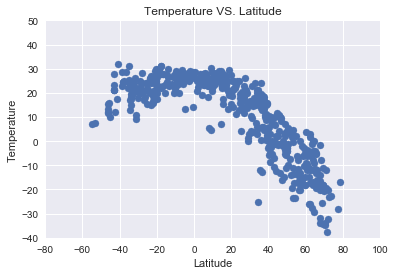
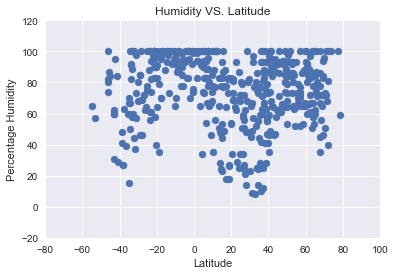
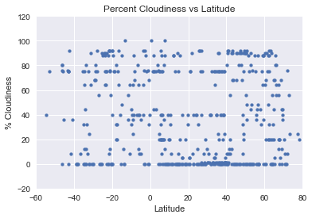
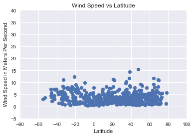

```python
# Three Observable Trends
# 1. The temperature increases as you approach the equator with peaks at -20 degrees and 20 degrees.
# 2. Just below the equator from 0 to -20 there no points with low humidity suggesting this is a very humid region. 
# 3. Windspeed noticeabley increases as you move away from the equator. 
```


```python
# Import dependencies and set keys
import requests
import pandas as pd
import matplotlib.pyplot as plt
from citipy import citipy
import seaborn as sns
import random
import numpy as np

url = "api.openweathermap.org/data/2.5/weather?"
api_key = "1554a148a00535035214c4ce3c74a8c7"
units = "metric"
```


```python
#Generate a list of random cities using random coordinates and the nearest city to those coordinates:

cities_list = []

while len(cities_list) < 1000:
    city = citipy.nearest_city(random.randrange(-90,90), random.randrange(-180,180)).city_name
    if city not in cities_list:
        cities_list.append(city)
```


```python
# Define Lists
temp = []
humidity = []
wind = []
cloudiness = []
open_weather_city_number = []
lat = []
lon = []
used_cities = []
process_number = 0
url = "api.openweathermap.org/data/2.5/weather?q="

# Query the API with Coordinates and create lists with Temperature, Humidity, Wind Speed, and Cloudiness Info.

for city in cities_list:
    if len(temp) < 500:
        query = f"http://{url}{city}&APPID={api_key}&units={units}"
        response = requests.get(query).json()
        
        #Add weather date to their appropriate lists:
        try:
            temp.append(response['main']['temp'])
            humidity.append(response['main']['humidity'])
            wind.append(response['wind']['speed'])
            cloudiness.append(response['clouds']['all'])
            open_weather_city_number.append(response['id'])
            lat.append(response['coord']['lat'])
            lon.append(response['coord']['lon'])
            used_cities.append(city)
            # Print the current process's information:
            process_number = process_number + 1
            print(f"{process_number}: Currently processing the city with the following information:")
            print(f"City ID Number: {response['id']}")
            print(f"City Name: {city}")
            print(f"Query url: {query}")
        except KeyError:
            print([response,city])
```

    1: Currently processing the city with the following information:
    City ID Number: 2110227
    City Name: butaritari
    Query url: http://api.openweathermap.org/data/2.5/weather?q=butaritari&APPID=1554a148a00535035214c4ce3c74a8c7&units=metric
    2: Currently processing the city with the following information:
    City ID Number: 3584003
    City Name: puerto el triunfo
    Query url: http://api.openweathermap.org/data/2.5/weather?q=puerto el triunfo&APPID=1554a148a00535035214c4ce3c74a8c7&units=metric
    3: Currently processing the city with the following information:
    City ID Number: 2152659
    City Name: port macquarie
    Query url: http://api.openweathermap.org/data/2.5/weather?q=port macquarie&APPID=1554a148a00535035214c4ce3c74a8c7&units=metric
    [{'cod': '404', 'message': 'city not found'}, 'chagda']
    4: Currently processing the city with the following information:
    City ID Number: 3694725
    City Name: moche
    Query url: http://api.openweathermap.org/data/2.5/weather?q=moche&APPID=1554a148a00535035214c4ce3c74a8c7&units=metric
    5: Currently processing the city with the following information:
    City ID Number: 4030556
    City Name: rikitea
    Query url: http://api.openweathermap.org/data/2.5/weather?q=rikitea&APPID=1554a148a00535035214c4ce3c74a8c7&units=metric
    6: Currently processing the city with the following information:
    City ID Number: 4020109
    City Name: atuona
    Query url: http://api.openweathermap.org/data/2.5/weather?q=atuona&APPID=1554a148a00535035214c4ce3c74a8c7&units=metric
    7: Currently processing the city with the following information:
    City ID Number: 2156643
    City Name: mount gambier
    Query url: http://api.openweathermap.org/data/2.5/weather?q=mount gambier&APPID=1554a148a00535035214c4ce3c74a8c7&units=metric
    8: Currently processing the city with the following information:
    City ID Number: 1485354
    City Name: zavodouspenskoye
    Query url: http://api.openweathermap.org/data/2.5/weather?q=zavodouspenskoye&APPID=1554a148a00535035214c4ce3c74a8c7&units=metric
    9: Currently processing the city with the following information:
    City ID Number: 2175403
    City Name: bluff
    Query url: http://api.openweathermap.org/data/2.5/weather?q=bluff&APPID=1554a148a00535035214c4ce3c74a8c7&units=metric
    [{'cod': '404', 'message': 'city not found'}, 'khagrachari']
    [{'cod': '404', 'message': 'city not found'}, 'taolanaro']
    10: Currently processing the city with the following information:
    City ID Number: 6185377
    City Name: yellowknife
    Query url: http://api.openweathermap.org/data/2.5/weather?q=yellowknife&APPID=1554a148a00535035214c4ce3c74a8c7&units=metric
    11: Currently processing the city with the following information:
    City ID Number: 5972291
    City Name: havre-saint-pierre
    Query url: http://api.openweathermap.org/data/2.5/weather?q=havre-saint-pierre&APPID=1554a148a00535035214c4ce3c74a8c7&units=metric
    12: Currently processing the city with the following information:
    City ID Number: 6243926
    City Name: seddon
    Query url: http://api.openweathermap.org/data/2.5/weather?q=seddon&APPID=1554a148a00535035214c4ce3c74a8c7&units=metric
    13: Currently processing the city with the following information:
    City ID Number: 4016734
    City Name: bucerias
    Query url: http://api.openweathermap.org/data/2.5/weather?q=bucerias&APPID=1554a148a00535035214c4ce3c74a8c7&units=metric
    14: Currently processing the city with the following information:
    City ID Number: 2447513
    City Name: arlit
    Query url: http://api.openweathermap.org/data/2.5/weather?q=arlit&APPID=1554a148a00535035214c4ce3c74a8c7&units=metric
    [{'cod': '404', 'message': 'city not found'}, 'samusu']
    15: Currently processing the city with the following information:
    City ID Number: 3372707
    City Name: ribeira grande
    Query url: http://api.openweathermap.org/data/2.5/weather?q=ribeira grande&APPID=1554a148a00535035214c4ce3c74a8c7&units=metric
    16: Currently processing the city with the following information:
    City ID Number: 2075265
    City Name: busselton
    Query url: http://api.openweathermap.org/data/2.5/weather?q=busselton&APPID=1554a148a00535035214c4ce3c74a8c7&units=metric
    17: Currently processing the city with the following information:
    City ID Number: 3974771
    City Name: praxedis guerrero
    Query url: http://api.openweathermap.org/data/2.5/weather?q=praxedis guerrero&APPID=1554a148a00535035214c4ce3c74a8c7&units=metric
    18: Currently processing the city with the following information:
    City ID Number: 1735634
    City Name: kuching
    Query url: http://api.openweathermap.org/data/2.5/weather?q=kuching&APPID=1554a148a00535035214c4ce3c74a8c7&units=metric
    19: Currently processing the city with the following information:
    City ID Number: 1274468
    City Name: chavakkad
    Query url: http://api.openweathermap.org/data/2.5/weather?q=chavakkad&APPID=1554a148a00535035214c4ce3c74a8c7&units=metric
    20: Currently processing the city with the following information:
    City ID Number: 2514651
    City Name: los llanos de aridane
    Query url: http://api.openweathermap.org/data/2.5/weather?q=los llanos de aridane&APPID=1554a148a00535035214c4ce3c74a8c7&units=metric
    21: Currently processing the city with the following information:
    City ID Number: 3874787
    City Name: punta arenas
    Query url: http://api.openweathermap.org/data/2.5/weather?q=punta arenas&APPID=1554a148a00535035214c4ce3c74a8c7&units=metric
    22: Currently processing the city with the following information:
    City ID Number: 3557758
    City Name: guane
    Query url: http://api.openweathermap.org/data/2.5/weather?q=guane&APPID=1554a148a00535035214c4ce3c74a8c7&units=metric
    23: Currently processing the city with the following information:
    City ID Number: 1651810
    City Name: airai
    Query url: http://api.openweathermap.org/data/2.5/weather?q=airai&APPID=1554a148a00535035214c4ce3c74a8c7&units=metric
    24: Currently processing the city with the following information:
    City ID Number: 3453439
    City Name: ponta do sol
    Query url: http://api.openweathermap.org/data/2.5/weather?q=ponta do sol&APPID=1554a148a00535035214c4ce3c74a8c7&units=metric
    25: Currently processing the city with the following information:
    City ID Number: 1785572
    City Name: yuxia
    Query url: http://api.openweathermap.org/data/2.5/weather?q=yuxia&APPID=1554a148a00535035214c4ce3c74a8c7&units=metric
    26: Currently processing the city with the following information:
    City ID Number: 1015776
    City Name: bredasdorp
    Query url: http://api.openweathermap.org/data/2.5/weather?q=bredasdorp&APPID=1554a148a00535035214c4ce3c74a8c7&units=metric
    27: Currently processing the city with the following information:
    City ID Number: 4031574
    City Name: provideniya
    Query url: http://api.openweathermap.org/data/2.5/weather?q=provideniya&APPID=1554a148a00535035214c4ce3c74a8c7&units=metric
    28: Currently processing the city with the following information:
    City ID Number: 2374583
    City Name: bubaque
    Query url: http://api.openweathermap.org/data/2.5/weather?q=bubaque&APPID=1554a148a00535035214c4ce3c74a8c7&units=metric
    29: Currently processing the city with the following information:
    City ID Number: 2138522
    City Name: poya
    Query url: http://api.openweathermap.org/data/2.5/weather?q=poya&APPID=1554a148a00535035214c4ce3c74a8c7&units=metric
    30: Currently processing the city with the following information:
    City ID Number: 344979
    City Name: lebu
    Query url: http://api.openweathermap.org/data/2.5/weather?q=lebu&APPID=1554a148a00535035214c4ce3c74a8c7&units=metric
    31: Currently processing the city with the following information:
    City ID Number: 3896218
    City Name: castro
    Query url: http://api.openweathermap.org/data/2.5/weather?q=castro&APPID=1554a148a00535035214c4ce3c74a8c7&units=metric
    32: Currently processing the city with the following information:
    City ID Number: 3461408
    City Name: ilheus
    Query url: http://api.openweathermap.org/data/2.5/weather?q=ilheus&APPID=1554a148a00535035214c4ce3c74a8c7&units=metric
    33: Currently processing the city with the following information:
    City ID Number: 1806840
    City Name: qidong
    Query url: http://api.openweathermap.org/data/2.5/weather?q=qidong&APPID=1554a148a00535035214c4ce3c74a8c7&units=metric
    34: Currently processing the city with the following information:
    City ID Number: 3366880
    City Name: hermanus
    Query url: http://api.openweathermap.org/data/2.5/weather?q=hermanus&APPID=1554a148a00535035214c4ce3c74a8c7&units=metric
    35: Currently processing the city with the following information:
    City ID Number: 964432
    City Name: port alfred
    Query url: http://api.openweathermap.org/data/2.5/weather?q=port alfred&APPID=1554a148a00535035214c4ce3c74a8c7&units=metric
    [{'cod': '404', 'message': 'city not found'}, 'falealupo']
    36: Currently processing the city with the following information:
    City ID Number: 262462
    City Name: saint george
    Query url: http://api.openweathermap.org/data/2.5/weather?q=saint george&APPID=1554a148a00535035214c4ce3c74a8c7&units=metric
    37: Currently processing the city with the following information:
    City ID Number: 3835994
    City Name: santa rosa
    Query url: http://api.openweathermap.org/data/2.5/weather?q=santa rosa&APPID=1554a148a00535035214c4ce3c74a8c7&units=metric
    38: Currently processing the city with the following information:
    City ID Number: 5106834
    City Name: albany
    Query url: http://api.openweathermap.org/data/2.5/weather?q=albany&APPID=1554a148a00535035214c4ce3c74a8c7&units=metric
    39: Currently processing the city with the following information:
    City ID Number: 1701054
    City Name: marawi
    Query url: http://api.openweathermap.org/data/2.5/weather?q=marawi&APPID=1554a148a00535035214c4ce3c74a8c7&units=metric
    40: Currently processing the city with the following information:
    City ID Number: 3833859
    City Name: barrow
    Query url: http://api.openweathermap.org/data/2.5/weather?q=barrow&APPID=1554a148a00535035214c4ce3c74a8c7&units=metric
    41: Currently processing the city with the following information:
    City ID Number: 2069194
    City Name: jamestown
    Query url: http://api.openweathermap.org/data/2.5/weather?q=jamestown&APPID=1554a148a00535035214c4ce3c74a8c7&units=metric
    42: Currently processing the city with the following information:
    City ID Number: 1273574
    City Name: vaini
    Query url: http://api.openweathermap.org/data/2.5/weather?q=vaini&APPID=1554a148a00535035214c4ce3c74a8c7&units=metric
    43: Currently processing the city with the following information:
    City ID Number: 3378644
    City Name: georgetown
    Query url: http://api.openweathermap.org/data/2.5/weather?q=georgetown&APPID=1554a148a00535035214c4ce3c74a8c7&units=metric
    44: Currently processing the city with the following information:
    City ID Number: 5855927
    City Name: hilo
    Query url: http://api.openweathermap.org/data/2.5/weather?q=hilo&APPID=1554a148a00535035214c4ce3c74a8c7&units=metric
    45: Currently processing the city with the following information:
    City ID Number: 3437689
    City Name: naranjal
    Query url: http://api.openweathermap.org/data/2.5/weather?q=naranjal&APPID=1554a148a00535035214c4ce3c74a8c7&units=metric
    46: Currently processing the city with the following information:
    City ID Number: 5314245
    City Name: show low
    Query url: http://api.openweathermap.org/data/2.5/weather?q=show low&APPID=1554a148a00535035214c4ce3c74a8c7&units=metric
    47: Currently processing the city with the following information:
    City ID Number: 2208248
    City Name: kaitangata
    Query url: http://api.openweathermap.org/data/2.5/weather?q=kaitangata&APPID=1554a148a00535035214c4ce3c74a8c7&units=metric
    48: Currently processing the city with the following information:
    City ID Number: 2618795
    City Name: klaksvik
    Query url: http://api.openweathermap.org/data/2.5/weather?q=klaksvik&APPID=1554a148a00535035214c4ce3c74a8c7&units=metric
    [{'cod': '404', 'message': 'city not found'}, 'santa eulalia del rio']
    [{'cod': '404', 'message': 'city not found'}, 'illoqqortoormiut']
    49: Currently processing the city with the following information:
    City ID Number: 3369157
    City Name: cape town
    Query url: http://api.openweathermap.org/data/2.5/weather?q=cape town&APPID=1554a148a00535035214c4ce3c74a8c7&units=metric
    50: Currently processing the city with the following information:
    City ID Number: 5919815
    City Name: channel-port aux basques
    Query url: http://api.openweathermap.org/data/2.5/weather?q=channel-port aux basques&APPID=1554a148a00535035214c4ce3c74a8c7&units=metric
    51: Currently processing the city with the following information:
    City ID Number: 2094342
    City Name: kavieng
    Query url: http://api.openweathermap.org/data/2.5/weather?q=kavieng&APPID=1554a148a00535035214c4ce3c74a8c7&units=metric
    52: Currently processing the city with the following information:
    City ID Number: 2271926
    City Name: almeirim
    Query url: http://api.openweathermap.org/data/2.5/weather?q=almeirim&APPID=1554a148a00535035214c4ce3c74a8c7&units=metric
    53: Currently processing the city with the following information:
    City ID Number: 3652462
    City Name: san cristobal
    Query url: http://api.openweathermap.org/data/2.5/weather?q=san cristobal&APPID=1554a148a00535035214c4ce3c74a8c7&units=metric
    54: Currently processing the city with the following information:
    City ID Number: 2790471
    City Name: hun
    Query url: http://api.openweathermap.org/data/2.5/weather?q=hun&APPID=1554a148a00535035214c4ce3c74a8c7&units=metric
    55: Currently processing the city with the following information:
    City ID Number: 3517970
    City Name: pochutla
    Query url: http://api.openweathermap.org/data/2.5/weather?q=pochutla&APPID=1554a148a00535035214c4ce3c74a8c7&units=metric
    56: Currently processing the city with the following information:
    City ID Number: 3471422
    City Name: arroio grande
    Query url: http://api.openweathermap.org/data/2.5/weather?q=arroio grande&APPID=1554a148a00535035214c4ce3c74a8c7&units=metric
    57: Currently processing the city with the following information:
    City ID Number: 2439155
    City Name: tanout
    Query url: http://api.openweathermap.org/data/2.5/weather?q=tanout&APPID=1554a148a00535035214c4ce3c74a8c7&units=metric
    58: Currently processing the city with the following information:
    City ID Number: 3647444
    City Name: calabozo
    Query url: http://api.openweathermap.org/data/2.5/weather?q=calabozo&APPID=1554a148a00535035214c4ce3c74a8c7&units=metric
    59: Currently processing the city with the following information:
    City ID Number: 1493110
    City Name: samus
    Query url: http://api.openweathermap.org/data/2.5/weather?q=samus&APPID=1554a148a00535035214c4ce3c74a8c7&units=metric
    60: Currently processing the city with the following information:
    City ID Number: 1731248
    City Name: alugan
    Query url: http://api.openweathermap.org/data/2.5/weather?q=alugan&APPID=1554a148a00535035214c4ce3c74a8c7&units=metric
    61: Currently processing the city with the following information:
    City ID Number: 1803560
    City Name: lingao
    Query url: http://api.openweathermap.org/data/2.5/weather?q=lingao&APPID=1554a148a00535035214c4ce3c74a8c7&units=metric
    [{'cod': '404', 'message': 'city not found'}, 'belushya guba']
    62: Currently processing the city with the following information:
    City ID Number: 6255012
    City Name: flinders
    Query url: http://api.openweathermap.org/data/2.5/weather?q=flinders&APPID=1554a148a00535035214c4ce3c74a8c7&units=metric
    63: Currently processing the city with the following information:
    City ID Number: 4501427
    City Name: port elizabeth
    Query url: http://api.openweathermap.org/data/2.5/weather?q=port elizabeth&APPID=1554a148a00535035214c4ce3c74a8c7&units=metric
    64: Currently processing the city with the following information:
    City ID Number: 1528998
    City Name: yumen
    Query url: http://api.openweathermap.org/data/2.5/weather?q=yumen&APPID=1554a148a00535035214c4ce3c74a8c7&units=metric
    65: Currently processing the city with the following information:
    City ID Number: 1213855
    City Name: sibolga
    Query url: http://api.openweathermap.org/data/2.5/weather?q=sibolga&APPID=1554a148a00535035214c4ce3c74a8c7&units=metric
    66: Currently processing the city with the following information:
    City ID Number: 2155415
    City Name: new norfolk
    Query url: http://api.openweathermap.org/data/2.5/weather?q=new norfolk&APPID=1554a148a00535035214c4ce3c74a8c7&units=metric
    67: Currently processing the city with the following information:
    City ID Number: 5848280
    City Name: kapaa
    Query url: http://api.openweathermap.org/data/2.5/weather?q=kapaa&APPID=1554a148a00535035214c4ce3c74a8c7&units=metric
    68: Currently processing the city with the following information:
    City ID Number: 3833367
    City Name: ushuaia
    Query url: http://api.openweathermap.org/data/2.5/weather?q=ushuaia&APPID=1554a148a00535035214c4ce3c74a8c7&units=metric
    69: Currently processing the city with the following information:
    City ID Number: 3374083
    City Name: bathsheba
    Query url: http://api.openweathermap.org/data/2.5/weather?q=bathsheba&APPID=1554a148a00535035214c4ce3c74a8c7&units=metric
    70: Currently processing the city with the following information:
    City ID Number: 5847411
    City Name: kahului
    Query url: http://api.openweathermap.org/data/2.5/weather?q=kahului&APPID=1554a148a00535035214c4ce3c74a8c7&units=metric
    [{'cod': '404', 'message': 'city not found'}, 'vaitupu']
    71: Currently processing the city with the following information:
    City ID Number: 6201424
    City Name: mataura
    Query url: http://api.openweathermap.org/data/2.5/weather?q=mataura&APPID=1554a148a00535035214c4ce3c74a8c7&units=metric
    [{'cod': '404', 'message': 'city not found'}, 'galgani']
    [{'cod': '404', 'message': 'city not found'}, 'tsihombe']
    72: Currently processing the city with the following information:
    City ID Number: 2163355
    City Name: hobart
    Query url: http://api.openweathermap.org/data/2.5/weather?q=hobart&APPID=1554a148a00535035214c4ce3c74a8c7&units=metric
    73: Currently processing the city with the following information:
    City ID Number: 535839
    City Name: leshukonskoye
    Query url: http://api.openweathermap.org/data/2.5/weather?q=leshukonskoye&APPID=1554a148a00535035214c4ce3c74a8c7&units=metric
    74: Currently processing the city with the following information:
    City ID Number: 3359638
    City Name: walvis bay
    Query url: http://api.openweathermap.org/data/2.5/weather?q=walvis bay&APPID=1554a148a00535035214c4ce3c74a8c7&units=metric
    75: Currently processing the city with the following information:
    City ID Number: 6693679
    City Name: gizo
    Query url: http://api.openweathermap.org/data/2.5/weather?q=gizo&APPID=1554a148a00535035214c4ce3c74a8c7&units=metric
    76: Currently processing the city with the following information:
    City ID Number: 3671519
    City Name: puerto carreno
    Query url: http://api.openweathermap.org/data/2.5/weather?q=puerto carreno&APPID=1554a148a00535035214c4ce3c74a8c7&units=metric
    77: Currently processing the city with the following information:
    City ID Number: 1014034
    City Name: carnarvon
    Query url: http://api.openweathermap.org/data/2.5/weather?q=carnarvon&APPID=1554a148a00535035214c4ce3c74a8c7&units=metric
    78: Currently processing the city with the following information:
    City ID Number: 2112802
    City Name: hasaki
    Query url: http://api.openweathermap.org/data/2.5/weather?q=hasaki&APPID=1554a148a00535035214c4ce3c74a8c7&units=metric
    79: Currently processing the city with the following information:
    City ID Number: 4036284
    City Name: alofi
    Query url: http://api.openweathermap.org/data/2.5/weather?q=alofi&APPID=1554a148a00535035214c4ce3c74a8c7&units=metric
    80: Currently processing the city with the following information:
    City ID Number: 1688696
    City Name: san policarpo
    Query url: http://api.openweathermap.org/data/2.5/weather?q=san policarpo&APPID=1554a148a00535035214c4ce3c74a8c7&units=metric
    81: Currently processing the city with the following information:
    City ID Number: 2136825
    City Name: isangel
    Query url: http://api.openweathermap.org/data/2.5/weather?q=isangel&APPID=1554a148a00535035214c4ce3c74a8c7&units=metric
    82: Currently processing the city with the following information:
    City ID Number: 3464008
    City Name: esmeraldas
    Query url: http://api.openweathermap.org/data/2.5/weather?q=esmeraldas&APPID=1554a148a00535035214c4ce3c74a8c7&units=metric
    83: Currently processing the city with the following information:
    City ID Number: 1282256
    City Name: hithadhoo
    Query url: http://api.openweathermap.org/data/2.5/weather?q=hithadhoo&APPID=1554a148a00535035214c4ce3c74a8c7&units=metric
    [{'cod': '404', 'message': 'city not found'}, 'babanusah']
    84: Currently processing the city with the following information:
    City ID Number: 296852
    City Name: erzin
    Query url: http://api.openweathermap.org/data/2.5/weather?q=erzin&APPID=1554a148a00535035214c4ce3c74a8c7&units=metric
    85: Currently processing the city with the following information:
    City ID Number: 1714733
    City Name: dingle
    Query url: http://api.openweathermap.org/data/2.5/weather?q=dingle&APPID=1554a148a00535035214c4ce3c74a8c7&units=metric
    86: Currently processing the city with the following information:
    City ID Number: 934479
    City Name: grand gaube
    Query url: http://api.openweathermap.org/data/2.5/weather?q=grand gaube&APPID=1554a148a00535035214c4ce3c74a8c7&units=metric
    87: Currently processing the city with the following information:
    City ID Number: 2172880
    City Name: byron bay
    Query url: http://api.openweathermap.org/data/2.5/weather?q=byron bay&APPID=1554a148a00535035214c4ce3c74a8c7&units=metric
    88: Currently processing the city with the following information:
    City ID Number: 3418910
    City Name: upernavik
    Query url: http://api.openweathermap.org/data/2.5/weather?q=upernavik&APPID=1554a148a00535035214c4ce3c74a8c7&units=metric
    89: Currently processing the city with the following information:
    City ID Number: 4013704
    City Name: laguna
    Query url: http://api.openweathermap.org/data/2.5/weather?q=laguna&APPID=1554a148a00535035214c4ce3c74a8c7&units=metric
    90: Currently processing the city with the following information:
    City ID Number: 2122614
    City Name: okha
    Query url: http://api.openweathermap.org/data/2.5/weather?q=okha&APPID=1554a148a00535035214c4ce3c74a8c7&units=metric
    91: Currently processing the city with the following information:
    City ID Number: 2013465
    City Name: verkhoyansk
    Query url: http://api.openweathermap.org/data/2.5/weather?q=verkhoyansk&APPID=1554a148a00535035214c4ce3c74a8c7&units=metric
    92: Currently processing the city with the following information:
    City ID Number: 1715335
    City Name: davila
    Query url: http://api.openweathermap.org/data/2.5/weather?q=davila&APPID=1554a148a00535035214c4ce3c74a8c7&units=metric
    93: Currently processing the city with the following information:
    City ID Number: 933186
    City Name: orapa
    Query url: http://api.openweathermap.org/data/2.5/weather?q=orapa&APPID=1554a148a00535035214c4ce3c74a8c7&units=metric
    94: Currently processing the city with the following information:
    City ID Number: 1259385
    City Name: port blair
    Query url: http://api.openweathermap.org/data/2.5/weather?q=port blair&APPID=1554a148a00535035214c4ce3c74a8c7&units=metric
    95: Currently processing the city with the following information:
    City ID Number: 5509851
    City Name: pahrump
    Query url: http://api.openweathermap.org/data/2.5/weather?q=pahrump&APPID=1554a148a00535035214c4ce3c74a8c7&units=metric
    96: Currently processing the city with the following information:
    City ID Number: 1788268
    City Name: dongsheng
    Query url: http://api.openweathermap.org/data/2.5/weather?q=dongsheng&APPID=1554a148a00535035214c4ce3c74a8c7&units=metric
    97: Currently processing the city with the following information:
    City ID Number: 1633419
    City Name: padang
    Query url: http://api.openweathermap.org/data/2.5/weather?q=padang&APPID=1554a148a00535035214c4ce3c74a8c7&units=metric
    98: Currently processing the city with the following information:
    City ID Number: 6171633
    City Name: ucluelet
    Query url: http://api.openweathermap.org/data/2.5/weather?q=ucluelet&APPID=1554a148a00535035214c4ce3c74a8c7&units=metric
    99: Currently processing the city with the following information:
    City ID Number: 5866063
    City Name: kenai
    Query url: http://api.openweathermap.org/data/2.5/weather?q=kenai&APPID=1554a148a00535035214c4ce3c74a8c7&units=metric
    100: Currently processing the city with the following information:
    City ID Number: 4267710
    City Name: sitka
    Query url: http://api.openweathermap.org/data/2.5/weather?q=sitka&APPID=1554a148a00535035214c4ce3c74a8c7&units=metric
    101: Currently processing the city with the following information:
    City ID Number: 3985710
    City Name: cabo san lucas
    Query url: http://api.openweathermap.org/data/2.5/weather?q=cabo san lucas&APPID=1554a148a00535035214c4ce3c74a8c7&units=metric
    102: Currently processing the city with the following information:
    City ID Number: 3932145
    City Name: pisco
    Query url: http://api.openweathermap.org/data/2.5/weather?q=pisco&APPID=1554a148a00535035214c4ce3c74a8c7&units=metric
    103: Currently processing the city with the following information:
    City ID Number: 3382160
    City Name: cayenne
    Query url: http://api.openweathermap.org/data/2.5/weather?q=cayenne&APPID=1554a148a00535035214c4ce3c74a8c7&units=metric
    104: Currently processing the city with the following information:
    City ID Number: 4912698
    City Name: streator
    Query url: http://api.openweathermap.org/data/2.5/weather?q=streator&APPID=1554a148a00535035214c4ce3c74a8c7&units=metric
    105: Currently processing the city with the following information:
    City ID Number: 3870243
    City Name: taltal
    Query url: http://api.openweathermap.org/data/2.5/weather?q=taltal&APPID=1554a148a00535035214c4ce3c74a8c7&units=metric
    106: Currently processing the city with the following information:
    City ID Number: 6165406
    City Name: thompson
    Query url: http://api.openweathermap.org/data/2.5/weather?q=thompson&APPID=1554a148a00535035214c4ce3c74a8c7&units=metric
    107: Currently processing the city with the following information:
    City ID Number: 2278158
    City Name: buchanan
    Query url: http://api.openweathermap.org/data/2.5/weather?q=buchanan&APPID=1554a148a00535035214c4ce3c74a8c7&units=metric
    108: Currently processing the city with the following information:
    City ID Number: 3831208
    City Name: qaanaaq
    Query url: http://api.openweathermap.org/data/2.5/weather?q=qaanaaq&APPID=1554a148a00535035214c4ce3c74a8c7&units=metric
    109: Currently processing the city with the following information:
    City ID Number: 2121385
    City Name: severo-kurilsk
    Query url: http://api.openweathermap.org/data/2.5/weather?q=severo-kurilsk&APPID=1554a148a00535035214c4ce3c74a8c7&units=metric
    110: Currently processing the city with the following information:
    City ID Number: 2171722
    City Name: charters towers
    Query url: http://api.openweathermap.org/data/2.5/weather?q=charters towers&APPID=1554a148a00535035214c4ce3c74a8c7&units=metric
    111: Currently processing the city with the following information:
    City ID Number: 4000900
    City Name: la paz
    Query url: http://api.openweathermap.org/data/2.5/weather?q=la paz&APPID=1554a148a00535035214c4ce3c74a8c7&units=metric
    112: Currently processing the city with the following information:
    City ID Number: 933644
    City Name: ghanzi
    Query url: http://api.openweathermap.org/data/2.5/weather?q=ghanzi&APPID=1554a148a00535035214c4ce3c74a8c7&units=metric
    113: Currently processing the city with the following information:
    City ID Number: 1337610
    City Name: thinadhoo
    Query url: http://api.openweathermap.org/data/2.5/weather?q=thinadhoo&APPID=1554a148a00535035214c4ce3c74a8c7&units=metric
    114: Currently processing the city with the following information:
    City ID Number: 1242110
    City Name: kalmunai
    Query url: http://api.openweathermap.org/data/2.5/weather?q=kalmunai&APPID=1554a148a00535035214c4ce3c74a8c7&units=metric
    115: Currently processing the city with the following information:
    City ID Number: 4034551
    City Name: faanui
    Query url: http://api.openweathermap.org/data/2.5/weather?q=faanui&APPID=1554a148a00535035214c4ce3c74a8c7&units=metric
    116: Currently processing the city with the following information:
    City ID Number: 5386035
    City Name: rancho palos verdes
    Query url: http://api.openweathermap.org/data/2.5/weather?q=rancho palos verdes&APPID=1554a148a00535035214c4ce3c74a8c7&units=metric
    117: Currently processing the city with the following information:
    City ID Number: 2122493
    City Name: omsukchan
    Query url: http://api.openweathermap.org/data/2.5/weather?q=omsukchan&APPID=1554a148a00535035214c4ce3c74a8c7&units=metric
    118: Currently processing the city with the following information:
    City ID Number: 3220813
    City Name: wanning
    Query url: http://api.openweathermap.org/data/2.5/weather?q=wanning&APPID=1554a148a00535035214c4ce3c74a8c7&units=metric
    119: Currently processing the city with the following information:
    City ID Number: 2995603
    City Name: saint-pierre
    Query url: http://api.openweathermap.org/data/2.5/weather?q=saint-pierre&APPID=1554a148a00535035214c4ce3c74a8c7&units=metric
    120: Currently processing the city with the following information:
    City ID Number: 2630299
    City Name: hofn
    Query url: http://api.openweathermap.org/data/2.5/weather?q=hofn&APPID=1554a148a00535035214c4ce3c74a8c7&units=metric
    121: Currently processing the city with the following information:
    City ID Number: 2063042
    City Name: port hedland
    Query url: http://api.openweathermap.org/data/2.5/weather?q=port hedland&APPID=1554a148a00535035214c4ce3c74a8c7&units=metric
    [{'cod': '404', 'message': 'city not found'}, 'barentsburg']
    122: Currently processing the city with the following information:
    City ID Number: 3374120
    City Name: vila do maio
    Query url: http://api.openweathermap.org/data/2.5/weather?q=vila do maio&APPID=1554a148a00535035214c4ce3c74a8c7&units=metric
    [{'cod': '404', 'message': 'city not found'}, 'grand river south east']
    [{'cod': '404', 'message': 'city not found'}, 'kuche']
    123: Currently processing the city with the following information:
    City ID Number: 1630662
    City Name: praya
    Query url: http://api.openweathermap.org/data/2.5/weather?q=praya&APPID=1554a148a00535035214c4ce3c74a8c7&units=metric
    124: Currently processing the city with the following information:
    City ID Number: 2647984
    City Name: great yarmouth
    Query url: http://api.openweathermap.org/data/2.5/weather?q=great yarmouth&APPID=1554a148a00535035214c4ce3c74a8c7&units=metric
    125: Currently processing the city with the following information:
    City ID Number: 2446796
    City Name: bilma
    Query url: http://api.openweathermap.org/data/2.5/weather?q=bilma&APPID=1554a148a00535035214c4ce3c74a8c7&units=metric
    126: Currently processing the city with the following information:
    City ID Number: 5983720
    City Name: iqaluit
    Query url: http://api.openweathermap.org/data/2.5/weather?q=iqaluit&APPID=1554a148a00535035214c4ce3c74a8c7&units=metric
    127: Currently processing the city with the following information:
    City ID Number: 3035883
    City Name: autun
    Query url: http://api.openweathermap.org/data/2.5/weather?q=autun&APPID=1554a148a00535035214c4ce3c74a8c7&units=metric
    128: Currently processing the city with the following information:
    City ID Number: 2126123
    City Name: chokurdakh
    Query url: http://api.openweathermap.org/data/2.5/weather?q=chokurdakh&APPID=1554a148a00535035214c4ce3c74a8c7&units=metric
    129: Currently processing the city with the following information:
    City ID Number: 2249901
    City Name: gat
    Query url: http://api.openweathermap.org/data/2.5/weather?q=gat&APPID=1554a148a00535035214c4ce3c74a8c7&units=metric
    130: Currently processing the city with the following information:
    City ID Number: 286245
    City Name: sur
    Query url: http://api.openweathermap.org/data/2.5/weather?q=sur&APPID=1554a148a00535035214c4ce3c74a8c7&units=metric
    131: Currently processing the city with the following information:
    City ID Number: 504294
    City Name: puchezh
    Query url: http://api.openweathermap.org/data/2.5/weather?q=puchezh&APPID=1554a148a00535035214c4ce3c74a8c7&units=metric
    132: Currently processing the city with the following information:
    City ID Number: 2472431
    City Name: bin qirdan
    Query url: http://api.openweathermap.org/data/2.5/weather?q=bin qirdan&APPID=1554a148a00535035214c4ce3c74a8c7&units=metric
    133: Currently processing the city with the following information:
    City ID Number: 1258501
    City Name: rangapara
    Query url: http://api.openweathermap.org/data/2.5/weather?q=rangapara&APPID=1554a148a00535035214c4ce3c74a8c7&units=metric
    134: Currently processing the city with the following information:
    City ID Number: 3995523
    City Name: monclova
    Query url: http://api.openweathermap.org/data/2.5/weather?q=monclova&APPID=1554a148a00535035214c4ce3c74a8c7&units=metric
    135: Currently processing the city with the following information:
    City ID Number: 2180815
    City Name: tuatapere
    Query url: http://api.openweathermap.org/data/2.5/weather?q=tuatapere&APPID=1554a148a00535035214c4ce3c74a8c7&units=metric
    136: Currently processing the city with the following information:
    City ID Number: 553725
    City Name: kamenka
    Query url: http://api.openweathermap.org/data/2.5/weather?q=kamenka&APPID=1554a148a00535035214c4ce3c74a8c7&units=metric
    137: Currently processing the city with the following information:
    City ID Number: 2297810
    City Name: mumford
    Query url: http://api.openweathermap.org/data/2.5/weather?q=mumford&APPID=1554a148a00535035214c4ce3c74a8c7&units=metric
    138: Currently processing the city with the following information:
    City ID Number: 1024552
    City Name: xai-xai
    Query url: http://api.openweathermap.org/data/2.5/weather?q=xai-xai&APPID=1554a148a00535035214c4ce3c74a8c7&units=metric
    139: Currently processing the city with the following information:
    City ID Number: 3372472
    City Name: vila franca do campo
    Query url: http://api.openweathermap.org/data/2.5/weather?q=vila franca do campo&APPID=1554a148a00535035214c4ce3c74a8c7&units=metric
    140: Currently processing the city with the following information:
    City ID Number: 2033196
    City Name: zhangjiakou
    Query url: http://api.openweathermap.org/data/2.5/weather?q=zhangjiakou&APPID=1554a148a00535035214c4ce3c74a8c7&units=metric
    141: Currently processing the city with the following information:
    City ID Number: 1254046
    City Name: tura
    Query url: http://api.openweathermap.org/data/2.5/weather?q=tura&APPID=1554a148a00535035214c4ce3c74a8c7&units=metric
    142: Currently processing the city with the following information:
    City ID Number: 2013279
    City Name: vostok
    Query url: http://api.openweathermap.org/data/2.5/weather?q=vostok&APPID=1554a148a00535035214c4ce3c74a8c7&units=metric
    143: Currently processing the city with the following information:
    City ID Number: 3459785
    City Name: joao pinheiro
    Query url: http://api.openweathermap.org/data/2.5/weather?q=joao pinheiro&APPID=1554a148a00535035214c4ce3c74a8c7&units=metric
    [{'cod': '404', 'message': 'city not found'}, 'phan rang']
    144: Currently processing the city with the following information:
    City ID Number: 3430545
    City Name: san miguel
    Query url: http://api.openweathermap.org/data/2.5/weather?q=san miguel&APPID=1554a148a00535035214c4ce3c74a8c7&units=metric
    145: Currently processing the city with the following information:
    City ID Number: 3892454
    City Name: diego de almagro
    Query url: http://api.openweathermap.org/data/2.5/weather?q=diego de almagro&APPID=1554a148a00535035214c4ce3c74a8c7&units=metric
    146: Currently processing the city with the following information:
    City ID Number: 3833859
    City Name: tres arroyos
    Query url: http://api.openweathermap.org/data/2.5/weather?q=tres arroyos&APPID=1554a148a00535035214c4ce3c74a8c7&units=metric
    [{'cod': '404', 'message': 'city not found'}, 'qurayyat']
    147: Currently processing the city with the following information:
    City ID Number: 2508813
    City Name: adrar
    Query url: http://api.openweathermap.org/data/2.5/weather?q=adrar&APPID=1554a148a00535035214c4ce3c74a8c7&units=metric
    148: Currently processing the city with the following information:
    City ID Number: 1489853
    City Name: tazovskiy
    Query url: http://api.openweathermap.org/data/2.5/weather?q=tazovskiy&APPID=1554a148a00535035214c4ce3c74a8c7&units=metric
    149: Currently processing the city with the following information:
    City ID Number: 556268
    City Name: ostrovnoy
    Query url: http://api.openweathermap.org/data/2.5/weather?q=ostrovnoy&APPID=1554a148a00535035214c4ce3c74a8c7&units=metric
    [{'cod': '404', 'message': 'city not found'}, 'taburi']
    150: Currently processing the city with the following information:
    City ID Number: 2181625
    City Name: te anau
    Query url: http://api.openweathermap.org/data/2.5/weather?q=te anau&APPID=1554a148a00535035214c4ce3c74a8c7&units=metric
    151: Currently processing the city with the following information:
    City ID Number: 4035715
    City Name: avarua
    Query url: http://api.openweathermap.org/data/2.5/weather?q=avarua&APPID=1554a148a00535035214c4ce3c74a8c7&units=metric
    152: Currently processing the city with the following information:
    City ID Number: 2126493
    City Name: boshnyakovo
    Query url: http://api.openweathermap.org/data/2.5/weather?q=boshnyakovo&APPID=1554a148a00535035214c4ce3c74a8c7&units=metric
    153: Currently processing the city with the following information:
    City ID Number: 3421765
    City Name: nanortalik
    Query url: http://api.openweathermap.org/data/2.5/weather?q=nanortalik&APPID=1554a148a00535035214c4ce3c74a8c7&units=metric
    154: Currently processing the city with the following information:
    City ID Number: 2090021
    City Name: namatanai
    Query url: http://api.openweathermap.org/data/2.5/weather?q=namatanai&APPID=1554a148a00535035214c4ce3c74a8c7&units=metric
    155: Currently processing the city with the following information:
    City ID Number: 4031637
    City Name: lavrentiya
    Query url: http://api.openweathermap.org/data/2.5/weather?q=lavrentiya&APPID=1554a148a00535035214c4ce3c74a8c7&units=metric
    [{'cod': '404', 'message': 'city not found'}, 'krasnoselkup']
    156: Currently processing the city with the following information:
    City ID Number: 3469058
    City Name: taguatinga
    Query url: http://api.openweathermap.org/data/2.5/weather?q=taguatinga&APPID=1554a148a00535035214c4ce3c74a8c7&units=metric
    157: Currently processing the city with the following information:
    City ID Number: 3466165
    City Name: cidreira
    Query url: http://api.openweathermap.org/data/2.5/weather?q=cidreira&APPID=1554a148a00535035214c4ce3c74a8c7&units=metric
    158: Currently processing the city with the following information:
    City ID Number: 4174715
    City Name: tallahassee
    Query url: http://api.openweathermap.org/data/2.5/weather?q=tallahassee&APPID=1554a148a00535035214c4ce3c74a8c7&units=metric
    159: Currently processing the city with the following information:
    City ID Number: 3374210
    City Name: sao filipe
    Query url: http://api.openweathermap.org/data/2.5/weather?q=sao filipe&APPID=1554a148a00535035214c4ce3c74a8c7&units=metric
    160: Currently processing the city with the following information:
    City ID Number: 6100832
    City Name: pembroke
    Query url: http://api.openweathermap.org/data/2.5/weather?q=pembroke&APPID=1554a148a00535035214c4ce3c74a8c7&units=metric
    161: Currently processing the city with the following information:
    City ID Number: 1627549
    City Name: cilegon
    Query url: http://api.openweathermap.org/data/2.5/weather?q=cilegon&APPID=1554a148a00535035214c4ce3c74a8c7&units=metric
    162: Currently processing the city with the following information:
    City ID Number: 153955
    City Name: micheweni
    Query url: http://api.openweathermap.org/data/2.5/weather?q=micheweni&APPID=1554a148a00535035214c4ce3c74a8c7&units=metric
    163: Currently processing the city with the following information:
    City ID Number: 3893629
    City Name: coquimbo
    Query url: http://api.openweathermap.org/data/2.5/weather?q=coquimbo&APPID=1554a148a00535035214c4ce3c74a8c7&units=metric
    164: Currently processing the city with the following information:
    City ID Number: 1005781
    City Name: elliot
    Query url: http://api.openweathermap.org/data/2.5/weather?q=elliot&APPID=1554a148a00535035214c4ce3c74a8c7&units=metric
    165: Currently processing the city with the following information:
    City ID Number: 3026644
    City Name: souillac
    Query url: http://api.openweathermap.org/data/2.5/weather?q=souillac&APPID=1554a148a00535035214c4ce3c74a8c7&units=metric
    [{'cod': '404', 'message': 'city not found'}, 'urdzhar']
    166: Currently processing the city with the following information:
    City ID Number: 3356832
    City Name: henties bay
    Query url: http://api.openweathermap.org/data/2.5/weather?q=henties bay&APPID=1554a148a00535035214c4ce3c74a8c7&units=metric
    167: Currently processing the city with the following information:
    City ID Number: 2396518
    City Name: port-gentil
    Query url: http://api.openweathermap.org/data/2.5/weather?q=port-gentil&APPID=1554a148a00535035214c4ce3c74a8c7&units=metric
    168: Currently processing the city with the following information:
    City ID Number: 1786538
    City Name: yining
    Query url: http://api.openweathermap.org/data/2.5/weather?q=yining&APPID=1554a148a00535035214c4ce3c74a8c7&units=metric
    169: Currently processing the city with the following information:
    City ID Number: 146639
    City Name: lasa
    Query url: http://api.openweathermap.org/data/2.5/weather?q=lasa&APPID=1554a148a00535035214c4ce3c74a8c7&units=metric
    170: Currently processing the city with the following information:
    City ID Number: 2377450
    City Name: nouakchott
    Query url: http://api.openweathermap.org/data/2.5/weather?q=nouakchott&APPID=1554a148a00535035214c4ce3c74a8c7&units=metric
    171: Currently processing the city with the following information:
    City ID Number: 1733782
    City Name: victoria
    Query url: http://api.openweathermap.org/data/2.5/weather?q=victoria&APPID=1554a148a00535035214c4ce3c74a8c7&units=metric
    172: Currently processing the city with the following information:
    City ID Number: 2172797
    City Name: cairns
    Query url: http://api.openweathermap.org/data/2.5/weather?q=cairns&APPID=1554a148a00535035214c4ce3c74a8c7&units=metric
    173: Currently processing the city with the following information:
    City ID Number: 2172153
    City Name: casino
    Query url: http://api.openweathermap.org/data/2.5/weather?q=casino&APPID=1554a148a00535035214c4ce3c74a8c7&units=metric
    174: Currently processing the city with the following information:
    City ID Number: 133595
    City Name: lar
    Query url: http://api.openweathermap.org/data/2.5/weather?q=lar&APPID=1554a148a00535035214c4ce3c74a8c7&units=metric
    175: Currently processing the city with the following information:
    City ID Number: 3652764
    City Name: puerto ayora
    Query url: http://api.openweathermap.org/data/2.5/weather?q=puerto ayora&APPID=1554a148a00535035214c4ce3c74a8c7&units=metric
    176: Currently processing the city with the following information:
    City ID Number: 3863379
    City Name: mar del plata
    Query url: http://api.openweathermap.org/data/2.5/weather?q=mar del plata&APPID=1554a148a00535035214c4ce3c74a8c7&units=metric
    177: Currently processing the city with the following information:
    City ID Number: 64814
    City Name: bandarbeyla
    Query url: http://api.openweathermap.org/data/2.5/weather?q=bandarbeyla&APPID=1554a148a00535035214c4ce3c74a8c7&units=metric
    178: Currently processing the city with the following information:
    City ID Number: 2028164
    City Name: deputatskiy
    Query url: http://api.openweathermap.org/data/2.5/weather?q=deputatskiy&APPID=1554a148a00535035214c4ce3c74a8c7&units=metric
    179: Currently processing the city with the following information:
    City ID Number: 986717
    City Name: kruisfontein
    Query url: http://api.openweathermap.org/data/2.5/weather?q=kruisfontein&APPID=1554a148a00535035214c4ce3c74a8c7&units=metric
    180: Currently processing the city with the following information:
    City ID Number: 1795424
    City Name: huilong
    Query url: http://api.openweathermap.org/data/2.5/weather?q=huilong&APPID=1554a148a00535035214c4ce3c74a8c7&units=metric
    181: Currently processing the city with the following information:
    City ID Number: 6138908
    City Name: saint-philippe
    Query url: http://api.openweathermap.org/data/2.5/weather?q=saint-philippe&APPID=1554a148a00535035214c4ce3c74a8c7&units=metric
    182: Currently processing the city with the following information:
    City ID Number: 2409914
    City Name: bonthe
    Query url: http://api.openweathermap.org/data/2.5/weather?q=bonthe&APPID=1554a148a00535035214c4ce3c74a8c7&units=metric
    183: Currently processing the city with the following information:
    City ID Number: 2037485
    City Name: erenhot
    Query url: http://api.openweathermap.org/data/2.5/weather?q=erenhot&APPID=1554a148a00535035214c4ce3c74a8c7&units=metric
    184: Currently processing the city with the following information:
    City ID Number: 2063036
    City Name: port lincoln
    Query url: http://api.openweathermap.org/data/2.5/weather?q=port lincoln&APPID=1554a148a00535035214c4ce3c74a8c7&units=metric
    185: Currently processing the city with the following information:
    City ID Number: 2015306
    City Name: tiksi
    Query url: http://api.openweathermap.org/data/2.5/weather?q=tiksi&APPID=1554a148a00535035214c4ce3c74a8c7&units=metric
    186: Currently processing the city with the following information:
    City ID Number: 4696310
    City Name: harper
    Query url: http://api.openweathermap.org/data/2.5/weather?q=harper&APPID=1554a148a00535035214c4ce3c74a8c7&units=metric
    [{'cod': '404', 'message': 'city not found'}, 'grimari']
    187: Currently processing the city with the following information:
    City ID Number: 2067070
    City Name: palmer
    Query url: http://api.openweathermap.org/data/2.5/weather?q=palmer&APPID=1554a148a00535035214c4ce3c74a8c7&units=metric
    188: Currently processing the city with the following information:
    City ID Number: 1521762
    City Name: kurchum
    Query url: http://api.openweathermap.org/data/2.5/weather?q=kurchum&APPID=1554a148a00535035214c4ce3c74a8c7&units=metric
    189: Currently processing the city with the following information:
    City ID Number: 5882953
    City Name: aklavik
    Query url: http://api.openweathermap.org/data/2.5/weather?q=aklavik&APPID=1554a148a00535035214c4ce3c74a8c7&units=metric
    [{'cod': '404', 'message': 'city not found'}, 'solovetskiy']
    190: Currently processing the city with the following information:
    City ID Number: 3424607
    City Name: tasiilaq
    Query url: http://api.openweathermap.org/data/2.5/weather?q=tasiilaq&APPID=1554a148a00535035214c4ce3c74a8c7&units=metric
    191: Currently processing the city with the following information:
    City ID Number: 546105
    City Name: nikolskoye
    Query url: http://api.openweathermap.org/data/2.5/weather?q=nikolskoye&APPID=1554a148a00535035214c4ce3c74a8c7&units=metric
    192: Currently processing the city with the following information:
    City ID Number: 4031742
    City Name: egvekinot
    Query url: http://api.openweathermap.org/data/2.5/weather?q=egvekinot&APPID=1554a148a00535035214c4ce3c74a8c7&units=metric
    193: Currently processing the city with the following information:
    City ID Number: 2122389
    City Name: ossora
    Query url: http://api.openweathermap.org/data/2.5/weather?q=ossora&APPID=1554a148a00535035214c4ce3c74a8c7&units=metric
    194: Currently processing the city with the following information:
    City ID Number: 3372760
    City Name: praia da vitoria
    Query url: http://api.openweathermap.org/data/2.5/weather?q=praia da vitoria&APPID=1554a148a00535035214c4ce3c74a8c7&units=metric
    195: Currently processing the city with the following information:
    City ID Number: 2321057
    City Name: uba
    Query url: http://api.openweathermap.org/data/2.5/weather?q=uba&APPID=1554a148a00535035214c4ce3c74a8c7&units=metric
    196: Currently processing the city with the following information:
    City ID Number: 1486910
    City Name: komsomolskiy
    Query url: http://api.openweathermap.org/data/2.5/weather?q=komsomolskiy&APPID=1554a148a00535035214c4ce3c74a8c7&units=metric
    197: Currently processing the city with the following information:
    City ID Number: 1106677
    City Name: bambous virieux
    Query url: http://api.openweathermap.org/data/2.5/weather?q=bambous virieux&APPID=1554a148a00535035214c4ce3c74a8c7&units=metric
    198: Currently processing the city with the following information:
    City ID Number: 3423146
    City Name: ilulissat
    Query url: http://api.openweathermap.org/data/2.5/weather?q=ilulissat&APPID=1554a148a00535035214c4ce3c74a8c7&units=metric
    199: Currently processing the city with the following information:
    City ID Number: 3355672
    City Name: luderitz
    Query url: http://api.openweathermap.org/data/2.5/weather?q=luderitz&APPID=1554a148a00535035214c4ce3c74a8c7&units=metric
    200: Currently processing the city with the following information:
    City ID Number: 544397
    City Name: kortkeros
    Query url: http://api.openweathermap.org/data/2.5/weather?q=kortkeros&APPID=1554a148a00535035214c4ce3c74a8c7&units=metric
    201: Currently processing the city with the following information:
    City ID Number: 3461789
    City Name: guaruja
    Query url: http://api.openweathermap.org/data/2.5/weather?q=guaruja&APPID=1554a148a00535035214c4ce3c74a8c7&units=metric
    202: Currently processing the city with the following information:
    City ID Number: 5924351
    City Name: clyde river
    Query url: http://api.openweathermap.org/data/2.5/weather?q=clyde river&APPID=1554a148a00535035214c4ce3c74a8c7&units=metric
    203: Currently processing the city with the following information:
    City ID Number: 1865309
    City Name: katsuura
    Query url: http://api.openweathermap.org/data/2.5/weather?q=katsuura&APPID=1554a148a00535035214c4ce3c74a8c7&units=metric
    204: Currently processing the city with the following information:
    City ID Number: 1489398
    City Name: topchikha
    Query url: http://api.openweathermap.org/data/2.5/weather?q=topchikha&APPID=1554a148a00535035214c4ce3c74a8c7&units=metric
    205: Currently processing the city with the following information:
    City ID Number: 2142316
    City Name: yeppoon
    Query url: http://api.openweathermap.org/data/2.5/weather?q=yeppoon&APPID=1554a148a00535035214c4ce3c74a8c7&units=metric
    206: Currently processing the city with the following information:
    City ID Number: 2337542
    City Name: naze
    Query url: http://api.openweathermap.org/data/2.5/weather?q=naze&APPID=1554a148a00535035214c4ce3c74a8c7&units=metric
    207: Currently processing the city with the following information:
    City ID Number: 3666887
    City Name: toribio
    Query url: http://api.openweathermap.org/data/2.5/weather?q=toribio&APPID=1554a148a00535035214c4ce3c74a8c7&units=metric
    208: Currently processing the city with the following information:
    City ID Number: 934322
    City Name: mahebourg
    Query url: http://api.openweathermap.org/data/2.5/weather?q=mahebourg&APPID=1554a148a00535035214c4ce3c74a8c7&units=metric
    209: Currently processing the city with the following information:
    City ID Number: 1729469
    City Name: baculin
    Query url: http://api.openweathermap.org/data/2.5/weather?q=baculin&APPID=1554a148a00535035214c4ce3c74a8c7&units=metric
    210: Currently processing the city with the following information:
    City ID Number: 49747
    City Name: xuddur
    Query url: http://api.openweathermap.org/data/2.5/weather?q=xuddur&APPID=1554a148a00535035214c4ce3c74a8c7&units=metric
    211: Currently processing the city with the following information:
    City ID Number: 2517679
    City Name: fortuna
    Query url: http://api.openweathermap.org/data/2.5/weather?q=fortuna&APPID=1554a148a00535035214c4ce3c74a8c7&units=metric
    212: Currently processing the city with the following information:
    City ID Number: 3380290
    City Name: sinnamary
    Query url: http://api.openweathermap.org/data/2.5/weather?q=sinnamary&APPID=1554a148a00535035214c4ce3c74a8c7&units=metric
    [{'cod': '404', 'message': 'city not found'}, 'hunza']
    213: Currently processing the city with the following information:
    City ID Number: 3452525
    City Name: pouso alegre
    Query url: http://api.openweathermap.org/data/2.5/weather?q=pouso alegre&APPID=1554a148a00535035214c4ce3c74a8c7&units=metric
    214: Currently processing the city with the following information:
    City ID Number: 5917349
    City Name: carnduff
    Query url: http://api.openweathermap.org/data/2.5/weather?q=carnduff&APPID=1554a148a00535035214c4ce3c74a8c7&units=metric
    215: Currently processing the city with the following information:
    City ID Number: 1718338
    City Name: carmen
    Query url: http://api.openweathermap.org/data/2.5/weather?q=carmen&APPID=1554a148a00535035214c4ce3c74a8c7&units=metric
    [{'cod': '404', 'message': 'city not found'}, 'meyungs']
    216: Currently processing the city with the following information:
    City ID Number: 3027513
    City Name: challans
    Query url: http://api.openweathermap.org/data/2.5/weather?q=challans&APPID=1554a148a00535035214c4ce3c74a8c7&units=metric
    217: Currently processing the city with the following information:
    City ID Number: 6170031
    City Name: tuktoyaktuk
    Query url: http://api.openweathermap.org/data/2.5/weather?q=tuktoyaktuk&APPID=1554a148a00535035214c4ce3c74a8c7&units=metric
    [{'cod': '404', 'message': 'city not found'}, 'mys shmidta']
    218: Currently processing the city with the following information:
    City ID Number: 3835869
    City Name: santiago del estero
    Query url: http://api.openweathermap.org/data/2.5/weather?q=santiago del estero&APPID=1554a148a00535035214c4ce3c74a8c7&units=metric
    [{'cod': '404', 'message': 'city not found'}, 'yirol']
    219: Currently processing the city with the following information:
    City ID Number: 2165087
    City Name: gold coast
    Query url: http://api.openweathermap.org/data/2.5/weather?q=gold coast&APPID=1554a148a00535035214c4ce3c74a8c7&units=metric
    220: Currently processing the city with the following information:
    City ID Number: 2160063
    City Name: codrington
    Query url: http://api.openweathermap.org/data/2.5/weather?q=codrington&APPID=1554a148a00535035214c4ce3c74a8c7&units=metric
    221: Currently processing the city with the following information:
    City ID Number: 1006984
    City Name: east london
    Query url: http://api.openweathermap.org/data/2.5/weather?q=east london&APPID=1554a148a00535035214c4ce3c74a8c7&units=metric
    222: Currently processing the city with the following information:
    City ID Number: 1507390
    City Name: dikson
    Query url: http://api.openweathermap.org/data/2.5/weather?q=dikson&APPID=1554a148a00535035214c4ce3c74a8c7&units=metric
    223: Currently processing the city with the following information:
    City ID Number: 2965139
    City Name: mahon
    Query url: http://api.openweathermap.org/data/2.5/weather?q=mahon&APPID=1554a148a00535035214c4ce3c74a8c7&units=metric
    224: Currently processing the city with the following information:
    City ID Number: 4372777
    City Name: vardo
    Query url: http://api.openweathermap.org/data/2.5/weather?q=vardo&APPID=1554a148a00535035214c4ce3c74a8c7&units=metric
    225: Currently processing the city with the following information:
    City ID Number: 3356332
    City Name: karibib
    Query url: http://api.openweathermap.org/data/2.5/weather?q=karibib&APPID=1554a148a00535035214c4ce3c74a8c7&units=metric
    226: Currently processing the city with the following information:
    City ID Number: 5961417
    City Name: husavik
    Query url: http://api.openweathermap.org/data/2.5/weather?q=husavik&APPID=1554a148a00535035214c4ce3c74a8c7&units=metric
    227: Currently processing the city with the following information:
    City ID Number: 6167817
    City Name: torbay
    Query url: http://api.openweathermap.org/data/2.5/weather?q=torbay&APPID=1554a148a00535035214c4ce3c74a8c7&units=metric
    228: Currently processing the city with the following information:
    City ID Number: 5404476
    City Name: ukiah
    Query url: http://api.openweathermap.org/data/2.5/weather?q=ukiah&APPID=1554a148a00535035214c4ce3c74a8c7&units=metric
    229: Currently processing the city with the following information:
    City ID Number: 3832899
    City Name: viedma
    Query url: http://api.openweathermap.org/data/2.5/weather?q=viedma&APPID=1554a148a00535035214c4ce3c74a8c7&units=metric
    230: Currently processing the city with the following information:
    City ID Number: 564719
    City Name: dubna
    Query url: http://api.openweathermap.org/data/2.5/weather?q=dubna&APPID=1554a148a00535035214c4ce3c74a8c7&units=metric
    231: Currently processing the city with the following information:
    City ID Number: 3137469
    City Name: sorland
    Query url: http://api.openweathermap.org/data/2.5/weather?q=sorland&APPID=1554a148a00535035214c4ce3c74a8c7&units=metric
    232: Currently processing the city with the following information:
    City ID Number: 4763231
    City Name: harrisonburg
    Query url: http://api.openweathermap.org/data/2.5/weather?q=harrisonburg&APPID=1554a148a00535035214c4ce3c74a8c7&units=metric
    233: Currently processing the city with the following information:
    City ID Number: 5880568
    City Name: bethel
    Query url: http://api.openweathermap.org/data/2.5/weather?q=bethel&APPID=1554a148a00535035214c4ce3c74a8c7&units=metric
    [{'cod': '404', 'message': 'city not found'}, 'sentyabrskiy']
    234: Currently processing the city with the following information:
    City ID Number: 1267772
    City Name: karhal
    Query url: http://api.openweathermap.org/data/2.5/weather?q=karhal&APPID=1554a148a00535035214c4ce3c74a8c7&units=metric
    235: Currently processing the city with the following information:
    City ID Number: 2084442
    City Name: vanimo
    Query url: http://api.openweathermap.org/data/2.5/weather?q=vanimo&APPID=1554a148a00535035214c4ce3c74a8c7&units=metric
    236: Currently processing the city with the following information:
    City ID Number: 2132606
    City Name: samarai
    Query url: http://api.openweathermap.org/data/2.5/weather?q=samarai&APPID=1554a148a00535035214c4ce3c74a8c7&units=metric
    237: Currently processing the city with the following information:
    City ID Number: 1803331
    City Name: linxia
    Query url: http://api.openweathermap.org/data/2.5/weather?q=linxia&APPID=1554a148a00535035214c4ce3c74a8c7&units=metric
    [{'cod': '404', 'message': 'city not found'}, 'amderma']
    238: Currently processing the city with the following information:
    City ID Number: 1705440
    City Name: lubao
    Query url: http://api.openweathermap.org/data/2.5/weather?q=lubao&APPID=1554a148a00535035214c4ce3c74a8c7&units=metric
    239: Currently processing the city with the following information:
    City ID Number: 2123814
    City Name: leningradskiy
    Query url: http://api.openweathermap.org/data/2.5/weather?q=leningradskiy&APPID=1554a148a00535035214c4ce3c74a8c7&units=metric
    240: Currently processing the city with the following information:
    City ID Number: 2729907
    City Name: longyearbyen
    Query url: http://api.openweathermap.org/data/2.5/weather?q=longyearbyen&APPID=1554a148a00535035214c4ce3c74a8c7&units=metric
    241: Currently processing the city with the following information:
    City ID Number: 3036965
    City Name: le port
    Query url: http://api.openweathermap.org/data/2.5/weather?q=le port&APPID=1554a148a00535035214c4ce3c74a8c7&units=metric
    [{'cod': '404', 'message': 'city not found'}, 'borlange']
    242: Currently processing the city with the following information:
    City ID Number: 2737599
    City Name: saldanha
    Query url: http://api.openweathermap.org/data/2.5/weather?q=saldanha&APPID=1554a148a00535035214c4ce3c74a8c7&units=metric
    243: Currently processing the city with the following information:
    City ID Number: 2635650
    City Name: torquay
    Query url: http://api.openweathermap.org/data/2.5/weather?q=torquay&APPID=1554a148a00535035214c4ce3c74a8c7&units=metric
    244: Currently processing the city with the following information:
    City ID Number: 1264976
    City Name: leh
    Query url: http://api.openweathermap.org/data/2.5/weather?q=leh&APPID=1554a148a00535035214c4ce3c74a8c7&units=metric
    [{'cod': '404', 'message': 'city not found'}, 'lolua']
    245: Currently processing the city with the following information:
    City ID Number: 5367788
    City Name: lompoc
    Query url: http://api.openweathermap.org/data/2.5/weather?q=lompoc&APPID=1554a148a00535035214c4ce3c74a8c7&units=metric
    246: Currently processing the city with the following information:
    City ID Number: 1788852
    City Name: xining
    Query url: http://api.openweathermap.org/data/2.5/weather?q=xining&APPID=1554a148a00535035214c4ce3c74a8c7&units=metric
    247: Currently processing the city with the following information:
    City ID Number: 3622537
    City Name: parrita
    Query url: http://api.openweathermap.org/data/2.5/weather?q=parrita&APPID=1554a148a00535035214c4ce3c74a8c7&units=metric
    248: Currently processing the city with the following information:
    City ID Number: 2017155
    City Name: saskylakh
    Query url: http://api.openweathermap.org/data/2.5/weather?q=saskylakh&APPID=1554a148a00535035214c4ce3c74a8c7&units=metric
    249: Currently processing the city with the following information:
    City ID Number: 4032420
    City Name: neiafu
    Query url: http://api.openweathermap.org/data/2.5/weather?q=neiafu&APPID=1554a148a00535035214c4ce3c74a8c7&units=metric
    250: Currently processing the city with the following information:
    City ID Number: 2088122
    City Name: port moresby
    Query url: http://api.openweathermap.org/data/2.5/weather?q=port moresby&APPID=1554a148a00535035214c4ce3c74a8c7&units=metric
    251: Currently processing the city with the following information:
    City ID Number: 3421982
    City Name: maniitsoq
    Query url: http://api.openweathermap.org/data/2.5/weather?q=maniitsoq&APPID=1554a148a00535035214c4ce3c74a8c7&units=metric
    252: Currently processing the city with the following information:
    City ID Number: 4176380
    City Name: venice
    Query url: http://api.openweathermap.org/data/2.5/weather?q=venice&APPID=1554a148a00535035214c4ce3c74a8c7&units=metric
    253: Currently processing the city with the following information:
    City ID Number: 3456642
    City Name: mozarlandia
    Query url: http://api.openweathermap.org/data/2.5/weather?q=mozarlandia&APPID=1554a148a00535035214c4ce3c74a8c7&units=metric
    254: Currently processing the city with the following information:
    City ID Number: 1645528
    City Name: denpasar
    Query url: http://api.openweathermap.org/data/2.5/weather?q=denpasar&APPID=1554a148a00535035214c4ce3c74a8c7&units=metric
    255: Currently processing the city with the following information:
    City ID Number: 582447
    City Name: almaznyy
    Query url: http://api.openweathermap.org/data/2.5/weather?q=almaznyy&APPID=1554a148a00535035214c4ce3c74a8c7&units=metric
    256: Currently processing the city with the following information:
    City ID Number: 6620339
    City Name: karratha
    Query url: http://api.openweathermap.org/data/2.5/weather?q=karratha&APPID=1554a148a00535035214c4ce3c74a8c7&units=metric
    257: Currently processing the city with the following information:
    City ID Number: 728016
    City Name: pravda
    Query url: http://api.openweathermap.org/data/2.5/weather?q=pravda&APPID=1554a148a00535035214c4ce3c74a8c7&units=metric
    258: Currently processing the city with the following information:
    City ID Number: 4220862
    City Name: saint simons
    Query url: http://api.openweathermap.org/data/2.5/weather?q=saint simons&APPID=1554a148a00535035214c4ce3c74a8c7&units=metric
    259: Currently processing the city with the following information:
    City ID Number: 1244926
    City Name: hambantota
    Query url: http://api.openweathermap.org/data/2.5/weather?q=hambantota&APPID=1554a148a00535035214c4ce3c74a8c7&units=metric
    [{'cod': '404', 'message': 'city not found'}, 'nizhneyansk']
    260: Currently processing the city with the following information:
    City ID Number: 3443061
    City Name: chuy
    Query url: http://api.openweathermap.org/data/2.5/weather?q=chuy&APPID=1554a148a00535035214c4ce3c74a8c7&units=metric
    261: Currently processing the city with the following information:
    City ID Number: 607610
    City Name: zhanaozen
    Query url: http://api.openweathermap.org/data/2.5/weather?q=zhanaozen&APPID=1554a148a00535035214c4ce3c74a8c7&units=metric
    262: Currently processing the city with the following information:
    City ID Number: 685981
    City Name: manta
    Query url: http://api.openweathermap.org/data/2.5/weather?q=manta&APPID=1554a148a00535035214c4ce3c74a8c7&units=metric
    263: Currently processing the city with the following information:
    City ID Number: 3466980
    City Name: caravelas
    Query url: http://api.openweathermap.org/data/2.5/weather?q=caravelas&APPID=1554a148a00535035214c4ce3c74a8c7&units=metric
    264: Currently processing the city with the following information:
    City ID Number: 1651591
    City Name: amahai
    Query url: http://api.openweathermap.org/data/2.5/weather?q=amahai&APPID=1554a148a00535035214c4ce3c74a8c7&units=metric
    265: Currently processing the city with the following information:
    City ID Number: 787487
    City Name: poum
    Query url: http://api.openweathermap.org/data/2.5/weather?q=poum&APPID=1554a148a00535035214c4ce3c74a8c7&units=metric
    266: Currently processing the city with the following information:
    City ID Number: 2313002
    City Name: matadi
    Query url: http://api.openweathermap.org/data/2.5/weather?q=matadi&APPID=1554a148a00535035214c4ce3c74a8c7&units=metric
    [{'cod': '404', 'message': 'city not found'}, 'ijaki']
    267: Currently processing the city with the following information:
    City ID Number: 2123628
    City Name: magadan
    Query url: http://api.openweathermap.org/data/2.5/weather?q=magadan&APPID=1554a148a00535035214c4ce3c74a8c7&units=metric
    268: Currently processing the city with the following information:
    City ID Number: 1337619
    City Name: ugoofaaru
    Query url: http://api.openweathermap.org/data/2.5/weather?q=ugoofaaru&APPID=1554a148a00535035214c4ce3c74a8c7&units=metric
    269: Currently processing the city with the following information:
    City ID Number: 2035707
    City Name: mujiayingzi
    Query url: http://api.openweathermap.org/data/2.5/weather?q=mujiayingzi&APPID=1554a148a00535035214c4ce3c74a8c7&units=metric
    [{'cod': '404', 'message': 'city not found'}, 'marcona']
    270: Currently processing the city with the following information:
    City ID Number: 6089245
    City Name: norman wells
    Query url: http://api.openweathermap.org/data/2.5/weather?q=norman wells&APPID=1554a148a00535035214c4ce3c74a8c7&units=metric
    271: Currently processing the city with the following information:
    City ID Number: 1802276
    City Name: longyan
    Query url: http://api.openweathermap.org/data/2.5/weather?q=longyan&APPID=1554a148a00535035214c4ce3c74a8c7&units=metric
    272: Currently processing the city with the following information:
    City ID Number: 2412992
    City Name: velingara
    Query url: http://api.openweathermap.org/data/2.5/weather?q=velingara&APPID=1554a148a00535035214c4ce3c74a8c7&units=metric
    273: Currently processing the city with the following information:
    City ID Number: 3415496
    City Name: keflavik
    Query url: http://api.openweathermap.org/data/2.5/weather?q=keflavik&APPID=1554a148a00535035214c4ce3c74a8c7&units=metric
    274: Currently processing the city with the following information:
    City ID Number: 2344415
    City Name: duku
    Query url: http://api.openweathermap.org/data/2.5/weather?q=duku&APPID=1554a148a00535035214c4ce3c74a8c7&units=metric
    275: Currently processing the city with the following information:
    City ID Number: 2520058
    City Name: cartagena
    Query url: http://api.openweathermap.org/data/2.5/weather?q=cartagena&APPID=1554a148a00535035214c4ce3c74a8c7&units=metric
    [{'cod': '404', 'message': 'city not found'}, 'dunayivtsi']
    276: Currently processing the city with the following information:
    City ID Number: 3928274
    City Name: supe
    Query url: http://api.openweathermap.org/data/2.5/weather?q=supe&APPID=1554a148a00535035214c4ce3c74a8c7&units=metric
    277: Currently processing the city with the following information:
    City ID Number: 3393692
    City Name: itarema
    Query url: http://api.openweathermap.org/data/2.5/weather?q=itarema&APPID=1554a148a00535035214c4ce3c74a8c7&units=metric
    278: Currently processing the city with the following information:
    City ID Number: 1524298
    City Name: aksu
    Query url: http://api.openweathermap.org/data/2.5/weather?q=aksu&APPID=1554a148a00535035214c4ce3c74a8c7&units=metric
    279: Currently processing the city with the following information:
    City ID Number: 608872
    City Name: makat
    Query url: http://api.openweathermap.org/data/2.5/weather?q=makat&APPID=1554a148a00535035214c4ce3c74a8c7&units=metric
    280: Currently processing the city with the following information:
    City ID Number: 174448
    City Name: abu kamal
    Query url: http://api.openweathermap.org/data/2.5/weather?q=abu kamal&APPID=1554a148a00535035214c4ce3c74a8c7&units=metric
    281: Currently processing the city with the following information:
    City ID Number: 2077895
    City Name: alice springs
    Query url: http://api.openweathermap.org/data/2.5/weather?q=alice springs&APPID=1554a148a00535035214c4ce3c74a8c7&units=metric
    [{'cod': '404', 'message': 'city not found'}, 'attawapiskat']
    282: Currently processing the city with the following information:
    City ID Number: 2189343
    City Name: kaeo
    Query url: http://api.openweathermap.org/data/2.5/weather?q=kaeo&APPID=1554a148a00535035214c4ce3c74a8c7&units=metric
    283: Currently processing the city with the following information:
    City ID Number: 1490085
    City Name: tarko-sale
    Query url: http://api.openweathermap.org/data/2.5/weather?q=tarko-sale&APPID=1554a148a00535035214c4ce3c74a8c7&units=metric
    284: Currently processing the city with the following information:
    City ID Number: 2023058
    City Name: kavalerovo
    Query url: http://api.openweathermap.org/data/2.5/weather?q=kavalerovo&APPID=1554a148a00535035214c4ce3c74a8c7&units=metric
    285: Currently processing the city with the following information:
    City ID Number: 5354943
    City Name: half moon bay
    Query url: http://api.openweathermap.org/data/2.5/weather?q=half moon bay&APPID=1554a148a00535035214c4ce3c74a8c7&units=metric
    [{'cod': '404', 'message': 'city not found'}, 'arkhangelos']
    286: Currently processing the city with the following information:
    City ID Number: 2399001
    City Name: mayumba
    Query url: http://api.openweathermap.org/data/2.5/weather?q=mayumba&APPID=1554a148a00535035214c4ce3c74a8c7&units=metric
    287: Currently processing the city with the following information:
    City ID Number: 72181
    City Name: marzuq
    Query url: http://api.openweathermap.org/data/2.5/weather?q=marzuq&APPID=1554a148a00535035214c4ce3c74a8c7&units=metric
    288: Currently processing the city with the following information:
    City ID Number: 2036892
    City Name: hohhot
    Query url: http://api.openweathermap.org/data/2.5/weather?q=hohhot&APPID=1554a148a00535035214c4ce3c74a8c7&units=metric
    289: Currently processing the city with the following information:
    City ID Number: 6539761
    City Name: roma
    Query url: http://api.openweathermap.org/data/2.5/weather?q=roma&APPID=1554a148a00535035214c4ce3c74a8c7&units=metric
    290: Currently processing the city with the following information:
    City ID Number: 5849996
    City Name: lahaina
    Query url: http://api.openweathermap.org/data/2.5/weather?q=lahaina&APPID=1554a148a00535035214c4ce3c74a8c7&units=metric
    291: Currently processing the city with the following information:
    City ID Number: 962367
    City Name: richards bay
    Query url: http://api.openweathermap.org/data/2.5/weather?q=richards bay&APPID=1554a148a00535035214c4ce3c74a8c7&units=metric
    292: Currently processing the city with the following information:
    City ID Number: 2980080
    City Name: saint-francois
    Query url: http://api.openweathermap.org/data/2.5/weather?q=saint-francois&APPID=1554a148a00535035214c4ce3c74a8c7&units=metric
    293: Currently processing the city with the following information:
    City ID Number: 3146684
    City Name: lyngdal
    Query url: http://api.openweathermap.org/data/2.5/weather?q=lyngdal&APPID=1554a148a00535035214c4ce3c74a8c7&units=metric
    294: Currently processing the city with the following information:
    City ID Number: 2656067
    City Name: broome
    Query url: http://api.openweathermap.org/data/2.5/weather?q=broome&APPID=1554a148a00535035214c4ce3c74a8c7&units=metric
    295: Currently processing the city with the following information:
    City ID Number: 1800657
    City Name: mentougou
    Query url: http://api.openweathermap.org/data/2.5/weather?q=mentougou&APPID=1554a148a00535035214c4ce3c74a8c7&units=metric
    296: Currently processing the city with the following information:
    City ID Number: 3573739
    City Name: esperance
    Query url: http://api.openweathermap.org/data/2.5/weather?q=esperance&APPID=1554a148a00535035214c4ce3c74a8c7&units=metric
    297: Currently processing the city with the following information:
    City ID Number: 3702577
    City Name: portobelo
    Query url: http://api.openweathermap.org/data/2.5/weather?q=portobelo&APPID=1554a148a00535035214c4ce3c74a8c7&units=metric
    298: Currently processing the city with the following information:
    City ID Number: 5397664
    City Name: south lake tahoe
    Query url: http://api.openweathermap.org/data/2.5/weather?q=south lake tahoe&APPID=1554a148a00535035214c4ce3c74a8c7&units=metric
    299: Currently processing the city with the following information:
    City ID Number: 579432
    City Name: balezino
    Query url: http://api.openweathermap.org/data/2.5/weather?q=balezino&APPID=1554a148a00535035214c4ce3c74a8c7&units=metric
    300: Currently processing the city with the following information:
    City ID Number: 3839307
    City Name: rawson
    Query url: http://api.openweathermap.org/data/2.5/weather?q=rawson&APPID=1554a148a00535035214c4ce3c74a8c7&units=metric
    301: Currently processing the city with the following information:
    City ID Number: 3430443
    City Name: necochea
    Query url: http://api.openweathermap.org/data/2.5/weather?q=necochea&APPID=1554a148a00535035214c4ce3c74a8c7&units=metric
    302: Currently processing the city with the following information:
    City ID Number: 749747
    City Name: ayan
    Query url: http://api.openweathermap.org/data/2.5/weather?q=ayan&APPID=1554a148a00535035214c4ce3c74a8c7&units=metric
    303: Currently processing the city with the following information:
    City ID Number: 3031582
    City Name: saint-augustin
    Query url: http://api.openweathermap.org/data/2.5/weather?q=saint-augustin&APPID=1554a148a00535035214c4ce3c74a8c7&units=metric
    304: Currently processing the city with the following information:
    City ID Number: 6063191
    City Name: mackenzie
    Query url: http://api.openweathermap.org/data/2.5/weather?q=mackenzie&APPID=1554a148a00535035214c4ce3c74a8c7&units=metric
    305: Currently processing the city with the following information:
    City ID Number: 5374361
    City Name: monterey
    Query url: http://api.openweathermap.org/data/2.5/weather?q=monterey&APPID=1554a148a00535035214c4ce3c74a8c7&units=metric
    306: Currently processing the city with the following information:
    City ID Number: 2126199
    City Name: cherskiy
    Query url: http://api.openweathermap.org/data/2.5/weather?q=cherskiy&APPID=1554a148a00535035214c4ce3c74a8c7&units=metric
    307: Currently processing the city with the following information:
    City ID Number: 2633414
    City Name: yarmouth
    Query url: http://api.openweathermap.org/data/2.5/weather?q=yarmouth&APPID=1554a148a00535035214c4ce3c74a8c7&units=metric
    [{'cod': '404', 'message': 'city not found'}, 'pemangkat']
    308: Currently processing the city with the following information:
    City ID Number: 2488835
    City Name: medea
    Query url: http://api.openweathermap.org/data/2.5/weather?q=medea&APPID=1554a148a00535035214c4ce3c74a8c7&units=metric
    309: Currently processing the city with the following information:
    City ID Number: 3665202
    City Name: aripuana
    Query url: http://api.openweathermap.org/data/2.5/weather?q=aripuana&APPID=1554a148a00535035214c4ce3c74a8c7&units=metric
    310: Currently processing the city with the following information:
    City ID Number: 863061
    City Name: usinsk
    Query url: http://api.openweathermap.org/data/2.5/weather?q=usinsk&APPID=1554a148a00535035214c4ce3c74a8c7&units=metric
    311: Currently processing the city with the following information:
    City ID Number: 162158
    City Name: baherden
    Query url: http://api.openweathermap.org/data/2.5/weather?q=baherden&APPID=1554a148a00535035214c4ce3c74a8c7&units=metric
    312: Currently processing the city with the following information:
    City ID Number: 3421319
    City Name: nuuk
    Query url: http://api.openweathermap.org/data/2.5/weather?q=nuuk&APPID=1554a148a00535035214c4ce3c74a8c7&units=metric
    313: Currently processing the city with the following information:
    City ID Number: 1250161
    City Name: batticaloa
    Query url: http://api.openweathermap.org/data/2.5/weather?q=batticaloa&APPID=1554a148a00535035214c4ce3c74a8c7&units=metric
    314: Currently processing the city with the following information:
    City ID Number: 1166993
    City Name: kalas
    Query url: http://api.openweathermap.org/data/2.5/weather?q=kalas&APPID=1554a148a00535035214c4ce3c74a8c7&units=metric
    315: Currently processing the city with the following information:
    City ID Number: 474470
    City Name: verkhnyaya toyma
    Query url: http://api.openweathermap.org/data/2.5/weather?q=verkhnyaya toyma&APPID=1554a148a00535035214c4ce3c74a8c7&units=metric
    316: Currently processing the city with the following information:
    City ID Number: 2013375
    City Name: vitim
    Query url: http://api.openweathermap.org/data/2.5/weather?q=vitim&APPID=1554a148a00535035214c4ce3c74a8c7&units=metric
    317: Currently processing the city with the following information:
    City ID Number: 3520064
    City Name: salina cruz
    Query url: http://api.openweathermap.org/data/2.5/weather?q=salina cruz&APPID=1554a148a00535035214c4ce3c74a8c7&units=metric
    318: Currently processing the city with the following information:
    City ID Number: 3075599
    City Name: holice
    Query url: http://api.openweathermap.org/data/2.5/weather?q=holice&APPID=1554a148a00535035214c4ce3c74a8c7&units=metric
    319: Currently processing the city with the following information:
    City ID Number: 7626384
    City Name: hovd
    Query url: http://api.openweathermap.org/data/2.5/weather?q=hovd&APPID=1554a148a00535035214c4ce3c74a8c7&units=metric
    320: Currently processing the city with the following information:
    City ID Number: 3448903
    City Name: sao joao da barra
    Query url: http://api.openweathermap.org/data/2.5/weather?q=sao joao da barra&APPID=1554a148a00535035214c4ce3c74a8c7&units=metric
    321: Currently processing the city with the following information:
    City ID Number: 3939168
    City Name: huarmey
    Query url: http://api.openweathermap.org/data/2.5/weather?q=huarmey&APPID=1554a148a00535035214c4ce3c74a8c7&units=metric
    322: Currently processing the city with the following information:
    City ID Number: 1261110
    City Name: nuzvid
    Query url: http://api.openweathermap.org/data/2.5/weather?q=nuzvid&APPID=1554a148a00535035214c4ce3c74a8c7&units=metric
    323: Currently processing the city with the following information:
    City ID Number: 1056899
    City Name: sambava
    Query url: http://api.openweathermap.org/data/2.5/weather?q=sambava&APPID=1554a148a00535035214c4ce3c74a8c7&units=metric
    324: Currently processing the city with the following information:
    City ID Number: 2413070
    City Name: nioro
    Query url: http://api.openweathermap.org/data/2.5/weather?q=nioro&APPID=1554a148a00535035214c4ce3c74a8c7&units=metric
    325: Currently processing the city with the following information:
    City ID Number: 493231
    City Name: shuya
    Query url: http://api.openweathermap.org/data/2.5/weather?q=shuya&APPID=1554a148a00535035214c4ce3c74a8c7&units=metric
    326: Currently processing the city with the following information:
    City ID Number: 2244800
    City Name: tivaouane
    Query url: http://api.openweathermap.org/data/2.5/weather?q=tivaouane&APPID=1554a148a00535035214c4ce3c74a8c7&units=metric
    327: Currently processing the city with the following information:
    City ID Number: 2306104
    City Name: accra
    Query url: http://api.openweathermap.org/data/2.5/weather?q=accra&APPID=1554a148a00535035214c4ce3c74a8c7&units=metric
    328: Currently processing the city with the following information:
    City ID Number: 515246
    City Name: onega
    Query url: http://api.openweathermap.org/data/2.5/weather?q=onega&APPID=1554a148a00535035214c4ce3c74a8c7&units=metric
    329: Currently processing the city with the following information:
    City ID Number: 4004293
    City Name: ixtapa
    Query url: http://api.openweathermap.org/data/2.5/weather?q=ixtapa&APPID=1554a148a00535035214c4ce3c74a8c7&units=metric
    330: Currently processing the city with the following information:
    City ID Number: 2448085
    City Name: agadez
    Query url: http://api.openweathermap.org/data/2.5/weather?q=agadez&APPID=1554a148a00535035214c4ce3c74a8c7&units=metric
    331: Currently processing the city with the following information:
    City ID Number: 2145554
    City Name: ulladulla
    Query url: http://api.openweathermap.org/data/2.5/weather?q=ulladulla&APPID=1554a148a00535035214c4ce3c74a8c7&units=metric
    332: Currently processing the city with the following information:
    City ID Number: 1732738
    City Name: kota tinggi
    Query url: http://api.openweathermap.org/data/2.5/weather?q=kota tinggi&APPID=1554a148a00535035214c4ce3c74a8c7&units=metric
    333: Currently processing the city with the following information:
    City ID Number: 3533462
    City Name: acapulco
    Query url: http://api.openweathermap.org/data/2.5/weather?q=acapulco&APPID=1554a148a00535035214c4ce3c74a8c7&units=metric
    334: Currently processing the city with the following information:
    City ID Number: 2168305
    City Name: dubbo
    Query url: http://api.openweathermap.org/data/2.5/weather?q=dubbo&APPID=1554a148a00535035214c4ce3c74a8c7&units=metric
    335: Currently processing the city with the following information:
    City ID Number: 3034911
    City Name: bar-le-duc
    Query url: http://api.openweathermap.org/data/2.5/weather?q=bar-le-duc&APPID=1554a148a00535035214c4ce3c74a8c7&units=metric
    336: Currently processing the city with the following information:
    City ID Number: 4164092
    City Name: merritt island
    Query url: http://api.openweathermap.org/data/2.5/weather?q=merritt island&APPID=1554a148a00535035214c4ce3c74a8c7&units=metric
    [{'cod': '404', 'message': 'city not found'}, 'skalistyy']
    337: Currently processing the city with the following information:
    City ID Number: 778707
    City Name: mehamn
    Query url: http://api.openweathermap.org/data/2.5/weather?q=mehamn&APPID=1554a148a00535035214c4ce3c74a8c7&units=metric
    338: Currently processing the city with the following information:
    City ID Number: 2318123
    City Name: yenagoa
    Query url: http://api.openweathermap.org/data/2.5/weather?q=yenagoa&APPID=1554a148a00535035214c4ce3c74a8c7&units=metric
    339: Currently processing the city with the following information:
    City ID Number: 5969025
    City Name: haines junction
    Query url: http://api.openweathermap.org/data/2.5/weather?q=haines junction&APPID=1554a148a00535035214c4ce3c74a8c7&units=metric
    340: Currently processing the city with the following information:
    City ID Number: 239899
    City Name: bria
    Query url: http://api.openweathermap.org/data/2.5/weather?q=bria&APPID=1554a148a00535035214c4ce3c74a8c7&units=metric
    341: Currently processing the city with the following information:
    City ID Number: 2212775
    City Name: sabha
    Query url: http://api.openweathermap.org/data/2.5/weather?q=sabha&APPID=1554a148a00535035214c4ce3c74a8c7&units=metric
    [{'cod': '404', 'message': 'city not found'}, 'gorno-chuyskiy']
    342: Currently processing the city with the following information:
    City ID Number: 2022572
    City Name: khatanga
    Query url: http://api.openweathermap.org/data/2.5/weather?q=khatanga&APPID=1554a148a00535035214c4ce3c74a8c7&units=metric
    343: Currently processing the city with the following information:
    City ID Number: 3860443
    City Name: comodoro rivadavia
    Query url: http://api.openweathermap.org/data/2.5/weather?q=comodoro rivadavia&APPID=1554a148a00535035214c4ce3c74a8c7&units=metric
    344: Currently processing the city with the following information:
    City ID Number: 161943
    City Name: gumdag
    Query url: http://api.openweathermap.org/data/2.5/weather?q=gumdag&APPID=1554a148a00535035214c4ce3c74a8c7&units=metric
    345: Currently processing the city with the following information:
    City ID Number: 2037375
    City Name: fujin
    Query url: http://api.openweathermap.org/data/2.5/weather?q=fujin&APPID=1554a148a00535035214c4ce3c74a8c7&units=metric
    346: Currently processing the city with the following information:
    City ID Number: 921786
    City Name: mitsamiouli
    Query url: http://api.openweathermap.org/data/2.5/weather?q=mitsamiouli&APPID=1554a148a00535035214c4ce3c74a8c7&units=metric
    347: Currently processing the city with the following information:
    City ID Number: 1497210
    City Name: novoagansk
    Query url: http://api.openweathermap.org/data/2.5/weather?q=novoagansk&APPID=1554a148a00535035214c4ce3c74a8c7&units=metric
    348: Currently processing the city with the following information:
    City ID Number: 5540831
    City Name: hurricane
    Query url: http://api.openweathermap.org/data/2.5/weather?q=hurricane&APPID=1554a148a00535035214c4ce3c74a8c7&units=metric
    349: Currently processing the city with the following information:
    City ID Number: 2027042
    City Name: batagay-alyta
    Query url: http://api.openweathermap.org/data/2.5/weather?q=batagay-alyta&APPID=1554a148a00535035214c4ce3c74a8c7&units=metric
    350: Currently processing the city with the following information:
    City ID Number: 1735902
    City Name: sibu
    Query url: http://api.openweathermap.org/data/2.5/weather?q=sibu&APPID=1554a148a00535035214c4ce3c74a8c7&units=metric
    351: Currently processing the city with the following information:
    City ID Number: 2310309
    City Name: anisoc
    Query url: http://api.openweathermap.org/data/2.5/weather?q=anisoc&APPID=1554a148a00535035214c4ce3c74a8c7&units=metric
    352: Currently processing the city with the following information:
    City ID Number: 3136023
    City Name: storsteinnes
    Query url: http://api.openweathermap.org/data/2.5/weather?q=storsteinnes&APPID=1554a148a00535035214c4ce3c74a8c7&units=metric
    353: Currently processing the city with the following information:
    City ID Number: 771158
    City Name: istok
    Query url: http://api.openweathermap.org/data/2.5/weather?q=istok&APPID=1554a148a00535035214c4ce3c74a8c7&units=metric
    [{'cod': '404', 'message': 'city not found'}, 'tumannyy']
    [{'cod': '404', 'message': 'city not found'}, 'bolungarvik']
    354: Currently processing the city with the following information:
    City ID Number: 5905393
    City Name: bonavista
    Query url: http://api.openweathermap.org/data/2.5/weather?q=bonavista&APPID=1554a148a00535035214c4ce3c74a8c7&units=metric
    355: Currently processing the city with the following information:
    City ID Number: 3402648
    City Name: carutapera
    Query url: http://api.openweathermap.org/data/2.5/weather?q=carutapera&APPID=1554a148a00535035214c4ce3c74a8c7&units=metric
    356: Currently processing the city with the following information:
    City ID Number: 1634614
    City Name: nabire
    Query url: http://api.openweathermap.org/data/2.5/weather?q=nabire&APPID=1554a148a00535035214c4ce3c74a8c7&units=metric
    [{'cod': '404', 'message': 'city not found'}, 'saleaula']
    357: Currently processing the city with the following information:
    City ID Number: 5178040
    City Name: wexford
    Query url: http://api.openweathermap.org/data/2.5/weather?q=wexford&APPID=1554a148a00535035214c4ce3c74a8c7&units=metric
    358: Currently processing the city with the following information:
    City ID Number: 3573197
    City Name: hamilton
    Query url: http://api.openweathermap.org/data/2.5/weather?q=hamilton&APPID=1554a148a00535035214c4ce3c74a8c7&units=metric
    359: Currently processing the city with the following information:
    City ID Number: 2014078
    City Name: urusha
    Query url: http://api.openweathermap.org/data/2.5/weather?q=urusha&APPID=1554a148a00535035214c4ce3c74a8c7&units=metric
    360: Currently processing the city with the following information:
    City ID Number: 3532499
    City Name: tecoanapa
    Query url: http://api.openweathermap.org/data/2.5/weather?q=tecoanapa&APPID=1554a148a00535035214c4ce3c74a8c7&units=metric
    361: Currently processing the city with the following information:
    City ID Number: 4500920
    City Name: brigantine
    Query url: http://api.openweathermap.org/data/2.5/weather?q=brigantine&APPID=1554a148a00535035214c4ce3c74a8c7&units=metric
    362: Currently processing the city with the following information:
    City ID Number: 2441530
    City Name: madaoua
    Query url: http://api.openweathermap.org/data/2.5/weather?q=madaoua&APPID=1554a148a00535035214c4ce3c74a8c7&units=metric
    363: Currently processing the city with the following information:
    City ID Number: 1611407
    City Name: chaiyaphum
    Query url: http://api.openweathermap.org/data/2.5/weather?q=chaiyaphum&APPID=1554a148a00535035214c4ce3c74a8c7&units=metric
    364: Currently processing the city with the following information:
    City ID Number: 3981460
    City Name: coahuayana
    Query url: http://api.openweathermap.org/data/2.5/weather?q=coahuayana&APPID=1554a148a00535035214c4ce3c74a8c7&units=metric
    365: Currently processing the city with the following information:
    City ID Number: 107304
    City Name: buraydah
    Query url: http://api.openweathermap.org/data/2.5/weather?q=buraydah&APPID=1554a148a00535035214c4ce3c74a8c7&units=metric
    366: Currently processing the city with the following information:
    City ID Number: 463355
    City Name: zheleznodorozhnyy
    Query url: http://api.openweathermap.org/data/2.5/weather?q=zheleznodorozhnyy&APPID=1554a148a00535035214c4ce3c74a8c7&units=metric
    367: Currently processing the city with the following information:
    City ID Number: 1267390
    City Name: kavaratti
    Query url: http://api.openweathermap.org/data/2.5/weather?q=kavaratti&APPID=1554a148a00535035214c4ce3c74a8c7&units=metric
    368: Currently processing the city with the following information:
    City ID Number: 3429594
    City Name: reconquista
    Query url: http://api.openweathermap.org/data/2.5/weather?q=reconquista&APPID=1554a148a00535035214c4ce3c74a8c7&units=metric
    369: Currently processing the city with the following information:
    City ID Number: 2611738
    City Name: thyboron
    Query url: http://api.openweathermap.org/data/2.5/weather?q=thyboron&APPID=1554a148a00535035214c4ce3c74a8c7&units=metric
    370: Currently processing the city with the following information:
    City ID Number: 2293342
    City Name: adzope
    Query url: http://api.openweathermap.org/data/2.5/weather?q=adzope&APPID=1554a148a00535035214c4ce3c74a8c7&units=metric
    371: Currently processing the city with the following information:
    City ID Number: 2122090
    City Name: pevek
    Query url: http://api.openweathermap.org/data/2.5/weather?q=pevek&APPID=1554a148a00535035214c4ce3c74a8c7&units=metric
    372: Currently processing the city with the following information:
    City ID Number: 2094027
    City Name: kieta
    Query url: http://api.openweathermap.org/data/2.5/weather?q=kieta&APPID=1554a148a00535035214c4ce3c74a8c7&units=metric
    373: Currently processing the city with the following information:
    City ID Number: 2654970
    City Name: brae
    Query url: http://api.openweathermap.org/data/2.5/weather?q=brae&APPID=1554a148a00535035214c4ce3c74a8c7&units=metric
    374: Currently processing the city with the following information:
    City ID Number: 135298
    City Name: esfarayen
    Query url: http://api.openweathermap.org/data/2.5/weather?q=esfarayen&APPID=1554a148a00535035214c4ce3c74a8c7&units=metric
    375: Currently processing the city with the following information:
    City ID Number: 2757220
    City Name: den helder
    Query url: http://api.openweathermap.org/data/2.5/weather?q=den helder&APPID=1554a148a00535035214c4ce3c74a8c7&units=metric
    376: Currently processing the city with the following information:
    City ID Number: 2267254
    City Name: lagoa
    Query url: http://api.openweathermap.org/data/2.5/weather?q=lagoa&APPID=1554a148a00535035214c4ce3c74a8c7&units=metric
    377: Currently processing the city with the following information:
    City ID Number: 2444995
    City Name: filingue
    Query url: http://api.openweathermap.org/data/2.5/weather?q=filingue&APPID=1554a148a00535035214c4ce3c74a8c7&units=metric
    378: Currently processing the city with the following information:
    City ID Number: 634964
    City Name: hakkari
    Query url: http://api.openweathermap.org/data/2.5/weather?q=hakkari&APPID=1554a148a00535035214c4ce3c74a8c7&units=metric
    379: Currently processing the city with the following information:
    City ID Number: 6144312
    City Name: sept-iles
    Query url: http://api.openweathermap.org/data/2.5/weather?q=sept-iles&APPID=1554a148a00535035214c4ce3c74a8c7&units=metric
    380: Currently processing the city with the following information:
    City ID Number: 4407665
    City Name: kodiak
    Query url: http://api.openweathermap.org/data/2.5/weather?q=kodiak&APPID=1554a148a00535035214c4ce3c74a8c7&units=metric
    381: Currently processing the city with the following information:
    City ID Number: 687116
    City Name: zhmerynka
    Query url: http://api.openweathermap.org/data/2.5/weather?q=zhmerynka&APPID=1554a148a00535035214c4ce3c74a8c7&units=metric
    382: Currently processing the city with the following information:
    City ID Number: 2173911
    City Name: broken hill
    Query url: http://api.openweathermap.org/data/2.5/weather?q=broken hill&APPID=1554a148a00535035214c4ce3c74a8c7&units=metric
    383: Currently processing the city with the following information:
    City ID Number: 286621
    City Name: salalah
    Query url: http://api.openweathermap.org/data/2.5/weather?q=salalah&APPID=1554a148a00535035214c4ce3c74a8c7&units=metric
    384: Currently processing the city with the following information:
    City ID Number: 3650121
    City Name: olinda
    Query url: http://api.openweathermap.org/data/2.5/weather?q=olinda&APPID=1554a148a00535035214c4ce3c74a8c7&units=metric
    385: Currently processing the city with the following information:
    City ID Number: 5325327
    City Name: avenal
    Query url: http://api.openweathermap.org/data/2.5/weather?q=avenal&APPID=1554a148a00535035214c4ce3c74a8c7&units=metric
    386: Currently processing the city with the following information:
    City ID Number: 792502
    City Name: bogovina
    Query url: http://api.openweathermap.org/data/2.5/weather?q=bogovina&APPID=1554a148a00535035214c4ce3c74a8c7&units=metric
    387: Currently processing the city with the following information:
    City ID Number: 2158744
    City Name: margate
    Query url: http://api.openweathermap.org/data/2.5/weather?q=margate&APPID=1554a148a00535035214c4ce3c74a8c7&units=metric
    388: Currently processing the city with the following information:
    City ID Number: 779622
    City Name: havoysund
    Query url: http://api.openweathermap.org/data/2.5/weather?q=havoysund&APPID=1554a148a00535035214c4ce3c74a8c7&units=metric
    389: Currently processing the city with the following information:
    City ID Number: 2641434
    City Name: northam
    Query url: http://api.openweathermap.org/data/2.5/weather?q=northam&APPID=1554a148a00535035214c4ce3c74a8c7&units=metric
    [{'cod': '404', 'message': 'city not found'}, 'olafsvik']
    390: Currently processing the city with the following information:
    City ID Number: 6320062
    City Name: vila velha
    Query url: http://api.openweathermap.org/data/2.5/weather?q=vila velha&APPID=1554a148a00535035214c4ce3c74a8c7&units=metric
    [{'cod': '404', 'message': 'city not found'}, 'riyaq']
    391: Currently processing the city with the following information:
    City ID Number: 737021
    City Name: zonguldak
    Query url: http://api.openweathermap.org/data/2.5/weather?q=zonguldak&APPID=1554a148a00535035214c4ce3c74a8c7&units=metric
    392: Currently processing the city with the following information:
    City ID Number: 152546
    City Name: mungaa
    Query url: http://api.openweathermap.org/data/2.5/weather?q=mungaa&APPID=1554a148a00535035214c4ce3c74a8c7&units=metric
    393: Currently processing the city with the following information:
    City ID Number: 1269811
    City Name: idukki
    Query url: http://api.openweathermap.org/data/2.5/weather?q=idukki&APPID=1554a148a00535035214c4ce3c74a8c7&units=metric
    [{'cod': '404', 'message': 'city not found'}, 'rawannawi']
    394: Currently processing the city with the following information:
    City ID Number: 2122783
    City Name: katangli
    Query url: http://api.openweathermap.org/data/2.5/weather?q=katangli&APPID=1554a148a00535035214c4ce3c74a8c7&units=metric
    395: Currently processing the city with the following information:
    City ID Number: 1254797
    City Name: tekari
    Query url: http://api.openweathermap.org/data/2.5/weather?q=tekari&APPID=1554a148a00535035214c4ce3c74a8c7&units=metric
    [{'cod': '404', 'message': 'city not found'}, 'malwan']
    [{'cod': '404', 'message': 'city not found'}, 'bur gabo']
    [{'cod': '404', 'message': 'city not found'}, 'sorvag']
    [{'cod': '404', 'message': 'city not found'}, 'viligili']
    [{'cod': '404', 'message': 'city not found'}, 'bengkulu']
    396: Currently processing the city with the following information:
    City ID Number: 3840092
    City Name: puerto madryn
    Query url: http://api.openweathermap.org/data/2.5/weather?q=puerto madryn&APPID=1554a148a00535035214c4ce3c74a8c7&units=metric
    [{'cod': '404', 'message': 'city not found'}, 'asau']
    397: Currently processing the city with the following information:
    City ID Number: 6540819
    City Name: siderno
    Query url: http://api.openweathermap.org/data/2.5/weather?q=siderno&APPID=1554a148a00535035214c4ce3c74a8c7&units=metric
    398: Currently processing the city with the following information:
    City ID Number: 2162005
    City Name: westwood
    Query url: http://api.openweathermap.org/data/2.5/weather?q=westwood&APPID=1554a148a00535035214c4ce3c74a8c7&units=metric
    399: Currently processing the city with the following information:
    City ID Number: 161901
    City Name: kaka
    Query url: http://api.openweathermap.org/data/2.5/weather?q=kaka&APPID=1554a148a00535035214c4ce3c74a8c7&units=metric
    400: Currently processing the city with the following information:
    City ID Number: 292968
    City Name: abu dhabi
    Query url: http://api.openweathermap.org/data/2.5/weather?q=abu dhabi&APPID=1554a148a00535035214c4ce3c74a8c7&units=metric
    401: Currently processing the city with the following information:
    City ID Number: 2015701
    City Name: taksimo
    Query url: http://api.openweathermap.org/data/2.5/weather?q=taksimo&APPID=1554a148a00535035214c4ce3c74a8c7&units=metric
    402: Currently processing the city with the following information:
    City ID Number: 1272502
    City Name: diu
    Query url: http://api.openweathermap.org/data/2.5/weather?q=diu&APPID=1554a148a00535035214c4ce3c74a8c7&units=metric
    403: Currently processing the city with the following information:
    City ID Number: 1505991
    City Name: igarka
    Query url: http://api.openweathermap.org/data/2.5/weather?q=igarka&APPID=1554a148a00535035214c4ce3c74a8c7&units=metric
    404: Currently processing the city with the following information:
    City ID Number: 3527457
    City Name: general bravo
    Query url: http://api.openweathermap.org/data/2.5/weather?q=general bravo&APPID=1554a148a00535035214c4ce3c74a8c7&units=metric
    405: Currently processing the city with the following information:
    City ID Number: 3592086
    City Name: ocos
    Query url: http://api.openweathermap.org/data/2.5/weather?q=ocos&APPID=1554a148a00535035214c4ce3c74a8c7&units=metric
    406: Currently processing the city with the following information:
    City ID Number: 4021858
    City Name: guerrero negro
    Query url: http://api.openweathermap.org/data/2.5/weather?q=guerrero negro&APPID=1554a148a00535035214c4ce3c74a8c7&units=metric
    407: Currently processing the city with the following information:
    City ID Number: 5975503
    City Name: hinton
    Query url: http://api.openweathermap.org/data/2.5/weather?q=hinton&APPID=1554a148a00535035214c4ce3c74a8c7&units=metric
    408: Currently processing the city with the following information:
    City ID Number: 260895
    City Name: karpathos
    Query url: http://api.openweathermap.org/data/2.5/weather?q=karpathos&APPID=1554a148a00535035214c4ce3c74a8c7&units=metric
    [{'cod': '404', 'message': 'city not found'}, 'rudbar']
    409: Currently processing the city with the following information:
    City ID Number: 3664716
    City Name: canutama
    Query url: http://api.openweathermap.org/data/2.5/weather?q=canutama&APPID=1554a148a00535035214c4ce3c74a8c7&units=metric
    [{'cod': '404', 'message': 'city not found'}, 'stornoway']
    410: Currently processing the city with the following information:
    City ID Number: 3593500
    City Name: la union
    Query url: http://api.openweathermap.org/data/2.5/weather?q=la union&APPID=1554a148a00535035214c4ce3c74a8c7&units=metric
    411: Currently processing the city with the following information:
    City ID Number: 5861897
    City Name: fairbanks
    Query url: http://api.openweathermap.org/data/2.5/weather?q=fairbanks&APPID=1554a148a00535035214c4ce3c74a8c7&units=metric
    412: Currently processing the city with the following information:
    City ID Number: 2332459
    City Name: lagos
    Query url: http://api.openweathermap.org/data/2.5/weather?q=lagos&APPID=1554a148a00535035214c4ce3c74a8c7&units=metric
    413: Currently processing the city with the following information:
    City ID Number: 108410
    City Name: riyadh
    Query url: http://api.openweathermap.org/data/2.5/weather?q=riyadh&APPID=1554a148a00535035214c4ce3c74a8c7&units=metric
    414: Currently processing the city with the following information:
    City ID Number: 1485724
    City Name: talaya
    Query url: http://api.openweathermap.org/data/2.5/weather?q=talaya&APPID=1554a148a00535035214c4ce3c74a8c7&units=metric
    415: Currently processing the city with the following information:
    City ID Number: 1849876
    City Name: tateyama
    Query url: http://api.openweathermap.org/data/2.5/weather?q=tateyama&APPID=1554a148a00535035214c4ce3c74a8c7&units=metric
    416: Currently processing the city with the following information:
    City ID Number: 632978
    City Name: vaasa
    Query url: http://api.openweathermap.org/data/2.5/weather?q=vaasa&APPID=1554a148a00535035214c4ce3c74a8c7&units=metric
    417: Currently processing the city with the following information:
    City ID Number: 5962442
    City Name: goderich
    Query url: http://api.openweathermap.org/data/2.5/weather?q=goderich&APPID=1554a148a00535035214c4ce3c74a8c7&units=metric
    418: Currently processing the city with the following information:
    City ID Number: 1736356
    City Name: tumpat
    Query url: http://api.openweathermap.org/data/2.5/weather?q=tumpat&APPID=1554a148a00535035214c4ce3c74a8c7&units=metric
    419: Currently processing the city with the following information:
    City ID Number: 2381334
    City Name: atar
    Query url: http://api.openweathermap.org/data/2.5/weather?q=atar&APPID=1554a148a00535035214c4ce3c74a8c7&units=metric
    420: Currently processing the city with the following information:
    City ID Number: 1850144
    City Name: nishihara
    Query url: http://api.openweathermap.org/data/2.5/weather?q=nishihara&APPID=1554a148a00535035214c4ce3c74a8c7&units=metric
    421: Currently processing the city with the following information:
    City ID Number: 3671450
    City Name: inirida
    Query url: http://api.openweathermap.org/data/2.5/weather?q=inirida&APPID=1554a148a00535035214c4ce3c74a8c7&units=metric
    422: Currently processing the city with the following information:
    City ID Number: 2171465
    City Name: clarence town
    Query url: http://api.openweathermap.org/data/2.5/weather?q=clarence town&APPID=1554a148a00535035214c4ce3c74a8c7&units=metric
    423: Currently processing the city with the following information:
    City ID Number: 3353715
    City Name: outjo
    Query url: http://api.openweathermap.org/data/2.5/weather?q=outjo&APPID=1554a148a00535035214c4ce3c74a8c7&units=metric
    424: Currently processing the city with the following information:
    City ID Number: 3461425
    City Name: ilhabela
    Query url: http://api.openweathermap.org/data/2.5/weather?q=ilhabela&APPID=1554a148a00535035214c4ce3c74a8c7&units=metric
    425: Currently processing the city with the following information:
    City ID Number: 2018735
    City Name: nyurba
    Query url: http://api.openweathermap.org/data/2.5/weather?q=nyurba&APPID=1554a148a00535035214c4ce3c74a8c7&units=metric
    426: Currently processing the city with the following information:
    City ID Number: 3141667
    City Name: roald
    Query url: http://api.openweathermap.org/data/2.5/weather?q=roald&APPID=1554a148a00535035214c4ce3c74a8c7&units=metric
    427: Currently processing the city with the following information:
    City ID Number: 2017658
    City Name: preobrazheniye
    Query url: http://api.openweathermap.org/data/2.5/weather?q=preobrazheniye&APPID=1554a148a00535035214c4ce3c74a8c7&units=metric
    428: Currently processing the city with the following information:
    City ID Number: 6096551
    City Name: pangnirtung
    Query url: http://api.openweathermap.org/data/2.5/weather?q=pangnirtung&APPID=1554a148a00535035214c4ce3c74a8c7&units=metric
    429: Currently processing the city with the following information:
    City ID Number: 477940
    City Name: ust-tsilma
    Query url: http://api.openweathermap.org/data/2.5/weather?q=ust-tsilma&APPID=1554a148a00535035214c4ce3c74a8c7&units=metric
    430: Currently processing the city with the following information:
    City ID Number: 521807
    City Name: nikologory
    Query url: http://api.openweathermap.org/data/2.5/weather?q=nikologory&APPID=1554a148a00535035214c4ce3c74a8c7&units=metric
    431: Currently processing the city with the following information:
    City ID Number: 3135601
    City Name: stryn
    Query url: http://api.openweathermap.org/data/2.5/weather?q=stryn&APPID=1554a148a00535035214c4ce3c74a8c7&units=metric
    432: Currently processing the city with the following information:
    City ID Number: 1082243
    City Name: ambilobe
    Query url: http://api.openweathermap.org/data/2.5/weather?q=ambilobe&APPID=1554a148a00535035214c4ce3c74a8c7&units=metric
    433: Currently processing the city with the following information:
    City ID Number: 5942911
    City Name: dryden
    Query url: http://api.openweathermap.org/data/2.5/weather?q=dryden&APPID=1554a148a00535035214c4ce3c74a8c7&units=metric
    434: Currently processing the city with the following information:
    City ID Number: 5720495
    City Name: coos bay
    Query url: http://api.openweathermap.org/data/2.5/weather?q=coos bay&APPID=1554a148a00535035214c4ce3c74a8c7&units=metric
    435: Currently processing the city with the following information:
    City ID Number: 4034496
    City Name: fare
    Query url: http://api.openweathermap.org/data/2.5/weather?q=fare&APPID=1554a148a00535035214c4ce3c74a8c7&units=metric
    [{'cod': '404', 'message': 'city not found'}, 'manalurpet']
    436: Currently processing the city with the following information:
    City ID Number: 2120048
    City Name: ust-nera
    Query url: http://api.openweathermap.org/data/2.5/weather?q=ust-nera&APPID=1554a148a00535035214c4ce3c74a8c7&units=metric
    437: Currently processing the city with the following information:
    City ID Number: 3865086
    City Name: bahia blanca
    Query url: http://api.openweathermap.org/data/2.5/weather?q=bahia blanca&APPID=1554a148a00535035214c4ce3c74a8c7&units=metric
    438: Currently processing the city with the following information:
    City ID Number: 3412093
    City Name: vestmannaeyjar
    Query url: http://api.openweathermap.org/data/2.5/weather?q=vestmannaeyjar&APPID=1554a148a00535035214c4ce3c74a8c7&units=metric
    439: Currently processing the city with the following information:
    City ID Number: 1159716
    City Name: sarakhs
    Query url: http://api.openweathermap.org/data/2.5/weather?q=sarakhs&APPID=1554a148a00535035214c4ce3c74a8c7&units=metric
    440: Currently processing the city with the following information:
    City ID Number: 2304548
    City Name: anloga
    Query url: http://api.openweathermap.org/data/2.5/weather?q=anloga&APPID=1554a148a00535035214c4ce3c74a8c7&units=metric
    441: Currently processing the city with the following information:
    City ID Number: 2018069
    City Name: peleduy
    Query url: http://api.openweathermap.org/data/2.5/weather?q=peleduy&APPID=1554a148a00535035214c4ce3c74a8c7&units=metric
    [{'cod': '404', 'message': 'city not found'}, 'play cu']
    442: Currently processing the city with the following information:
    City ID Number: 4034438
    City Name: haapiti
    Query url: http://api.openweathermap.org/data/2.5/weather?q=haapiti&APPID=1554a148a00535035214c4ce3c74a8c7&units=metric
    443: Currently processing the city with the following information:
    City ID Number: 2338660
    City Name: yaan
    Query url: http://api.openweathermap.org/data/2.5/weather?q=yaan&APPID=1554a148a00535035214c4ce3c74a8c7&units=metric
    444: Currently processing the city with the following information:
    City ID Number: 3447658
    City Name: sertanopolis
    Query url: http://api.openweathermap.org/data/2.5/weather?q=sertanopolis&APPID=1554a148a00535035214c4ce3c74a8c7&units=metric
    445: Currently processing the city with the following information:
    City ID Number: 3471451
    City Name: arraial do cabo
    Query url: http://api.openweathermap.org/data/2.5/weather?q=arraial do cabo&APPID=1554a148a00535035214c4ce3c74a8c7&units=metric
    446: Currently processing the city with the following information:
    City ID Number: 5975004
    City Name: high level
    Query url: http://api.openweathermap.org/data/2.5/weather?q=high level&APPID=1554a148a00535035214c4ce3c74a8c7&units=metric
    447: Currently processing the city with the following information:
    City ID Number: 3394023
    City Name: natal
    Query url: http://api.openweathermap.org/data/2.5/weather?q=natal&APPID=1554a148a00535035214c4ce3c74a8c7&units=metric
    448: Currently processing the city with the following information:
    City ID Number: 3910094
    City Name: monteagudo
    Query url: http://api.openweathermap.org/data/2.5/weather?q=monteagudo&APPID=1554a148a00535035214c4ce3c74a8c7&units=metric
    449: Currently processing the city with the following information:
    City ID Number: 1795565
    City Name: shenzhen
    Query url: http://api.openweathermap.org/data/2.5/weather?q=shenzhen&APPID=1554a148a00535035214c4ce3c74a8c7&units=metric
    450: Currently processing the city with the following information:
    City ID Number: 3395458
    City Name: maragogi
    Query url: http://api.openweathermap.org/data/2.5/weather?q=maragogi&APPID=1554a148a00535035214c4ce3c74a8c7&units=metric
    451: Currently processing the city with the following information:
    City ID Number: 3404558
    City Name: cabedelo
    Query url: http://api.openweathermap.org/data/2.5/weather?q=cabedelo&APPID=1554a148a00535035214c4ce3c74a8c7&units=metric
    452: Currently processing the city with the following information:
    City ID Number: 5960603
    City Name: geraldton
    Query url: http://api.openweathermap.org/data/2.5/weather?q=geraldton&APPID=1554a148a00535035214c4ce3c74a8c7&units=metric
    [{'cod': '404', 'message': 'city not found'}, 'bargal']
    453: Currently processing the city with the following information:
    City ID Number: 1641497
    City Name: kanigoro
    Query url: http://api.openweathermap.org/data/2.5/weather?q=kanigoro&APPID=1554a148a00535035214c4ce3c74a8c7&units=metric
    454: Currently processing the city with the following information:
    City ID Number: 5392034
    City Name: san gabriel
    Query url: http://api.openweathermap.org/data/2.5/weather?q=san gabriel&APPID=1554a148a00535035214c4ce3c74a8c7&units=metric
    455: Currently processing the city with the following information:
    City ID Number: 2088659
    City Name: panguna
    Query url: http://api.openweathermap.org/data/2.5/weather?q=panguna&APPID=1554a148a00535035214c4ce3c74a8c7&units=metric
    456: Currently processing the city with the following information:
    City ID Number: 2224827
    City Name: ngaoundere
    Query url: http://api.openweathermap.org/data/2.5/weather?q=ngaoundere&APPID=1554a148a00535035214c4ce3c74a8c7&units=metric
    457: Currently processing the city with the following information:
    City ID Number: 110690
    City Name: faya
    Query url: http://api.openweathermap.org/data/2.5/weather?q=faya&APPID=1554a148a00535035214c4ce3c74a8c7&units=metric
    458: Currently processing the city with the following information:
    City ID Number: 3461724
    City Name: gurupi
    Query url: http://api.openweathermap.org/data/2.5/weather?q=gurupi&APPID=1554a148a00535035214c4ce3c74a8c7&units=metric
    459: Currently processing the city with the following information:
    City ID Number: 2079582
    City Name: alyangula
    Query url: http://api.openweathermap.org/data/2.5/weather?q=alyangula&APPID=1554a148a00535035214c4ce3c74a8c7&units=metric
    460: Currently processing the city with the following information:
    City ID Number: 4551177
    City Name: shawnee
    Query url: http://api.openweathermap.org/data/2.5/weather?q=shawnee&APPID=1554a148a00535035214c4ce3c74a8c7&units=metric
    461: Currently processing the city with the following information:
    City ID Number: 3901547
    City Name: villamontes
    Query url: http://api.openweathermap.org/data/2.5/weather?q=villamontes&APPID=1554a148a00535035214c4ce3c74a8c7&units=metric
    462: Currently processing the city with the following information:
    City ID Number: 4580543
    City Name: greenville
    Query url: http://api.openweathermap.org/data/2.5/weather?q=greenville&APPID=1554a148a00535035214c4ce3c74a8c7&units=metric
    [{'cod': '404', 'message': 'city not found'}, 'sakakah']
    463: Currently processing the city with the following information:
    City ID Number: 2367990
    City Name: aneho
    Query url: http://api.openweathermap.org/data/2.5/weather?q=aneho&APPID=1554a148a00535035214c4ce3c74a8c7&units=metric
    464: Currently processing the city with the following information:
    City ID Number: 341297
    City Name: butajira
    Query url: http://api.openweathermap.org/data/2.5/weather?q=butajira&APPID=1554a148a00535035214c4ce3c74a8c7&units=metric
    465: Currently processing the city with the following information:
    City ID Number: 3572375
    City Name: freeport
    Query url: http://api.openweathermap.org/data/2.5/weather?q=freeport&APPID=1554a148a00535035214c4ce3c74a8c7&units=metric
    466: Currently processing the city with the following information:
    City ID Number: 4033557
    City Name: tautira
    Query url: http://api.openweathermap.org/data/2.5/weather?q=tautira&APPID=1554a148a00535035214c4ce3c74a8c7&units=metric
    467: Currently processing the city with the following information:
    City ID Number: 2821254
    City Name: treuchtlingen
    Query url: http://api.openweathermap.org/data/2.5/weather?q=treuchtlingen&APPID=1554a148a00535035214c4ce3c74a8c7&units=metric
    468: Currently processing the city with the following information:
    City ID Number: 3981391
    City Name: tomatlan
    Query url: http://api.openweathermap.org/data/2.5/weather?q=tomatlan&APPID=1554a148a00535035214c4ce3c74a8c7&units=metric
    469: Currently processing the city with the following information:
    City ID Number: 2037886
    City Name: dandong
    Query url: http://api.openweathermap.org/data/2.5/weather?q=dandong&APPID=1554a148a00535035214c4ce3c74a8c7&units=metric
    470: Currently processing the city with the following information:
    City ID Number: 3347019
    City Name: namibe
    Query url: http://api.openweathermap.org/data/2.5/weather?q=namibe&APPID=1554a148a00535035214c4ce3c74a8c7&units=metric
    471: Currently processing the city with the following information:
    City ID Number: 3437029
    City Name: san patricio
    Query url: http://api.openweathermap.org/data/2.5/weather?q=san patricio&APPID=1554a148a00535035214c4ce3c74a8c7&units=metric
    472: Currently processing the city with the following information:
    City ID Number: 3687505
    City Name: la palma
    Query url: http://api.openweathermap.org/data/2.5/weather?q=la palma&APPID=1554a148a00535035214c4ce3c74a8c7&units=metric
    473: Currently processing the city with the following information:
    City ID Number: 1253628
    City Name: lata
    Query url: http://api.openweathermap.org/data/2.5/weather?q=lata&APPID=1554a148a00535035214c4ce3c74a8c7&units=metric
    474: Currently processing the city with the following information:
    City ID Number: 566532
    City Name: derbent
    Query url: http://api.openweathermap.org/data/2.5/weather?q=derbent&APPID=1554a148a00535035214c4ce3c74a8c7&units=metric
    475: Currently processing the city with the following information:
    City ID Number: 2621072
    City Name: guderup
    Query url: http://api.openweathermap.org/data/2.5/weather?q=guderup&APPID=1554a148a00535035214c4ce3c74a8c7&units=metric
    476: Currently processing the city with the following information:
    City ID Number: 1214488
    City Name: meulaboh
    Query url: http://api.openweathermap.org/data/2.5/weather?q=meulaboh&APPID=1554a148a00535035214c4ce3c74a8c7&units=metric
    477: Currently processing the city with the following information:
    City ID Number: 4231997
    City Name: avera
    Query url: http://api.openweathermap.org/data/2.5/weather?q=avera&APPID=1554a148a00535035214c4ce3c74a8c7&units=metric
    478: Currently processing the city with the following information:
    City ID Number: 3445459
    City Name: varzea da palma
    Query url: http://api.openweathermap.org/data/2.5/weather?q=varzea da palma&APPID=1554a148a00535035214c4ce3c74a8c7&units=metric
    479: Currently processing the city with the following information:
    City ID Number: 2019935
    City Name: mnogovershinnyy
    Query url: http://api.openweathermap.org/data/2.5/weather?q=mnogovershinnyy&APPID=1554a148a00535035214c4ce3c74a8c7&units=metric
    480: Currently processing the city with the following information:
    City ID Number: 2138285
    City Name: tadine
    Query url: http://api.openweathermap.org/data/2.5/weather?q=tadine&APPID=1554a148a00535035214c4ce3c74a8c7&units=metric
    481: Currently processing the city with the following information:
    City ID Number: 4626334
    City Name: greeneville
    Query url: http://api.openweathermap.org/data/2.5/weather?q=greeneville&APPID=1554a148a00535035214c4ce3c74a8c7&units=metric
    482: Currently processing the city with the following information:
    City ID Number: 3421719
    City Name: narsaq
    Query url: http://api.openweathermap.org/data/2.5/weather?q=narsaq&APPID=1554a148a00535035214c4ce3c74a8c7&units=metric
    483: Currently processing the city with the following information:
    City ID Number: 1273909
    City Name: churachandpur
    Query url: http://api.openweathermap.org/data/2.5/weather?q=churachandpur&APPID=1554a148a00535035214c4ce3c74a8c7&units=metric
    484: Currently processing the city with the following information:
    City ID Number: 5312476
    City Name: safford
    Query url: http://api.openweathermap.org/data/2.5/weather?q=safford&APPID=1554a148a00535035214c4ce3c74a8c7&units=metric
    485: Currently processing the city with the following information:
    City ID Number: 8010472
    City Name: belmonte
    Query url: http://api.openweathermap.org/data/2.5/weather?q=belmonte&APPID=1554a148a00535035214c4ce3c74a8c7&units=metric
    486: Currently processing the city with the following information:
    City ID Number: 2024461
    City Name: ekimchan
    Query url: http://api.openweathermap.org/data/2.5/weather?q=ekimchan&APPID=1554a148a00535035214c4ce3c74a8c7&units=metric
    [{'cod': '404', 'message': 'city not found'}, 'kamenskoye']
    487: Currently processing the city with the following information:
    City ID Number: 2654726
    City Name: west bay
    Query url: http://api.openweathermap.org/data/2.5/weather?q=west bay&APPID=1554a148a00535035214c4ce3c74a8c7&units=metric
    488: Currently processing the city with the following information:
    City ID Number: 588365
    City Name: vao
    Query url: http://api.openweathermap.org/data/2.5/weather?q=vao&APPID=1554a148a00535035214c4ce3c74a8c7&units=metric
    489: Currently processing the city with the following information:
    City ID Number: 2303611
    City Name: axim
    Query url: http://api.openweathermap.org/data/2.5/weather?q=axim&APPID=1554a148a00535035214c4ce3c74a8c7&units=metric
    490: Currently processing the city with the following information:
    City ID Number: 2025241
    City Name: churapcha
    Query url: http://api.openweathermap.org/data/2.5/weather?q=churapcha&APPID=1554a148a00535035214c4ce3c74a8c7&units=metric
    491: Currently processing the city with the following information:
    City ID Number: 630768
    City Name: ylivieska
    Query url: http://api.openweathermap.org/data/2.5/weather?q=ylivieska&APPID=1554a148a00535035214c4ce3c74a8c7&units=metric
    492: Currently processing the city with the following information:
    City ID Number: 6355222
    City Name: yulara
    Query url: http://api.openweathermap.org/data/2.5/weather?q=yulara&APPID=1554a148a00535035214c4ce3c74a8c7&units=metric
    [{'cod': '404', 'message': 'city not found'}, 'eldikan']
    493: Currently processing the city with the following information:
    City ID Number: 1273637
    City Name: dalmau
    Query url: http://api.openweathermap.org/data/2.5/weather?q=dalmau&APPID=1554a148a00535035214c4ce3c74a8c7&units=metric
    494: Currently processing the city with the following information:
    City ID Number: 4406282
    City Name: rolla
    Query url: http://api.openweathermap.org/data/2.5/weather?q=rolla&APPID=1554a148a00535035214c4ce3c74a8c7&units=metric
    495: Currently processing the city with the following information:
    City ID Number: 2214433
    City Name: nalut
    Query url: http://api.openweathermap.org/data/2.5/weather?q=nalut&APPID=1554a148a00535035214c4ce3c74a8c7&units=metric
    496: Currently processing the city with the following information:
    City ID Number: 86049
    City Name: jalu
    Query url: http://api.openweathermap.org/data/2.5/weather?q=jalu&APPID=1554a148a00535035214c4ce3c74a8c7&units=metric
    [{'cod': '404', 'message': 'city not found'}, 'abu jubayhah']
    497: Currently processing the city with the following information:
    City ID Number: 1263751
    City Name: mangrol
    Query url: http://api.openweathermap.org/data/2.5/weather?q=mangrol&APPID=1554a148a00535035214c4ce3c74a8c7&units=metric
    498: Currently processing the city with the following information:
    City ID Number: 352733
    City Name: marsa matruh
    Query url: http://api.openweathermap.org/data/2.5/weather?q=marsa matruh&APPID=1554a148a00535035214c4ce3c74a8c7&units=metric
    499: Currently processing the city with the following information:
    City ID Number: 3164527
    City Name: verona
    Query url: http://api.openweathermap.org/data/2.5/weather?q=verona&APPID=1554a148a00535035214c4ce3c74a8c7&units=metric
    500: Currently processing the city with the following information:
    City ID Number: 5063646
    City Name: beatrice
    Query url: http://api.openweathermap.org/data/2.5/weather?q=beatrice&APPID=1554a148a00535035214c4ce3c74a8c7&units=metric


```python
random_sample_df = pd.DataFrame(data = used_cities, columns = ["Cities"])
```


```python
random_sample_df["Current Temperature"] = temp
random_sample_df["Current Humidity"] = humidity
random_sample_df["Current Wind Speed"] = wind
random_sample_df["Current Cloudiness"] = cloudiness
random_sample_df["Latitude"] = lat
random_sample_df["Longitude"] = lon
random_sample_df.head()
```


<div>
<style scoped>
    .dataframe tbody tr th:only-of-type {
        vertical-align: middle;
    }

    .dataframe tbody tr th {
        vertical-align: top;
    }

    .dataframe thead th {
        text-align: right;
    }
</style>
<table border="1" class="dataframe">
  <thead>
    <tr style="text-align: right;">
      <th></th>
      <th>Cities</th>
      <th>Current Temperature</th>
      <th>Current Humidity</th>
      <th>Current Wind Speed</th>
      <th>Current Cloudiness</th>
      <th>Latitude</th>
      <th>Longitude</th>
    </tr>
  </thead>
  <tbody>
    <tr>
      <th>0</th>
      <td>butaritari</td>
      <td>27.85</td>
      <td>100</td>
      <td>4.36</td>
      <td>44</td>
      <td>3.07</td>
      <td>172.79</td>
    </tr>
    <tr>
      <th>1</th>
      <td>puerto el triunfo</td>
      <td>29.00</td>
      <td>51</td>
      <td>2.10</td>
      <td>0</td>
      <td>13.27</td>
      <td>-88.55</td>
    </tr>
    <tr>
      <th>2</th>
      <td>port macquarie</td>
      <td>22.00</td>
      <td>73</td>
      <td>3.60</td>
      <td>90</td>
      <td>-31.43</td>
      <td>152.91</td>
    </tr>
    <tr>
      <th>3</th>
      <td>moche</td>
      <td>20.00</td>
      <td>88</td>
      <td>5.70</td>
      <td>75</td>
      <td>-8.17</td>
      <td>-79.01</td>
    </tr>
    <tr>
      <th>4</th>
      <td>rikitea</td>
      <td>26.85</td>
      <td>100</td>
      <td>7.88</td>
      <td>64</td>
      <td>-23.12</td>
      <td>-134.97</td>
    </tr>
  </tbody>
</table>
</div>


```python
# Add the OpenWeatherMap City numbers to the dataframe. 
random_sample_df['OpenWeatherMap City Number'] = open_weather_city_number
random_sample_df.head()
```


<div>
<style scoped>
    .dataframe tbody tr th:only-of-type {
        vertical-align: middle;
    }

    .dataframe tbody tr th {
        vertical-align: top;
    }

    .dataframe thead th {
        text-align: right;
    }
</style>
<table border="1" class="dataframe">
  <thead>
    <tr style="text-align: right;">
      <th></th>
      <th>Cities</th>
      <th>Current Temperature</th>
      <th>Current Humidity</th>
      <th>Current Wind Speed</th>
      <th>Current Cloudiness</th>
      <th>Latitude</th>
      <th>Longitude</th>
      <th>OpenWeatherMap City Number</th>
    </tr>
  </thead>
  <tbody>
    <tr>
      <th>0</th>
      <td>butaritari</td>
      <td>27.85</td>
      <td>100</td>
      <td>4.36</td>
      <td>44</td>
      <td>3.07</td>
      <td>172.79</td>
      <td>2110227</td>
    </tr>
    <tr>
      <th>1</th>
      <td>puerto el triunfo</td>
      <td>29.00</td>
      <td>51</td>
      <td>2.10</td>
      <td>0</td>
      <td>13.27</td>
      <td>-88.55</td>
      <td>3584003</td>
    </tr>
    <tr>
      <th>2</th>
      <td>port macquarie</td>
      <td>22.00</td>
      <td>73</td>
      <td>3.60</td>
      <td>90</td>
      <td>-31.43</td>
      <td>152.91</td>
      <td>2152659</td>
    </tr>
    <tr>
      <th>3</th>
      <td>moche</td>
      <td>20.00</td>
      <td>88</td>
      <td>5.70</td>
      <td>75</td>
      <td>-8.17</td>
      <td>-79.01</td>
      <td>3694725</td>
    </tr>
    <tr>
      <th>4</th>
      <td>rikitea</td>
      <td>26.85</td>
      <td>100</td>
      <td>7.88</td>
      <td>64</td>
      <td>-23.12</td>
      <td>-134.97</td>
      <td>4030556</td>
    </tr>
  </tbody>
</table>
</div>


```python
#Temperature Vs Latitude
sns.set()
plt.scatter(random_sample_df["Latitude"], random_sample_df["Current Temperature"])
plt.title("Temperature VS. Latitude")
plt.xlabel("Latitude")
plt.ylabel("Temperature")
plt.xlim(-80,100)
plt.ylim(-40, 50)
plt.savefig("temp_vs_lat.png")
plt.show()
```





```python
#Humidity % VS Latitude
plt.scatter(random_sample_df["Latitude"], random_sample_df["Current Humidity"])
plt.title("Humidity VS. Latitude")
plt.xlabel("Latitude")
plt.ylabel("Percentage Humidity")
plt.xlim(-80,100)
plt.ylim(-20, 120)
plt.savefig("humidity_vs_lat.png")
plt.show()
```





```python
# Cloudiness % VS Latitude
plt.scatter(random_sample_df["Latitude"], random_sample_df["Current Cloudiness"], s=15)
plt.title("Percent Cloudiness vs Latitude")
plt.xlabel("Latitude")
plt.ylabel("% Cloudiness")
plt.xlim(-60,80)
plt.ylim(-20,120)
plt.savefig("cloudiness_vs_lat")
plt.show()
```





```python
#Wind Speed VS Latitude
plt.scatter(random_sample_df["Latitude"], random_sample_df["Current Wind Speed"])
plt.title("Wind Speed vs Latitude")
plt.xlabel("Latitude")
plt.ylabel("Wind Speed in Meters Per Second")
plt.xlim(-80,100)
plt.ylim(-5, 40)
plt.savefig("windspeed_vs_lat")
plt.show()
```





```python
random_sample_df.to_csv(path_or_buf="random_global_weather.csv")
```
